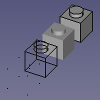
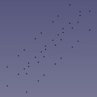
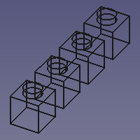
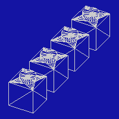
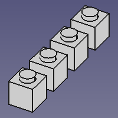
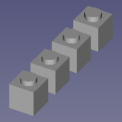
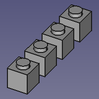

---
- GuiCommand:
   Name:Std DrawStyle
   MenuLocation:View → Draw style → ...
   Workbenches:All
   Shortcut:**V** **1** - **V** **7**
   SeeAlso:[Std SelBoundingBox](Std_SelBoundingBox.md)
---

## Description

The **Std DrawStyle** command can override the effect of the **Display Mode** [property](Property_editor.md) of objects in a [3D view](3D_view.md).

## Usage

1.  There are several ways to invoke the command:
    -   Click on the black down arrow to the right of the ** [Std DrawStyle](Std_DrawStyle.md)** button and select a style from the flyout.
    -   In the menu go to {{MenuCommand|View → Draw style}} and select a style.
    -   In the [3D view](3D_view.md) context menu go to {{MenuCommand|Draw style}} and select a style.
    -   Use one of the keyboard shortcut: **V** then **1**, **2**, **3**, **4**, **5**, **6** or **7**.

## Available draw styles {#available_draw_styles}

###  As is {#std_drawstyleasis.svg_as_is}

The **As is** style does not override the **Display Mode** of objects.

   *4 identical objects each with a different Display Mode (from left to right: 'Points', 'Wireframe', 'Shaded' and 'Flat lines') with the 'As is' draw style applied*

###  Points {#std_drawstylepoints.svg_points}

The **Points** style overrides the **Display Mode** of objects. This style matches the \'Points\' Display Mode. Vertices are displayed in solid colors. Edges and faces are not displayed.

   *The same objects with the 'Points' draw style applied*

###  Wireframe {#std_drawstylewireframe.svg_wireframe}

The **Wireframe** style overrides the **Display Mode** of objects. This style matches the \'Wireframe\' Display Mode. Vertices and edges are displayed in solid colors. Faces are not displayed.

   *The same objects with the 'Wireframe' draw style applied*

###  Hidden line {#std_drawstylehiddenline.svg_hidden_line}

The **Hidden line** style overrides the **Display Mode** of objects. Objects are displayed as if converted to triangular meshes.

   *The same objects with the 'Hidden line' draw style applied*

###  No shading {#std_drawstylenoshading.svg_no_shading}

The **No shading** style overrides the **Display Mode** of objects. Vertices, edges and faces are displayed in solid colors.

   *The same objects with the 'No shading' draw style applied*

###  Shaded {#std_drawstyleshaded.svg_shaded}

The **Shaded** style overrides the **Display Mode** of objects. This style matches the \'Shaded\' Display Mode. Vertices and edges are not displayed. Faces are illuminated depending on their orientation.

   *The same objects with the 'Shaded' draw style applied*

###  Flat lines {#std_drawstyleflatlines.svg_flat_lines}

The **Flat lines** style overrides the **Display Mode** of objects. This style matches the \'Flat lines\' Display Mode. Vertices and edges are displayed in solid colors. Faces are illuminated depending on their orientation.

   *The same objects with the 'Flat lines' draw style applied*

## Notes

-   Objects in a [3D view](3D_view.md) also have a **Draw Style** property. This property controls the linetype used for the edges. The Std DrawStyle command does not override this property.
-   For a macro to toggle between two draw styles see: [Macro Toggle Drawstyle](Macro_Toggle_Drawstyle.md).

 {{Std Base navi}}  
