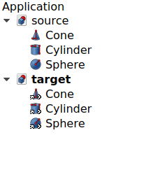
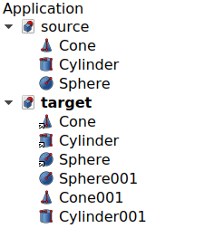

---
- GuiCommand:
   Name:Std LinkImportAll
   MenuLocation:None
   Workbenches:All
   Version:0.19
   SeeAlso:[Std LinkMake](Std_LinkMake.md), [Std LinkMakeRelative](Std_LinkMakeRelative.md), [Std LinkImport](Std_LinkImport.md)
---

# Std LinkImportAll

## Description

**[ [Std LinkImportAll](Std_LinkImportAll.md)**

imports all **Linked Object**s from Links into the current document, and then changes the attachment to point to these imported objects.

This command essentially runs **[ [Std LinkImport](Std_LinkImport.md)** for all Links in a document.

## Usage

1.  Make sure you have a \"source\" document with original objects, and a second \"target\" document with Links to those objects.
2.  Open the target document and press **[ [Std LinkImportAll](Std_LinkImportAll.md)**.

 

*Left: various Links that point to objects in the "source" document. Right: the original objects were imported (copied) into the "target" document, and the existing Links were changed to point to these copies, so they no longer point to objects in "source".*

 {{Std Base navi}}

---
 [documentation index](../README.md) > Std LinkImportAll
