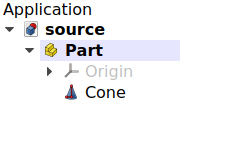
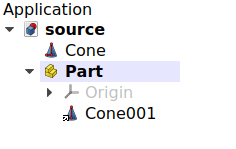

---
- GuiCommand:
   Name: Std LinkReplace
   MenuLocation: None
   Workbenches: All
   Version: 0.19
   SeeAlso: [Std LinkMake](Std_LinkMake.md), [Std LinkMakeRelative](Std_LinkMakeRelative.md), [Std LinkUnlink](Std_LinkUnlink.md)
---

# Std LinkReplace

## Description

**[ [Std LinkReplace](Std_LinkReplace.md)**

replaces an object that is inside another for an [App Link](App_Link.md) version of the former.

This operation acts on the \"children\" of a \"parent\" object as seen in the [tree view](tree_view.md). For example, given two objects (A and B) that participate in a **[ [Part Boolean](Part_Boolean.md)** operation, say, C = A + B, the A object can be replaced by a Link, so that C = A_link + B.

This operation can be done to replace nested objects that are in a complex [assembly](assembly.md) for a Link, which may be more efficient if that nested object is used many times in different sub-assemblies. The inverse operation is **[ [Std LinkUnlink](Std_LinkUnlink.md)**. To create a generic Link see **[ [Std LinkMake](Std_LinkMake.md)**.

## Usage

1.  Make sure you have one object that is inside another one. For example, consider that a **[ [Part Fuse](Part_Fuse.md)** was used with two previously created objects, a **[ [Part Sphere](Part_Sphere.md)** and a **[ [Part Cylinder](Part_Cylinder.md)**.
2.  Select the  [Sphere](Part_Sphere.md) in the [tree view](tree_view.md).
3.  Press **[ [Replace with link](Std_LinkReplace.md)**.

The original  [Sphere](Part_Sphere.md) must now be outside the **[ [Part Fuse](Part_Fuse.md)**, and inside there must be a Link instead (a small overlay arrow is shown in the icon).

 

*An object inside another one is replaced by a Link; the Link is now inside, and the real object is placed outside.*

This can also be done with objects contained inside {{button|[ [Std Parts](Std_Part.md)}} and {{button|[ [Std Groups](Std_Group.md)}}.

 

*An object inside a container is replaced by a Link; the Link is now inside, and the real object is placed outside.*

## Properties

This command creates a new [App Link](App_Link.md); its properties are described in **[ [Std LinkMake](Std_LinkMake.md)**.

 {{Std Base navi}}

---
⏵ [documentation index](../README.md) > Std LinkReplace
