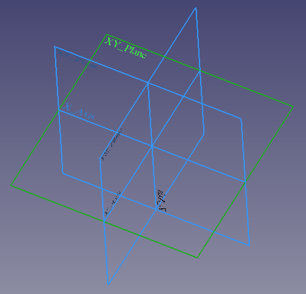

---
- GuiCommand:
   Name:Std Part
   MenuLocation:None
   Workbenches:All
   Version:0.17
   SeeAlso:[Std Group](Std_Group.md), [PartDesign Body](PartDesign_Body.md)
---

# Std Part

## Description


**[ [Std Part](Std_Part.md)**

(internally called [App Part](App_Part.md)) is a general purpose container that keeps together a group of objects so that they can be moved together as a unit in the [3D view](3D_view.md).

The Std Part element was developed to be the basic building block to create mechanical [assemblies](assembly.md). In particular, it is meant to arrange objects that have a [Part TopoShape](Part_TopoShape.md), like [Part Primitives](Part_Primitives.md), [PartDesign Bodies](PartDesign_Body.md), and other [Part Features](Part_Feature.md). The Std Part provides an [Origin object](#Origin.md) with local X, Y, and Z axes, and standard planes, that can be used as reference to position the contained objects. In addition, Std Parts may be nested inside other Std Parts to create a big assembly from smaller sub-assemblies.

Although it is primarily intended for solid bodies, the Std Part can be used to manage any object that has a [Placement](Placement.md) property, so it can also contain [Mesh Features](Mesh_Feature.md), [sketches](Sketch.md), and other objects derived from the [App GeoFeature](App_GeoFeature.md) class.

Do not confuse the **[ [PartDesign Body](PartDesign_Body.md)** with the **[ [Std Part](Std_Part.md)**. The first one is a specific object used in the  [PartDesign Workbench](PartDesign_Workbench.md), intended to model a [single contiguous solid](PartDesign_Body#Single_contiguous_solid.md) by means of [PartDesign Features](PartDesign_Feature.md). On the other hand, the [Std Part](Std_Part.md) is not used for modelling, just to arrange different objects in space, with the intention to create [assemblies](assembly.md).

The **[ [Std Part](Std_Part.md)** tool is not defined by a particular workbench, but by the base system, thus it is found in the **structure toolbar** that is available in all [workbenches](Workbenches.md). To group objects arbitrarily without considering their position, use **[ [Std Group](Std_Group.md)**; this object does not affect the placements of the elements that it contains, it is essentially just a folder that is used to keep the [tree view](tree_view.md) organized.

  


*Left: elements inside a Std Part in the [tree view](tree_view.md). Right: objects positioned in space, referred to the Origin of the Std Part.*

## Usage

1.  Press the **[ [Std Part](Std_Part.md)** button. An empty Part is created and automatically becomes *[active](Std_Part#Active_status.md)*.
2.  To add objects to a Part, select them in [tree view](tree_view.md), and then drag and drop them over the Part.
3.  To remove objects from a Part, drag them out of the Part, and onto the document label at the top of the [tree view](tree_view.md).

### Notes

-   As of v0.19, a given object can only belong to a single Part.
-   Double-click the Part in the [tree view](tree_view.md) or open the context menu (right-click) and select **Toggle active part** to activate or deactivate the Part. If another Part is active, it will be deactivated. See [active status](Std_Part#Active_status.md) for more information.

### Limitations

-   At this time, [Draft Snap](Draft_Snap.md) methods do not work on selected Part containers nor on the objects inside of them.
-   A Part has no [topological shape](Part_TopoShape.md), therefore 3D operations like [Part Boolean](Part_Boolean.md) cannot be used on a Part itself. For example, you cannot select two Parts, and perform a [Part Fuse](Part_Fuse.md) or [Part Cut](Part_Cut.md) with them.
    -   These boolean operations only work on the contained objects as long as these are derived from [Part Feature](Part_Feature.md) and have a [topological shape](Part_TopoShape.md).

## Properties

A [Std Part](Std_Part.md) is internally called [App Part](App_Part.md) (`App::Part` class), and is derived from an [App GeoFeature](App_GeoFeature.md) (`App::GeoFeature` class), therefore it shares most of the latter\'s properties.

In addition to the properties described in [App GeoFeature](App_GeoFeature.md), the App Part class has some properties that help it manage information in the context of an assembly, for example, **Type**, **Id**, **License**, **LicenseURL**, **Color**, and **Group**.

These are the properties available in the [property editor](property_editor.md). Hidden properties can be shown by using the **Show all** command in the context menu of the [property editor](property_editor.md).

### Data


{{TitleProperty|Base}}

-    **Type|String**: a description for this object. By default, it is an empty string {{value|""}}.

-    **Id|String**: an identification or part number for this object. By default, it is an empty string {{value|""}}.

-    **License|String**: a field to specify the license for this object. By default, it is an empty string {{value|""}}.

-    **LicenseURL|String**: a field to specify the web address to the license or contract for this object. By default, it is an empty string {{value|""}}.

-    **Color|Color**: a tuple of four floating point RGBA values white color.

-    **Placement|Placement**: the position of the object in the [3D view](3D_view.md). The placement is defined by a `Base` point (vector), and a `Rotation` (axis and angle). See [Placement](Placement.md).

    -   
        **Angle**
        
        : the angle of rotation around the **Axis**. By default, it is {{value|0°}} (zero degrees).

    -   
        **Axis**
        
        : the unit vector that defines the axis of rotation for the placement. Each component is a floating point value between {{value|0}} and {{value|1}}. If any value is above {{value|1}}, the vector is normalized so that the magnitude of the vector is {{value|1}}. By default, it is the positive Z axis, {{value|(0, 0, 1)}}.

    -   
        **Position**
        
        : a vector with the 3D coordinates of the base point. By default, it is the origin {{value|(0, 0, 0)}}.

-    **Label|String**: the user editable name of this object, it is an arbitrary UTF8 string.

-    **Group|LinkList**: a list of referenced objects. By default, it is empty {{value|[]}}.

#### Hidden properties Data 

-    **Material|Map**: map with material properties. By default, it is empty {}.

-    **Meta|Map**: map with additional meta information. By default, it is empty {}.

-    **Uid|UUID**: the [universally unique identifier](https://en.wikipedia.org/wiki/Universally_unique_identifier) (UUID) (128-bit number) of the object. This is assigned at creation time.

-    **Label2|String**: a longer, user editable description of this object, it is an arbitrary UTF8 string that may include newlines. By default, it is an empty string {{value|""}}.

-    **Expression Engine|ExpressionEngine**: a list of expressions. By default, it is empty {{value|[]}}.

-    **Visibility|Bool**: whether to display the object or not.

-    **Origin|Link**: the [App Origin](App_Origin.md) object that is the positional reference for all elements listed in **Group**.

-    **_ Group Touched|Bool**: whether the group is touched or not.

### View

The App Part only has the five properties of the basic [App FeaturePython](App_FeaturePython.md), and it does not have hidden properties.


{{TitleProperty|Base}}

-    **Display Mode|Enumeration**: {{value|Group}}.

-    **On Top When Selected|Enumeration**: {{value|Disabled}} (default), {{value|Enabled}}, {{value|Object}}, {{value|Element}}.

-    **Selection Style|Enumeration**: {{value|Shape}} (default), {{value|BoundBox}}. If the option is {{value|Shape}}, the entire shape (vertices, edges, and faces) will be highlighted in the [3D view](3D_view.md); if it is {{value|BoundBox}} only the bounding box will be highlighted.

-    **Show In Tree|Bool**: if it is `True`, the object appears in the [tree view](tree_view.md). Otherwise, it is set as invisible.

-    **Visibility|Bool**: if it is `True`, the object appears in the [3D view](3D_view.md); otherwise it is invisible. By default this property can be toggled on and off by pressing the **Space** bar in the keyboard.

## Assembly concept 

The Std Part is intended to be the basic building block to create assemblies. Unlike a [PartDesign Body](PartDesign_Body.md), an assembly is meant to be a collection of separate, distinguishable elements which are connected in some way in the physical world, for example, through pressure, screws, or glue.

Examples that could be Parts:

-   A wooden table that consists of individual wooden pieces (legs, top), which are put together by glue or metal screws.
-   A ball bearing that is composed of multiple steel balls, an inner ring, a retainer, a seal, and an outer ring.
-   An assembly of a screw with a washer, and a matching nut.

    
*Left: three individual contiguous solids, each of them modelled by a [PartDesign Body](PartDesign_Body.md). Right: the individual Bodies put together inside a Std Part to create an assembly.*

In general terms, when importing a STEP file into the program, the main assembly and its sub-assemblies will be imported as Part containers, each of them containing a simple [Part Feature](Part_Feature.md).

## Detailed explanation 

### Active status 

An open document can contain multiple Parts. An active Part will be displayed in the [tree view](Tree_view.md) with the background color specified by the **Active container** value in the [preferences editor](Preferences_Editor#Colors.md) (by default, light blue). An active part will also be shown in bold text.

To activate or de-activate a Part:

-   Double click on it on the [tree view](Tree_view.md), or
-   Open the context menu (right click) and select **Toggle active part**.


**Notes:**

-   The {{emphasis|active status}} of Parts was developed in v0.17 in parallel with the {{emphasis|active status}} of [PartDesign Bodies](PartDesign_Body.md); however, as of v0.19 this status does not serve a real purpose for Parts.
-   Even when a Part is active, newly created objects are not placed inside of it automatically. In this case, simply drag these new objects, and drop them onto the desired Part.
-   Only a single Part can be active at a time.

  


*Document with two Std Parts, of which the second one is active.*

### Origin

The Origin consists of the three standard axes (X, Y, Z) and three standard planes (XY, XZ and YZ). [Sketches](Sketch.md) and other objects can be attached to these elements when creating them.

   


*Left: Part Origin in the [tree view](tree_view.md). Right: representation of the Origin elements in the [3D view](3D_view.md).*


**Note:**

the Origin is an [App Origin](App_Origin.md) object (`App::Origin` class), while the axes and planes are objects of type `App::Line` and `App::Plane` respectively. Each of these elements can be hidden and unhidden individually with the **Space** bar; this is useful to choose the correct reference when creating other objects.


**Note 2:**

all elements inside the Part are referenced to the Part\'s Origin which means that the Part can be moved and rotated in reference to the global coordinate system without affecting the placement of the elements inside.

### Visibility Management 

The Part\'s visibility supersedes the visibility of any object it contains. If the Part is hidden, the objects it contains will be hidden as well, even if their individual **Visibility** property is set to `True`. If the Part is visible, then each object\'s **Visibility** determines whether the object is shown or not.

  
*The visibility of the Std Part determines whether the objects grouped under it are shown in the [3D view](3D_view.md) or not. Left: the Part is hidden, so none of the objects will be shown in the [3D view](3D_view.md). Right: the Part is visible, so each object controls its own visibility.*

### Inheritance

A [Std Part](Std_Part.md) is formally an instance of the class `App::Part`, whose parent is the basic [App GeoFeature](App_GeoFeature.md) (`App::GeoFeature` class), and is augmented with an Origin extension.


*Simplified diagram of the relationships between the core objects in the program. The `App::Part* class is a simple container that has a position in 3D space, and has an Origin to control the placement of the objects grouped under it.`

## Scripting


**See also:**

[FreeCAD Scripting Basics](FreeCAD_Scripting_Basics.md), and [scripted objects](scripted_objects.md).

See [Part Feature](Part_Feature.md) for the general information on adding objects to the document.

A Std Part ([App Part](App_Part.md)) is created with the `addObject()` method of the document. Once a Part exists, other objects can be added to it with the `addObject()` or `addObjects()` methods of this Part.

 
```python
import FreeCAD as App

doc = App.newDocument()
obj = App.ActiveDocument.addObject("App::Part", "Part")

bod1 = App.ActiveDocument.addObject("PartDesign::Body", "Body")
bod2 = App.ActiveDocument.addObject("Part::Box", "Box")

obj.addObjects([bod1, bod2])
App.ActiveDocument.recompute()
```

You cannot create a scripted `App::Part`. However, you can add `App::Part` behaviour to a scripted `Part::FeaturePython` object by using the following code:

 
```python
class MyGroup(object):
    def __init__(self, obj=None):
        self.Object = obj
        if obj:
            self.attach(obj)

    def __getstate__(self):
        return

    def __setstate__(self, _state):
        return

    def attach(self, obj):
        obj.addExtension('App::OriginGroupExtensionPython')
        obj.Origin = FreeCAD.ActiveDocument.addObject('App::Origin', 'Origin')

    def onDocumentRestored(self, obj):
        self.Object = obj

class ViewProviderMyGroup(object):
    def __init__(self, vobj=None):
        if vobj:
            vobj.Proxy = self
            self.attach(vobj)
        else:
            self.ViewObject = None

    def attach(self, vobj):
        vobj.addExtension('Gui::ViewProviderOriginGroupExtensionPython')
        self.ViewObject = vobj

    def __getstate__(self):
        return None

    def __setstate__(self, _state):
        return None

App.ActiveDocument.addObject('Part::FeaturePython', 'Group', group.MyGroup(), group.ViewProviderMyGroup(), True)
```


 {{Std Base navi}}

---
[documentation index](../README.md) > Std Part
