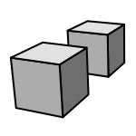

---
- GuiCommand:
   Name: Std PerspectiveCamera
   MenuLocation: View -> Perspective view
   Workbenches: All
   Shortcut: **V** **P**
   SeeAlso: Std_OrthographicCamera
---

# Std PerspectiveCamera

## Description

The **Std PerspectiveCamera** command switches the camera in the active [3D view](3D_view.md) to perspective view mode. In this mode, objects that are further from the camera appear smaller than those that are closer.

   
*Two cubes with the same dimensions in perspective view*

## Usage

1.  There are several ways to invoke the command:
    -   Select the **View →  Perspective view** option from the menu.
    -   Select the ** Perspective view** option from the Mini-cube menu of the [Navigation Cube](Navigation_Cube.md).
    -   Use the keyboard shortcut: **V** then **P**.

## Preferences

-   The camera type can be changed in the preferences: **Edit → Preferences... → Display → 3D View → Camera type**. The selected type will be used for all 3D views of all opened documents and also for new documents. See [Preferences Editor](Preferences_Editor#3D_View.md).

## Scripting


**See also:**

[FreeCAD Scripting Basics](FreeCAD_Scripting_Basics.md).

To change the view to perspective use the `setCameraType` method of the ActiveView object. This method is not available if FreeCAD is in console mode.

 
```python
import FreeCADGui

FreeCADGui.ActiveDocument.ActiveView.setCameraType('Perspective')
FreeCADGui.ActiveDocument.ActiveView.getCameraType()
```


 {{Std Base navi}}


---
⏵ [documentation index](../README.md) > Std PerspectiveCamera
