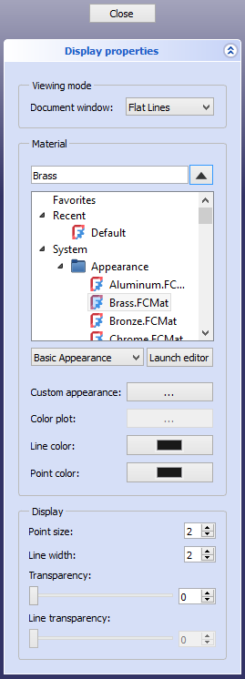

---
 GuiCommand:
   Name: Std SetAppearance
   MenuLocation: View , Appearance...
   Workbenches: Material_Workbench, Part_Workbench, PartDesign_Workbench and more
   Shortcut: **Ctrl**+**D**
   SeeAlso: Std_SetMaterial, Part_ColorPerFace
---

# Std SetAppearance

## Description

The **Std SetAppearance** command sets the display properties of selected objects.

This page has been updated for version 1.0.

   
*The Display properties task panel*

## Usage

1.  Select one or more objects.
2.  There are several ways to invoke the command:
    -   Select the **View →  Appearance...** option from the menu.
    -   Select the ** Appearance...** option from the [Tree view](Tree_view.md) context menu or [3D view](3D_view.md) context menu.
    -   Use the keyboard shortcut: **Ctrl**+**D**.
3.  The **Display properties** task panel opens. See [Options](#Options.md).
4.  Change one or more properties.
5.  The objects are updated immediately.
6.  Optionally select one or more new objects whose properties you want to change.
7.  Press the **Close** button to close the task panel and finish the command.

## Options

### Viewing mode 

-   Select a **Display Mode** from the dropdown list. The available options are: {{Value|Flat lines}}, {{Value|Shaded}} (not for [Draft](Draft_Workbench.md) objects), {{Value|Wireframe}} and {{Value|Points}}. See the [Std DrawStyle](Std_DrawStyle.md) command for more information.

### Material

-   Select a material from the list.
    1.  Optionally select a category from the dropdown list below the material list to filter the materials. The available categories are {{Value|Basic Appearance}}, {{Value|Texture Appearance}} (such materials are not yet available) and {{Value|All Materials}}.
    2.  Optionally press the **Launch editor** button to launch the [Materials editor](Materials_Edit.md).
-   **Custom appearance:** press the **...** button to override the material appearance. The **Material properties** dialog box opens. See [Part ColorPerFace](Part_ColorPerFace#Usage.md).
-   **Color plot:** unsupported at this time.
-   **Line color:** sets the **Line Color** property. Press the button to open the Select color dialog box.
-   **Point color:** sets the **Point Color** property. Press the button to open the Select color dialog box.

### Display

-   **Point size:** sets the **Point Size** property (in pixels).
-   **Line width:** sets the **Line Width** property (in pixels).
-   **Transparency:** sets the **Transparency** property (in percentage). 0% is opaque, 100% is fully transparent.
-   **Line transparency:** unsupported at this time.

## Notes

-   The mentioned view properties can also be changed in the [Property editor](Property_editor.md).

---
⏵ [documentation index](../README.md) > Std SetAppearance
