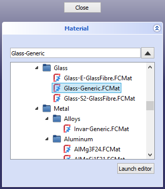

---
 GuiCommand:
   Name: Std SetMaterial
   MenuLocation: View , Material...
   Workbenches: Material_Workbench, Part_Workbench, PartDesign_Workbench and more
   Shortcut: 
   Version: 1.0
   SeeAlso: Std_SetAppearance
---

# Std SetMaterial

## Description

The **Std SetMaterial** command sets the material of selected objects.

   
*The Material task panel*

## Usage

1.  Select one or more objects.
2.  There are several ways to invoke the command:
    -   Select the **View →  Material...** option from the menu.
    -   Select the ** Material...** option from the [Tree view](Tree_view.md) context menu or [3D view](3D_view.md) context menu.
3.  The **Material** task panel opens.
4.  Select a material from the list.
    1.  Optionally press the **Launch editor** button to launch the [Materials editor](Materials_Edit.md).
5.  The objects are updated immediately.
6.  Optionally select one or more new objects whose material you want to change.
7.  Press the **Close** button to close the task panel and finish the command.

---
⏵ [documentation index](../README.md) > Std SetMaterial
