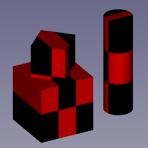

---
 GuiCommand:
   Name: Std TextureMapping
   MenuLocation: View , Texture Mapping...
   Workbenches: All
---

# Std TextureMapping

## Description

The **Std TextureMapping** command temporarily maps a texture onto all objects in a [3D view](3D_view.md).

   
*Two objects mapped with a 120 by 120 pixel image of a checker pattern*

## Usage

1.  Select the **View →  Texture Mapping...** option from the menu.
2.  The **Texture** task panel opens.
3.  Optionally check the **Environment** checkbox.
4.  Press the **...** button.
5.  Select an image file in the dialog box.
6.  Press the **Close** button to close the task panel and finish the command.

 {{Std_Base_navi}}

---
⏵ [documentation index](../README.md) > Std TextureMapping
