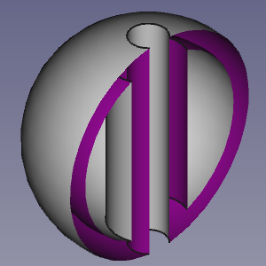
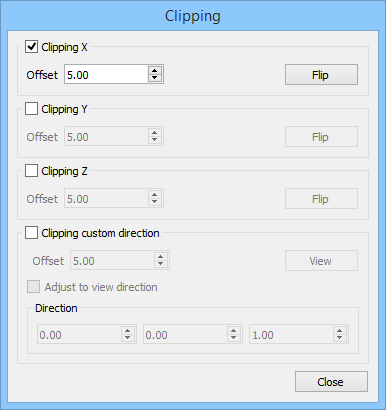

---
- GuiCommand:
   Name:Std ToggleClipPlane
   MenuLocation:View → Clipping plane
   Workbenches:All
   SeeAlso:[Part SectionCut](Part_SectionCut.md)
---

# Std ToggleClipPlane

## Description

The **Std ToggleClipPlane** command temporarily hides objects and parts of objects on one side of up to three virtual planes in the active [3D view](3D_view.md).

   
*A clipped hollow object*

   
*The Clipping dialog box*

## Usage

1.  Select the **View →  Clipping plane** option from the menu.
2.  In the Clipping dialog box do one of the following:
    -   Check one or more of the {{CheckBox|TRUE|Clipping X}} to {{CheckBox|TRUE|Clipping Z}} checkboxes.
        -   Optionally change the offset distance(s).
        -   Optionally press the **Flip** button(s) to change the side of the clipping plane objects are hidden on.
    -   Check the {{CheckBox|TRUE|Clipping custom direction}} checkbox.
        -   Optionally change the offset distance.
        -   Do one of the following:
            -   Press the **View** button to use the direction of the current view.
            -   Check the {{CheckBox|TRUE|Adjust to view direction}} checkbox for a direction that dynamically adepts to view changes.
            -   Specify the direction by entering the X, Y and Z coordinates of a normal vector.
3.  Optionally change the view to inspect the model.
4.  Press the **Close** button to close the task panel and finish the command.

## Notes

-   To clearly distinguish the interior of partially clipped objects change their **Lighting** property to \'One side\'. The color of the interior side of their faces will then depend on the backlight settings: **Edit → Preferences... → Display → 3D View → Backlight color - Intensity**. See [Preferences Editor](Preferences_Editor#3D_View.md).

 {{Std_Base_navi}}

---
 [documentation index](../README.md) > Std ToggleClipPlane
