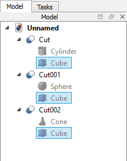

---
 GuiCommand:
   Name: Std TreeSelectAllInstances
   Workbenches: All
---

# Std TreeSelectAllInstances

## Description

The **Std TreeSelectAllInstances** command expands the [Tree view](Tree_view.md) to reveal all instances of the same object and selects them.

   
*3 instances of the same [Part Box](Part_Box.md), used in 3 [Part Cut](Part_Cut.md) operations, selected with this command*

## Usage

1.  Select an object.
2.  Select the ** Select all instances** option from the Tree view context menu.

---
⏵ [documentation index](../README.md) > Std TreeSelectAllInstances
