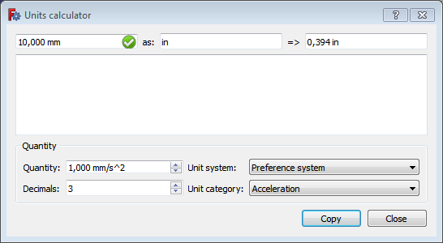

---
 GuiCommand:
   Name: Std UnitsCalculator
   MenuLocation: Tools , Units calculator...
   Workbenches: All
---

# Std UnitsCalculator

## Description

The **Std UnitsCalculator** command opens the Units calculator dialog box. The Units calculator can be used to convert values from one unit system to another.

   
*The Units calculator dialog box*

## Usage

1.  Select the **Tools →  Units calculator...** option from the menu.
2.  The Units calculator dialog box opens. For more information see [Options](#Options.md).
3.  The dialog box is modeless, meaning it can stay open while you continue working in FreeCAD.
4.  Press the **Close** button to close the dialog box.

## Options

### Top row 

1.  Enter a value with units in the first input box. For example {{Value|10 mm}}.
    -   Units with exponents should be entered using the {{Value|^}} notation. For example {{Value|1 m^2}}.
    -   If the input value cannot be recognized or if the units are unknown the **=\>** box will display the \'syntax error\' message.
2.  Enter the target units in the **as** input box. For example {{Value|in}}.
    -   If the units are unknown the **=\>** box will display the \'unknown unit\' message.
    -   If the units in the first and second input box do not match, the **=\>** box will display the \'unit mismatch\' message. In the example the units match as \'mm\' and \'in\' are both length units.
3.  If there are no input errors the **=\>** box will immediately show the result. For the example values the result is {{Value|0,394 in}}.
4.  Optionally press the **Copy** button to copy the content of the **=\>** box to the clipboard. The value can then for example be pasted in a FreeCAD task panel or dialog box.

### Text area 

1.  The conversion performed in the top row can be copied to the text area by pressing **Enter** in the first or second input box.
2.  The text area can contain multiple conversions and its content can be selected and copied to the clipboard with **Ctrl+C** and used in other programs.

### Quantity

**This new part (<small>(v0.19**) of the Units calculator still suffers from some bugs.)</small> 

1.  Select an option from the **Unit system** dropdown list. This will be the target unit system. Select **Preference system** to use the unit system defined in the [Preferences](Preferences_Editor#Units.md).
2.  Select an option from the **Unit category** dropdown list.
3.  Enter a value with units in the **Quantity** input box. The units must match the unit category.
    -   If the **Area** unit category has been selected, entering certain units is problematic. For example to enter {{Value|m^2}} you have to first enter {{Value|^2}}, put the cursor before the {{Value|^}} character and then enter {{Value|m}}.
4.  Click in the **Decimals** input box and press **Enter** to convert the value in the **Quantity** input box.

## Notes

-   See the [Expressions](Expressions#Units.md) page for a list of all known units.

 {{Std Base navi}}

---
⏵ [documentation index](../README.md) > Std UnitsCalculator
