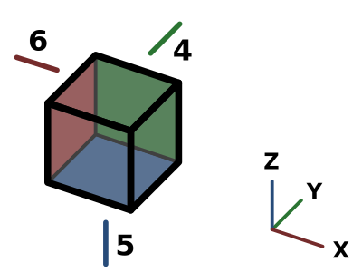

---
- GuiCommand:
   Name:Std ViewBottom
   MenuLocation:View → Standard views → Bottom
   Workbenches:All
   Shortcut:**5**
   SeeAlso:[Std ViewRear](Std_ViewRear.md), [Std ViewLeft](Std_ViewLeft.md)
---

## Description

The **Std ViewBottom** command points the camera in the active [3D view](3D_view.md) in the direction of the positive Z axis.

   *Arrow 5 points in the direction of the bottom view*

## Usage

1.  There are several ways to invoke the command:
    -   Press the ** [Std ViewBottom](Std_ViewBottom.md)** button.
    -   Select the {{MenuCommand|View → Standard views →  Bottom}} option from the menu.
    -   Select the {{MenuCommand|Standard views →  Bottom}} option from the [3D view](3D_view.md) context menu.
    -   Use the keyboard shortcut: **5**.

## Scripting


**See also:**

[FreeCAD Scripting Basics](FreeCAD_Scripting_Basics.md).

To change to bottom view use the `viewBottom` method of the ActiveView object. This method is not available if FreeCAD is in console mode.

 
```python
import FreeCADGui

FreeCADGui.ActiveDocument.ActiveView.viewBottom()
FreeCADGui.ActiveDocument.ActiveView.getViewDirection()
```


 {{Std Base navi}}  
