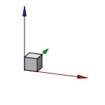

---
- GuiCommand:
   Name:Std ViewDimetric
   MenuLocation:View → Standard views → Axonometric → Dimetric
   Workbenches:All
   SeeAlso:[Std ViewIsometric](Std_ViewIsometric.md), [Std ViewTrimetric](Std_ViewTrimetric.md)
---

# Std ViewDimetric

## Description

The **Std ViewDimetric** command realigns the camera in the active _, but the command also works if the view is in [perspective mode](Std_PerspectiveCamera.md).

   *The [axis cross](Std_AxisCross.md) and a cube in dimetric view*

## Usage

1.  Select the **View → Standard views → Axonometric →  Dimetric** option from the menu.

## Scripting


**See also:**

[FreeCAD Scripting Basics](FreeCAD_Scripting_Basics.md).

To change to dimetric view use the `viewDimetric` method of the ActiveView object. This method is not available if FreeCAD is in console mode.

 
```python
import FreeCADGui

FreeCADGui.ActiveDocument.ActiveView.viewDimetric()
FreeCADGui.ActiveDocument.ActiveView.getViewDirection()
```


 {{Std Base navi}}

---
[documentation index](../README.md) > Std ViewDimetric
