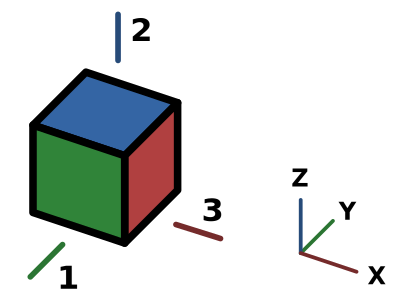

---
- GuiCommand:
   Name:Std ViewFront
   MenuLocation:View → Standard views → Front
   Workbenches:All
   Shortcut:**1**
   SeeAlso:[Std ViewTop](Std_ViewTop.md), [Std ViewRight](Std_ViewRight.md)
---

## Description

The **Std ViewFront** command points the camera in the active [3D view](3D_view.md) in the direction of the positive Y axis.

   *Arrow 1 points in the direction of the front view*

## Usage

1.  There are several ways to invoke the command:
    -   Press the ** [Std ViewFront](Std_ViewFront.md)** button.
    -   Select the {{MenuCommand|View → Standard views →  Front}} option from the menu.
    -   Select the {{MenuCommand|Standard views →  Front}} option from the [3D view](3D_view.md) context menu.
    -   Use the keyboard shortcut: **1**.

## Scripting


**See also:**

[FreeCAD Scripting Basics](FreeCAD_Scripting_Basics.md).

To change to front view use the `viewFront` method of the ActiveView object. This method is not available if FreeCAD is in console mode.

 
```python
import FreeCADGui

FreeCADGui.ActiveDocument.ActiveView.viewFront()
FreeCADGui.ActiveDocument.ActiveView.getViewDirection()
```


 {{Std Base navi}}  
