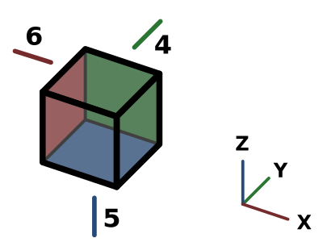

---
 GuiCommand:
   Name: Std ViewRear
   MenuLocation: View , Standard views , Rear
   Workbenches: All
   Shortcut: **4**
   SeeAlso: Std_ViewBottom, Std_ViewLeft
---

# Std ViewRear

## Description

The **Std ViewRear** command points the camera in the active [3D view](3D_view.md) in the direction of the negative Y axis.

   
*Arrow 4 points in the direction of the rear view*

## Usage

1.  There are several ways to invoke the command:
    -   Press the ** [Rear](Std_ViewRear.md)** button.
    -   Select the **View → Standard views →  Rear** option from the menu.
    -   Select the **Standard views →  Rear** option from the [3D view](3D_view.md) context menu.
    -   Use the keyboard shortcut: **4**.

## Scripting

See [Std ViewFront](Std_ViewFront#Scripting.md).

 {{Std_Base_navi}}

---
⏵ [documentation index](../README.md) > Std ViewRear
