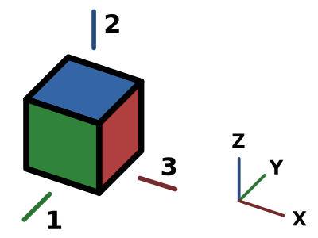

---
 GuiCommand:
   Name: Std ViewRight
   MenuLocation: View , Standard views , Right
   Workbenches: All
   Shortcut: **3**
   SeeAlso: Std_ViewFront, Std_ViewTop
---

# Std ViewRight

## Description

The **Std ViewRight** command points the camera in the active [3D view](3D_view.md) in the direction of the negative X axis.

   
*Arrow 3 points in the direction of the right view*

## Usage

1.  There are several ways to invoke the command:
    -   Press the ** [Right](Std_ViewRight.md)** button.
    -   Select the **View → Standard views →  Right** option from the menu.
    -   Select the **Standard views →  Right** option from the [3D view](3D_view.md) context menu.
    -   Use the keyboard shortcut: **3**.

## Scripting

See [Std ViewFront](Std_ViewFront#Scripting.md).

---
⏵ [documentation index](../README.md) > Std ViewRight
