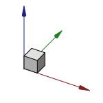

---
 GuiCommand:
   Name: Std ViewTrimetric
   MenuLocation: View , Standard views , Axonometric , Trimetric
   Workbenches: All
   SeeAlso: Std_ViewIsometric, Std_ViewDimetric
---

# Std ViewTrimetric

## Description

The **Std ViewTrimetric** command realigns the camera in the active [3D view](3D_view.md) to obtain a [trimetric](https://en.wikipedia.org/wiki/Axonometric_projection#Three_types) view. For a truly trimetric view the 3D view must be in [orthographic mode](Std_OrthographicCamera.md), but the command also works if the view is in [perspective mode](Std_PerspectiveCamera.md).

   
*The [axis cross](Std_AxisCross.md) and a cube in trimetric view*

## Usage

1.  Select the **View → Standard views → Axonometric →  Trimetric** option from the menu.

## Scripting

See [Std ViewIsometric](Std_ViewIsometric#Scripting.md).

 {{Std_Base_navi}}

---
⏵ [documentation index](../README.md) > Std ViewTrimetric
