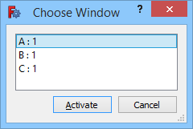

---
 GuiCommand:
   Name: Std Windows
   MenuLocation: Windows , Windows...
   Workbenches: All
   SeeAlso: Std_ActivateNextWindow, Std_ActivatePrevWindow
---

# Std Windows

## Description

The **Std Windows** command opens a dialog box with a list of [Main view area](Main_view_area.md) windows. From this list a selected window can be activated.

   
*The Choose Window dialog box*

## Usage

1.  Select the **Windows →  Windows...** option from the menu.
2.  The **Choose Window** dialog box opens.
3.  Do one of the following:
    -   Select a window in the list and press the **Activate** button.
    -   Double-click a window in the list.
4.  The dialog box closes.
5.  The selected window is activated.

## Options

-   Press **Esc** or the **Cancel** button to abort the command.

## Notes

-   The first 10 Main view area windows are also listed in the **Windows** menu and can be activated from there.

---
⏵ [documentation index](../README.md) > Std Windows
