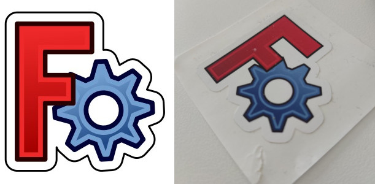

FreeCAD doesn\'t offer swag that you can order from us to support the project. The production, shipping and platform costs would make the final price so high that we feel it wouldn\'t help to support FreeCAD in any way, plus it would consume a lot of time and resources to maintain, administer, take care of payments and shipping, etc. But we all love swag, so here is the solution: **self-producing swag!!**

Just download the files, head on to your favorite printing platform, and get them sent to you! By using the files below, you are guaranteed to get the true, authentic, official stuff!

## T-shirts 

Official FreeCAD t-shirts are very easy to produce! Download one of the full-resolution .png images below, then head to a printing website such as <https://zazzle.com> (this is one of the most well-known ones, you might easily find better or cheaper t-shirt printing site in your country), then select your t-shirt, add the image, stretch it as big as the platform allows, make sure you ask for printing in full 4 colors mode, and you\'re done!

#### Version 0.11 

Example:

Downloadable file:

<https://wiki.freecadweb.org/images/b/bc/Freecad-tshirt011-template.png>

#### Version 0.19 

Example:

Downloadable file:

<https://yorik.uncreated.net/images/2021/freecad-tshirt019-template.png>

## Stickers

The file below can be used to print 50x50mm stickers. Most print shops will ask you for Adobe Illustrator files, sometimes two files (one for the printing and one for the contour cut). But the svg files below will import in Illustrator just fine, so you can send them instead. Some print shops will ask for both the print and the contour to be in the same file, but with special instructions for the contour, such as be in magenta color. Make sure to check the requirements before sending to print.

Downloadable files:

[freecad-sticker-full.svg](https://yorik.uncreated.net/images/2021/freecad-sticker-full.svg) - full file (color + contour)

[freecad-sticker-color.svg](https://yorik.uncreated.net/images/2021/freecad-sticker-color.svg) - color (print) only

[freecad-sticker-contour.svg](https://yorik.uncreated.net/images/2021/freecad-sticker-contour.svg) - contour only
