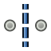
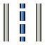

---
- GuiCommand:
   Name:TechDraw 2PointCenterLine
   MenuLocation:TechDraw → Add Lines → Add Centerline between 2 points
   Workbenches:[TechDraw](TechDraw_Workbench.md)
   Version:0.19
   SeeAlso:[TechDraw Centerline to Face(s)](TechDraw_FaceCenterLine.md), [TechDraw Centerline between 2 Lines](TechDraw_2LineCenterLine.md)
---

## Description

The 2PointCenterLine tool adds a centerline between two Vertices (Points).

  

*Centerline between 2 Points*

## Usage

1.  Select 2 Vertexes in a View.
2.  Press the ** Add Centerline between 2 Points** button
3.  A dialog will open where you can specify attributes of the new centerline.
4.  A centerline will be added between the 2 selected Vertices.

To delete a Centerline, select it and use the toolbar button ** [Remove Cosmetic Object](TechDraw_CosmeticEraser.md)**.

## Editing Centerlines {#editing_centerlines}

Any of the centerline command buttons ( ** [Add Centerline to Face(s)](TechDraw_FaceCenterLine.md)**, ** [Add Centerline between 2 Lines](TechDraw_2LineCenterLine.md)**, ** Add Centerline between 2 Points**) can be used to edit any centerline.

1.  Select a centerline.
2.  Press any centerline command button.
3.  A dialog will open where you can change attributes of the centerline.
4.  Press **OK** to see your changes.

## Properties

Centerlines have no properties of their own, as they are no document objects. They have attributes that can be changed in the centerline edit dialog.

1.  Mode (radio buttons):
    -   **Vertical**: Forces a centerline vertical
    -   **Horizontal**: Forces a centerline horizontal
    -   **Aligned**: Follows the general direction of the Edge for 2 Edge centerline
2.  **Shift Horiz**: Moves the centerline left or right of its normal position
3.  **Shift Vert**: Moves the centerline up or down from its normal position
4.  **Rotate**: Rotates the centerline around its center (degrees. + counterclockwise, - clockwise)
5.  **Extend**: Makes the centerline longer by this amount
6.  **Color**: Color of centerline
7.  **Weight**: Thickness of the centerline
8.  **Style**:  Continuous,  Dash,  Dot,  DashDot,  DashDotDot

## Scripting

**See also:**

[TechDraw API](TechDraw_API.md) and [FreeCAD Scripting Basics](FreeCAD_Scripting_Basics.md).

Centerlines are not accessible from [macros](Macros.md) or the [Python](Python.md) console at this time.

 {{TechDraw Tools navi}}  
