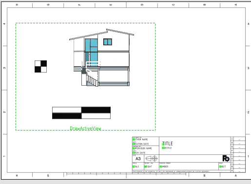

---
- GuiCommand:
   Name:TechDraw  ActiveView
   MenuLocation:TechDraw → Insert Active View (3D View)
   Workbenches:[TechDraw](TechDraw_Workbench.md)
   Version:0.19
   SeeAlso:[TechDraw Symbol](TechDraw_Symbol.md)
---

# TechDraw ActiveView

## Description

The ActiveView tool inserts a copy of a 3D window into a drawing page.

  


*A simple view from the 3D model that doesn't perform any complex calculation.*

## Usage

1.  Navigate to the 3D window you wish to copy.
2.  If you have multiple drawing pages in your document, you will also need to select the desired page in the tree.
3.  Press the ** [Insert Active View](TechDraw_ActiveView.md)** button
4.  A dialog will open to allow you to specify the size, border and background color of the copy.

## Notes

-   Active views are static once generated, they are never updated with changes to the 3D model.
-   ActiveView behind the scenes is a  [Symbol View](TechDraw_Symbol.md). Its **Scale Type** is therefore always initialized as *Custom*.
-   This tool is still somewhat **Experimental**.

## Properties

See  [Symbol](TechDraw_Symbol.md)

### Dialog Fields 

-    **Width**: The width of the generated view.

-    **Height**: The height of the generated view.

-    **Border**: The amount of empty space to be left around the view (but within Width x Height).

-    **Background**: Show or hide a background.

-    **Background Color**: Color to paint the background, if applicable.

-    **Line Width**: Thickness of individual lines in the view.

-    **Render Mode**: The [render mode](https://grey.colorado.edu/coin3d/classSoRenderManager.html#a4b8d99cff0fd91e31bc2c5d33610f6eb) of the library [Coin3d](https://en.wikipedia.org/wiki/Coin3D). The possible modes are

    -   **AS\_IS** Render primitives as they are
    -   **WIREFRAME** Render polygons as wireframe
    -   **POINTS** Render only the vertices of the polygons and lines
    -   **WIREFRAME\_OVERLAY** Render a wireframe overlay in addition to the **AS\_IS** mode
    -   **HIDDEN\_LINE** As **WIREFRAME**, but culls lines which would otherwise not be shown due to geometric culling
    -   **BOUNDING\_BOX** Only show the bounding box of each object

## Scripting


**See also:**

[TechDraw API](TechDraw_API.md) and [FreeCAD Scripting Basics](FreeCAD_Scripting_Basics.md).

The ActiveView tool can be used in [macros](Macros.md) and from the [Python](Python.md) console by using the following functions:

 
```python
import TechDrawGui
TechDrawGui.copyActiveViewToSvgFile(Gui.ActiveDocument.ActiveView,"myFile.svg")
```


 {{TechDraw Tools navi}}

---
[documentation index](../README.md) > [TechDraw](TechDraw_Workbench.md) > TechDraw ActiveView
