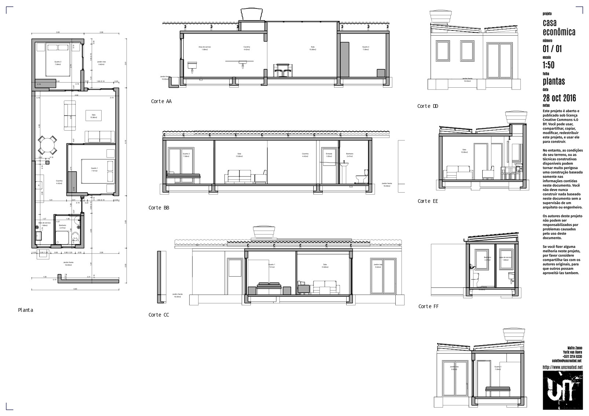
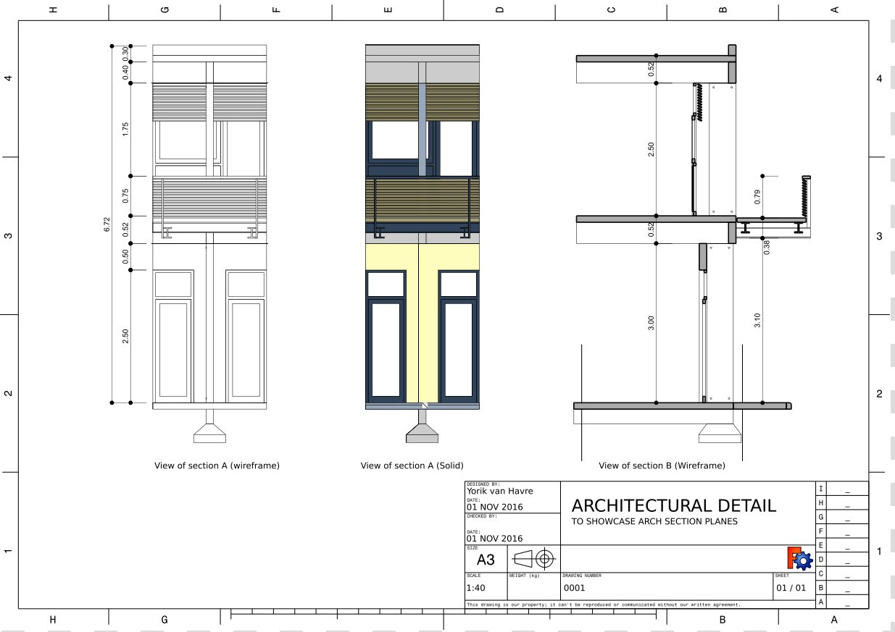
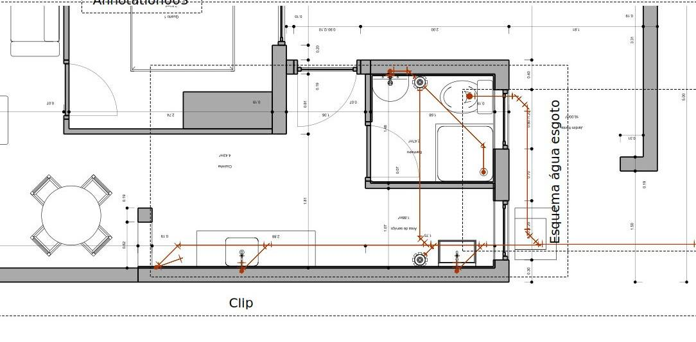

---
 GuiCommand:
   Name: TechDraw ArchView
   MenuLocation: TechDraw , Views From Other Workbenches , Insert Arch Workbench Object
   Workbenches: TechDraw_Workbench, Arch_Workbench
   SeeAlso: Arch_SectionPlane
---

# TechDraw ArchView

## Description

The **TechDraw ArchView** tool inserts a view of an ** [Arch SectionPlane](Arch_SectionPlane.md)** on a [TechDraw page](TechDraw_PageDefault.md).

  

## Usage

1.  Select a single Arch section plane in the [3D view](3D_view.md) or [Tree view](Tree_view.md).
2.  If there are multiple drawing pages in the document: optionally add the desired page to the selection by selecting it in the [Tree view](Tree_view.md).
3.  There are several ways to invoke the tool:
    -   Press the ** [Insert Arch Workbench Object](TechDraw_ArchView.md)** button.
    -   Select the **TechDraw → Views From Other Workbenches →  Insert Arch Workbench Object** option from the menu.
4.  If there are multiple drawing pages in the document and you have not yet selected a page, the **Page Chooser** dialog box opens: <small>(v0.20)</small> 
    1.  Select the desired page.
    2.  Press the **OK** button.

## Options

-   The Arch View is rendered by the [Arch Workbench](Arch_Workbench.md).
-   [Draft Dimensions](Draft_Snap_Dimensions.md), [Draft Texts](Draft_Text.md) and any other 2D (Sketch or Draft) object considered by the section plane is rendered \"as is\" (no intersection or hidden lines) on top of the solid geometry
-   The volume of [Arch Spaces](Arch_Space.md) is not rendered, only the label will be rendered
-   Cut lines, projected lines (if Show Hidden property is set to True) and 2D lines above can be rendered with different line widths. This can be configured in the Arch preferences.
-   The ArchView has two rendering modes:
    -   Wireframe, which uses the OpenCasCade algorithms of the [TechDraw Workbench](TechDraw_Workbench.md), is fast and produces only lines (no face fill possible)
    -   Solid, which is based on the [Painter\'s algorithm](https://en.wikipedia.org/wiki/Painter%27s_algorithm), and is capable of rendering faces filled with their shape color. However, it is much slower and can fail in many situations.

:   The image below illustrates the difference between the two rendering modes:


:   
-   Only the base line of [Arch Pipes](Arch_Pipe.md) is rendered, not the full volume of the tube:


:   


## Notes

The ArchView is rendered within the [Arch Workbench](Arch_Workbench.md), therefore TechDraw has limited control over its appearance. You may need to make changes within Arch to get the representation you want.

## Properties

See also [TechDraw View](TechDraw_View#Properties.md).

### Data


{{TitleProperty|Arch view}}

-    **Source|Link**: The section plane object to be displayed.

-    **All On|Bool**: If hidden objects must be shown or not. If `False`, only objects that are visible in the 3D view are rendered.

-    **Render Mode|Enumeration**: The render mode to use, {{Value|Solid}} or {{Value|Wireframe}}.

-    **Fill Spaces|Bool**: If `True`, Arch Spaces are shown as a colored area.

-    **Show Hidden|Bool**: If the hidden geometry (the part of the geometry that lies behind the section plane) is shown or not. It will be rendered in dashed line, which can be configured in the Arch preferences.

-    **Show Fill|Bool**: If cut areas must be filled with a grey color or not.

-    **Line Width|Float**: The width of the main lines. Cut lines and projected/2D line widths ratios can be configured in the Arch preferences.

-    **Font Size|Float**: The size of all texts that appear in this view.

-    **Cut Line Width|Float**: Width of the cut lines in this view.

-    **Join Arch|Bool**: If `True`, walls and structures will be fused by material.

## Scripting

See also: [Autogenerated API documentation](https://freecad.github.io/SourceDoc/) and [FreeCAD Scripting Basics](FreeCAD_Scripting_Basics.md).

The ArchView tool can be used in [macros](Macros.md) and from the [Python](Python.md) console by using the following functions:

 
```python
dv = FreeCAD.ActiveDocument.addObject('TechDraw::DrawViewArch','TestArch')
dv.Source = mySectionPlane
rc = page.addView(dv)
```


 {{TechDraw Tools navi}}


---
⏵ [documentation index](../README.md) > [TechDraw](TechDraw_Workbench.md) > TechDraw ArchView
