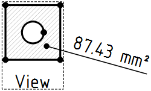

---
 GuiCommand:
   Name: TechDraw AreaDimension
   MenuLocation: TechDraw , Dimensions , Insert Area Annotation
   Workbenches: TechDraw_Workbench
   Version: 1.0
   SeeAlso: TechDraw_ExtensionAreaAnnotation
---

# TechDraw AreaDimension

## Description

The **TechDraw AreaDimension** tool adds an area dimension to a face in a Part View.

   
*Area Dimension of a face with a hole. See [Limitations](#Limitations.md).*

## Usage

1.  Select a face. The geometry may be selected in the [3D view](3D_view.md) or in the drawing.
2.  If you have selected geometry in the 3D view: add the correct TechDraw View to the selection by selecting it in the [Tree view](Tree_view.md).
3.  There are several ways to invoke the tool:
    -   If the **Dimensioning tools** [preference](TechDraw_Preferences#Dimensions.md) is set to {{Value|Single tool}} (default): press the down arrow to the right of the **** button and select the ** Insert Area Annotation** option from the dropdown.
    -   If this preference has a different value: press the ** [Insert Area Annotation](TechDraw_AreaDimension.md)** button.
    -   Select the **TechDraw → Dimensions →  Insert Area Annotation** option from the menu.
4.  A dimension is added to the view.
5.  The dimension may be dragged to the desired position.
6.  If needed, add tolerances as described on [this page](TechDraw_Geometric_dimensioning_and_tolerancing#Tolerances.md).

## Limitations

-    {{VersionMinus|1.0}}: The tool can only detect holes (islands) in faces selected in the 3D view. To get the correct area for such a face selected in the drawing do the following:

    1.  Set the correct **References 3D** with  [TechDraw DimensionRepair](TechDraw_DimensionRepair.md).
    2.  Change the **Measure Type** property to {{Value|True}}.
    3.  Invoke  [Std Refresh](Std_Refresh.md) if required.

 {{TechDraw_Tools_navi}}

---
⏵ [documentation index](../README.md) > [TechDraw](TechDraw_Workbench.md) > TechDraw AreaDimension
