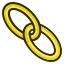

---
- GuiCommand:
   Name:TechDraw AxoHorizontalDimension
   MenuLocation:TechDraw → Dimensions → Insert Horizontal Dimension
   Workbenches:[TechDraw](TechDraw_Workbench.md)
---

# TechDraw AxoLengthDimension

## Description

The **Axonometric Length Dimension** tool adds a length dimension to an axonometric view. The dimension may be the length of one edge or between two vertices. The distance will initially be the projected distance (ie as shown on the drawing), but this may be changed to the actual 3D distance using the ** [TechDraw LinkDimension](TechDraw_LinkDimension.md)** tool.

   
*Axonometric length dimension taken from one edge (blue) or two arbitrary nodes of the view (red)*

## Usage

1.  Select two edges, e1 and e2 in the image. The first one defines the direction and length of the dimension line, the second one defines the (in 3D orthogonal) direction of the reference lines.
2.  Press the ** [Axonometric Length Dimension](TechDraw_AxoLengthDimension.md)** button.
3.  An axonometric dimension (blue in the image) will be added to the view. The dimension may be dragged to the desired position.
4.  If needed, add tolerances as described in [this page](TechDraw_Geometric_dimensioning_and_tolerancing#Tolerances.md).

To change the properties of a dimension object either double-clicking it in the drawing or in the [Tree view](Tree_view.md). This will open the [dimension dialog](TechDraw_LengthDimension#Dimension_dialog.md).

## Usage (optional) 

1.  Select two edges. (e3 and e4 in the image). The first one defines the direction of the dimension line, the second one defines the (in 3D orthogonal) direction of the reference lines.
2.  Select two vertexes (v1 and v2 in the image).
3.  Press the ** [Axonometric Length Dimension](TechDraw_AxoLengthDimension.md)** button.
4.  An axonometric dimension (red in the image) will be added to the view. The dimension may be dragged to the desired position.
5.  If needed, add tolerances as described in [this page](TechDraw_Geometric_dimensioning_and_tolerancing#Tolerances.md).

To change the properties of a dimension object either double-clicking it in the drawing or in the [Tree view](Tree_view.md). This will open the [dimension dialog](TechDraw_LengthDimension#Dimension_dialog.md).

## Limitations

The distance will be the projected distance (ie as shown on the drawing), this is not the actual 3D distance. The value may be changed using the Arbitrary option. See [TechDraw LengthDimension](TechDraw_LengthDimension.md) for more information.

 {{TechDraw Tools navi}}

---
 [documentation index](../README.md) > [TechDraw](TechDraw_Workbench.md) > TechDraw AxoLengthDimension
