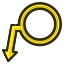

---
- GuiCommand:
   Name:TechDraw Balloon
   MenuLocation:TechDraw → Annotations → Insert Balloon Annotation
   Workbenches:[TechDraw](TechDraw_Workbench.md)
   Version:0.19
   SeeAlso:[TechDraw Annotation](TechDraw_Annotation.md)
---

## Description

The Balloon tool can add balloons with leader line in a drawing.

  

## Usage

1.  Select the View to which the Balloon will be attached.
2.  Press the ** [Balloon](TechDraw_Balloon.md)** button.
3.  The cursor is now displayed as a balloon icon. Click on the page to place the balloon origin to the desired position.
4.  The balloon bubble may be dragged to the desired position. Use **Ctrl**+drag to move the bubble and the arrow.
5.  To change the balloon properties either double-clicking onto it in the drawing or double-click on the balloon object in the model tree. This will open the balloon dialog.

**Note:** The position of the balloon is relative to the View and uses the same scale factor as the View.

## Using separators 

When using a rectangle shape, separators can be added using \"\|\" in the text. For example \"AAA\|TEST\|111\" gives:


## Properties

### Data

-    **Text**: Text to be displayed.

-    **Source View**: Source View for the balloon.

-    **Origin X**: Balloon origin x-position relative to the View.

-    **Origin Y**: Balloon origin y-position relative to the View.

-    **End Type**: End symbol for the balloon line. Options:  None,  Filled Arrow,  Open Arrow,  Tick,  Dot,  Open Circle,  Fork,  Filled Triangle

-    **End Type Scale**: Scale factor for the **End Type**.

-    **Bubble Shape**: Shape of the balloon bubble. Options:  Circular, None,  Triangle,  Inspection,  Hexagon,  Square,  Rectangle

-    **Shape Scale**: Scale factor for the **Shape**.

-    **Text Wrap**: Text wrap length; -1 means the text will never be wrapped and the result is in every case a single line.

-    **Kink Length**: Distance from the **Shape** to the leader line kink.

-    **X**: Horizontal position of the balloon bubble relative to the View.

-    **Y**: Vertical position of the balloon bubble relative to the View.

### View

-    **Color**: Color of the balloon text.

-    **Font**: The name of the font to use for the balloon bubble.

-    **Fontsize**: Dimension text size in mm.

-    **Line Visible**: Whether the balloon line is visible.

-    **Line Width**: Balloon line width

## Scripting


**See also:**

[TechDraw API](TechDraw_API.md) and [FreeCAD Scripting Basics](FreeCAD_Scripting_Basics.md).

The Balloon tool can be used in [macros](Macros.md) and from the [Python](Python.md) console by using the following functions:

 
```python
bal1 = FreeCAD.ActiveDocument.addObject('TechDraw::DrawViewBalloon','Balloon')
rc = page.addView(bal1)
```


 {{TechDraw Tools navi}}  
