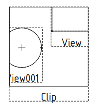

---
 GuiCommand:
   Name: TechDraw ClipGroup
   MenuLocation: TechDraw , TechDraw Views , Insert Clip Group
   Workbenches: TechDraw_Workbench
   SeeAlso: 
---

# TechDraw ClipGroup

## Description

The **TechDraw ClipGroup** tool creates a clipping window which can contain Views.

   
*Viewport window clipping different existing views*

## Usage

1.  If there are multiple drawing pages in the document: optionally activate the desired page by selecting it in the [Tree view](Tree_view.md).
2.  There are several ways to invoke the tool:
    -   Press the ** [Insert Clip Group](TechDraw_ClipGroup.md)** button.
    -   Select the **TechDraw → TechDraw Views →  Insert Clip Group** option from the menu.
3.  If there are multiple drawing pages in the document and you have not yet activated a page, the **Page Chooser** dialog box opens:
    1.  Select the desired page.
    2.  Press the **OK** button.
4.  Views can be dragged and dropped to and from the Clip Group in the Tree view. <small>(v1.0)</small> 

## Properties

See also: [Property editor](Property_editor.md).

A Clip Group, formally a {{Incode|TechDraw::DrawViewClip}} object, has the [properties](TechDraw_View#Properties_Part_View.md) that are common to all View types. It also has the following additional properties.

### Data

{{TitleProperty|Clip Group}}

-    **Width|Length**: The width of the clipping window in units

-    **Height|Length**: The height of the clipping window in units

-    **ShowFrame|Bool**: When true, show a frame around the clipping window

-    **Views|LinkList**: The Views contained in the clipping window

 {{TechDraw_Tools_navi}}

---
⏵ [documentation index](../README.md) > [TechDraw](TechDraw_Workbench.md) > TechDraw ClipGroup
