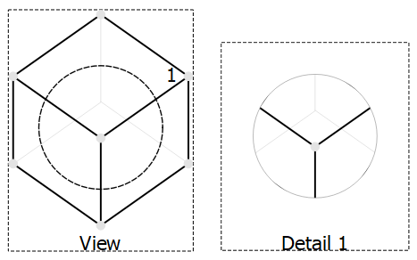

---
- GuiCommand:
   Name:TechDraw DetailView
   MenuLocation:TechDraw → Insert Detail View
   Workbenches:[TechDraw](TechDraw_Workbench.md)
   SeeAlso:[TechDraw View](TechDraw_View.md), [TechDraw Projection Group](TechDraw_ProjectionGroup.md)
---

# TechDraw DetailView

## Description

The Detail tool creates a view of small area of an existing view.

   
*Detail view with circular viewbox of an existing view*

## Usage

-   Select a view in the page or tree.
-   Press the ** [Insert Detail View](TechDraw_DetailView.md)** button to create the detail view.
-   In the appearing task dialog you can define the radius of the view box, the scale and the view position. For the latter you can do this
    -   either by changing the coordinates
    -   or by pressing the button **Drag Highlight**. In this case the detail origin border is highlighted bold and with the label *drag*. Click on the border or the label, keep the mouse button pressed and drag it to the position you like. Finally release the mouse to accept the change.

The Detail view can be displayed within a round or square view box. This is controlled by the [preferences](TechDraw_Preferences#Annotation.md) setting **Detail View Outline Shape**.

## Properties Detail View 

See also [TechDraw View](TechDraw_View#Properties.md).

### Data


{{TitleProperty|Detail}}

-    **Base View|Link**: The view on which this Detail view is based.

-    **Anchor Point|Vector**: The center of the Detail view within the **Base View**.

-    **Radius|Float**: The size of the area in the **Base View** that is displayed in the Detail view.

-    **Reference|String**: An identifier for the Detail view in the **Base View**.

## Properties Base View 

A Detail view inherits all applicable properties of the view specified as **Base View**. In the properties of this view you can change the appearance of the detail outline:

-    **Highlight Adjust**: Clockwise rotation angle of the Detail view.

-    **Highlight Line Color**: Line color for the outline shape. Default setting for this is the setting **Detail Highlight** in the [TechDraw preferences](TechDraw_Preferences.md).

-    **Highlight Line Style**: Line style for the outline shape. Default setting for this is the setting **Detail Highlight Style** in the [TechDraw preferences](TechDraw_Preferences.md).

## Notes

-   [A good discussion about setting the Anchor](https://www.forum.freecadweb.org/viewtopic.php?f=35&t=34055#p285281)

## Scripting

See also: [Autogenerated API documentation](https://freecad.github.io/SourceDoc/) and [FreeCAD Scripting Basics](FreeCAD_Scripting_Basics.md).

The Detail tool can be used in [macros](Macros.md) and from the [Python](Python.md) console by using the following functions:

 
```python
Detail = FreeCAD.ActiveDocument.addObject('TechDraw::DrawViewDetail','Detail')
...TBA
```


 {{TechDraw Tools navi}}


---
 [documentation index](../README.md) > [TechDraw](TechDraw_Workbench.md) > TechDraw DetailView
