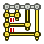

---
- GuiCommand   *
   Name   *TechDraw ExtensionCascadeHorizDimension
   MenuLocation   *TechDraw → Extensions   * Attributes/Modifications → Cascade Horizontal Dimensions
   Workbenches   *[TechDraw](TechDraw_Workbench.md)
   Shortcut   *
   Version   *0.20
   SeeAlso   *[TechDraw ExtensionCascadeVertDimension](TechDraw_ExtensionCascadeVertDimension.md), [TechDraw ExtensionCascadeObliqueDimension](TechDraw_ExtensionCascadeObliqueDimension.md)
---

# TechDraw ExtensionCascadeHorizDimension

## Description

The  **TechDraw ExtensionCascadeHorizDimension** tool evenly spaces horizontal dimensions.

   
*On the right the evenly spaced horizontal dimensions*

## Usage

1.  Optionally specify the cascade spacing with the  [TechDraw ExtensionSelectLineAttributes](TechDraw_ExtensionSelectLineAttributes.md) tool.
2.  Select two or more horizontal dimensions.
3.  The first dimension defines the position. This dimension will not be moved, the other dimensions will be positioned relative to this dimension.
4.  There are several ways to invoke the tool   *
    -   Press the ** [TechDraw ExtensionCascadeHorizDimension](TechDraw_ExtensionCascadeHorizDimension.md)** button.
    -   Select the **TechDraw → Extensions   * Attributes/Modifications →  Cascade Horizontal Dimensions** option from the menu.
5.  The dimensions are evenly spaced and their dimension texts are centered.

## Notes

-   The tool can also be used to center the dimension text of a single dimension.

 {{TechDraw_Tools_navi}}

---
 [documentation index](../README.md) > [TechDraw](TechDraw_Workbench.md) > TechDraw ExtensionCascadeHorizDimension
