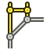

---
- GuiCommand:
   Name:TechDraw ExtensionCreateHorizChamferDimension
   MenuLocation:TechDraw → Extensions: Dimensions → Create horizontal chamfer dimension
   Workbenches:[TechDraw](TechDraw_Workbench.md)
   Shortcut:
   Version:0.20
   SeeAlso:[TechDraw ExtensionCreateVertChamferDimension](TechDraw_ExtensionCreateVertChamferDimension.md)
---

# TechDraw ExtensionCreateHorizChamferDimension

## Description

The  **TechDraw ExtensionCreateHorizChamferDimension** tool creates a horizontal chamfer dimension.

   
*On the right the created dimension*

## Usage

1.  Select two vertices in any order.
2.  There are several ways to invoke the tool:
    -   Press the ** [TechDraw ExtensionCreateHorizChamferDimension](TechDraw_ExtensionCreateHorizChamferDimension.md)** button.
    -   Select the **TechDraw → Extensions: Dimensions →  Create horizontal chamfer dimension** option from the menu.
3.  A chamfer dimension is created.

 {{TechDraw_Tools_navi}}

---
 [documentation index](../README.md) > [TechDraw](TechDraw_Workbench.md) > TechDraw ExtensionCreateHorizChamferDimension
