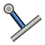

---
 GuiCommand:
   Name: TechDraw ExtensionLinePerpendicular
   MenuLocation: TechDraw , Extensions: Centerlines/Threading , Add Cosmetic Perpendicular Line
   Workbenches: TechDraw_Workbench
   Shortcut: 
   Version: 0.20
   SeeAlso: TechDraw_ExtensionLineParallel
---

# TechDraw ExtensionLinePerpendicular

## Description

The **TechDraw ExtensionLinePerpendicular** tool adds a cosmetic line perpendicular to another line through a vertex.

   
*On the right an added cosmetic perpendicular line*

## Usage

1.  Optionally specify the line attributes with the  [TechDraw ExtensionSelectLineAttributes](TechDraw_ExtensionSelectLineAttributes.md) tool.
2.  Select a straight edge to determine the direction and the length of the line.
3.  Select a vertex to determine the position of the line.
4.  There are several ways to invoke the tool:
    -   Press the ** [Add Cosmetic Perpendicular Line](TechDraw_ExtensionLinePerpendicular.md)** button.
    -   Select the **TechDraw → Extensions: Centerlines/Threading →  Add Cosmetic Perpendicular Line** option from the menu.
5.  A cosmetic line is added.

 {{TechDraw_Tools_navi}}

---
⏵ [documentation index](../README.md) > [TechDraw](TechDraw_Workbench.md) > TechDraw ExtensionLinePerpendicular
