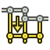

---
- GuiCommand:
   Name:TechDraw ExtensionPosHorizChainDimension
   MenuLocation:TechDraw → Extensions: Attributes/Modifications → Align horizontal dimensions
   Workbenches:[TechDraw](TechDraw_Workbench.md)
   Shortcut:
   Version:0.20
   SeeAlso:[TechDraw ExtensionPosVertChainDimension](TechDraw_ExtensionPosVertChainDimension.md), [TechDraw ExtensionPosObliqueChainDimension](TechDraw_ExtensionPosObliqueChainDimension.md)
---

# TechDraw ExtensionPosHorizChainDimension

## Description

The  **TechDraw ExtensionPosHorizChainDimension** tool aligns horizontal dimensions to create a chain dimension.

   
*On the right the aligned dimensions*

## Usage

1.  Select the first horizontal dimension. This dimension will not be moved, the dimensions that are added to the selection will be aligned with this dimension.
2.  Add one or more horizontal dimensions to the selection.
3.  There are several ways to invoke the tool:
    -   Press the ** [TechDraw ExtensionPosHorizChainDimension](TechDraw_ExtensionPosHorizChainDimension.md)** button.
    -   Select the **TechDraw → Extensions: Attributes/Modifications →  Align horizontal dimensions** option from the menu.
4.  The dimensions are aligned and their dimension texts are centered.

## Notes

-   The tool can also be used to center the dimension text of a single dimension.

 {{TechDraw_Tools_navi}}

---
 [documentation index](../README.md) > [TechDraw](TechDraw_Workbench.md) > TechDraw ExtensionPosHorizChainDimension
