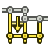

---
- GuiCommand:
   Name:TechDraw ExtensionPosObliqueChainDimension
   MenuLocation:TechDraw → Extensions: Attributes/Modifications → Align oblique dimensions
   Workbenches:[TechDraw](TechDraw_Workbench.md)
   Shortcut:
   Version:0.20
   SeeAlso:[TechDraw ExtensionPosHorizChainDimension](TechDraw_ExtensionPosHorizChainDimension.md), [TechDraw ExtensionPosVertChainDimension](TechDraw_ExtensionPosVertChainDimension.md)
---

# TechDraw ExtensionPosObliqueChainDimension

## Description

The  **TechDraw ExtensionPosObliqueChainDimension** tool aligns oblique dimensions to create a chain dimension.

   
*On the right the aligned dimensions*

## Usage

1.  Select the first oblique dimension. This dimension will not be moved, the dimensions that are added to the selection will be aligned with this dimension.
2.  Add one or more parallel oblique dimensions to the selection.
3.  There are several ways to invoke the tool:
    -   Press the ** [TechDraw ExtensionPosObliqueChainDimension](TechDraw_ExtensionPosObliqueChainDimension.md)** button.
    -   Select the **TechDraw → Extensions: Attributes/Modifications →  Align oblique dimensions** option from the menu.
4.  The dimensions are aligned and their dimension texts are centered.

## Notes

-   The tool can also be used to center the dimension text of a single dimension.

 {{TechDraw_Tools_navi}}

---
[documentation index](../README.md) > [TechDraw](TechDraw_Workbench.md) > TechDraw ExtensionPosObliqueChainDimension
