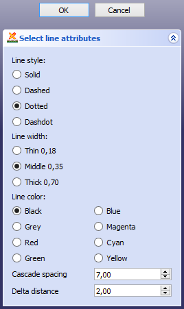

---
- GuiCommand   *
   Name   *TechDraw ExtensionSelectLineAttributes
   MenuLocation   *TechDraw → Extensions   * Attributes/Modifications → Select Line Attributes, Cascade Spacing and Delta Distance
   Workbenches   *[TechDraw](TechDraw_Workbench.md)
   Shortcut   *
   Version   *0.20
   SeeAlso   *[TechDraw ExtensionChangeLineAttributes](TechDraw_ExtensionChangeLineAttributes.md)
---

# TechDraw ExtensionSelectLineAttributes

## Description

The  **TechDraw ExtensionSelectLineAttributes** tool opens a dialog box where you can select the attributes (style, width and color) for new cosmetic lines and centerlines created with the [Extensions tools](TechDraw_Workbench#Extensions.md), and specify the cascade spacing and delta distance. The line attributes are also used by the [TechDraw ExtensionChangeLineAttributes](TechDraw_ExtensionChangeLineAttributes.md) tool.

   
*The Select line attributes task panel*

## Usage

1.  There are several ways to invoke the tool   *
    -   Press the ** [TechDraw ExtensionSelectLineAttributes](TechDraw_ExtensionSelectLineAttributes.md)** button.
    -   Select the **TechDraw → Extensions   * Attributes/Modifications →  Select Line Attributes, Cascade Spacing and Delta Distance** option from the menu.
2.  The **Select line attributes** task panel opens.
3.  Optionally change the **Line style**, the **Line width** and the **Line color**.
4.  Optionally change the **Cascade spacing**. The [Cascade Dimensions](TechDraw_Workbench#Attributes_and_modifications.md) tools and the [Create Coordinate Dimensions](TechDraw_Workbench#Dimensions_2.md) tools use this value.
5.  Optionally change the **Delta distance**. The  [TechDraw ExtensionExtendLine](TechDraw_ExtensionExtendLine.md) tool and  [TechDraw ExtensionShortenLine](TechDraw_ExtensionShortenLine.md) tool use this value.
6.  Press the **OK** button.

## Notes

-   The specified values will be used in the current FreeCAD session only.

 {{TechDraw_Tools_navi}}

---
 [documentation index](../README.md) > [TechDraw](TechDraw_Workbench.md) > TechDraw ExtensionSelectLineAttributes
