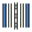

---
- GuiCommand:
   Name:TechDraw ExtensionThreadHoleSide
   MenuLocation:TechDraw → Extensions: Centerlines/Threading → Thread section hole
   Workbenches:[TechDraw](TechDraw_Workbench.md)
   Shortcut:
   Version:0.20
   SeeAlso:[TechDraw ExtensionThreadBoltSide](TechDraw_ExtensionThreadBoltSide.md)
---

# TechDraw ExtensionThreadHoleSide

## Description

The  **TechDraw ExtensionThreadHoleSide** tool adds a symbolic thread to the side view of a hole.

   
*On the right a hole with a symbolic thread*

## Usage

1.  Optionally change the current line attributes with the  [TechDraw ExtensionSelectLineAttributes](TechDraw_ExtensionSelectLineAttributes.md) tool.
2.  Select the two parallel lines of a hole.
3.  There are several ways to invoke the tool:
    -   Press the ** [TechDraw ExtensionThreadHoleSide](TechDraw_ExtensionThreadHoleSide.md)** button.
    -   Select the **TechDraw → Extensions: Centerlines/Threading →  Thread section Hole** option from the menu.
4.  A symbolic thread is added.

 {{TechDraw_Tools_navi}}

---
[documentation index](../README.md) > [TechDraw](TechDraw_Workbench.md) > TechDraw ExtensionThreadHoleSide
