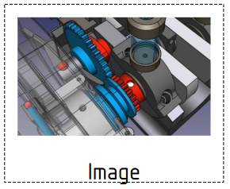

---
- GuiCommand:
   Name:TechDraw Image
   MenuLocation:TechDraw → Insert Bitmap Image
   Workbenches:[TechDraw](TechDraw_Workbench.md)
   SeeAlso:[TechDraw SVG Symbol](TechDraw_Symbol.md)
---

# TechDraw Image

## Description

The Image tool inserts a [bitmap](bitmap.md) image (PNG, TIFF, JPEG, etc.) from a file into the page as a view.

   
*Image inserted in the drawing page*

## Usage

1.  Press the ** [Insert Bitmap Image](TechDraw_Image.md)** button
2.  A file dialog will open. Select a location and file name.

## Properties

See also [TechDraw View](TechDraw_View#Properties.md).

### Data


{{TitleProperty|Image}}

-    **Image File|File**: The file containing this bitmap.

-    **Image Included|FileIncluded**: Embedded image file. System use only.

-    **Width|Float**: The width of the cropped image in mm. Only used if **Crop** is `True`.

-    **Height|Float**: The height of the cropped image in mm. Idem.

### View


{{TitleProperty|Image}}

-    **Crop|Bool**: Crop the image to **Width** x **Height**.

## Scripting

See also: [Autogenerated API documentation](https://freecad.github.io/SourceDoc/) and [FreeCAD Scripting Basics](FreeCAD_Scripting_Basics.md).

The Image tool can be used in [macros](Macros.md) and from the [Python](Python.md) console by using the following functions:

 
```python
dvi = FreeCAD.ActiveDocument.addObject('TechDraw::DrawViewImage','TestImage')
rc = page.addView(dvi)
dvi.ImageFile = "pathToMy/imageFile.png"
dvi.Height = 200
dvi.Width  = 200
```


 {{TechDraw Tools navi}}


---
 [documentation index](../README.md) > [TechDraw](TechDraw_Workbench.md) > TechDraw Image
