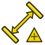

---
 GuiCommand:
   Name: TechDraw LandmarkDimension
   MenuLocation: TechDraw , Dimensions , Insert Landmark Dimension - EXPERIMENTAL
   Workbenches: TechDraw_Workbench
   Version: 0.19
   SeeAlso: TechDraw_HorizontalDimension, TechDraw_VerticalDimension
---

# TechDraw LandmarkDimension

## Description

The **TechDraw LandmarkDimension** tool adds a linear dimension to a View. The dimension is based on two point objects ([Draft Point](Draft_Point.md), [Part Point](Part_Point.md) or [PartDesign Point](PartDesign_Point.md) objects) from the 3D model.

The purpose of this tool is to provide a workaround to the corruption of dimensions caused by the \"[topological naming](Topological_naming_problem.md)\" issues. The source points should use [Expressions](Expressions.md) or other containing mechanisms to establish their position. Since the points are [Document Objects](App_DocumentObject.md), and not shape components, their name does not change with recomputes, and hence they are easily found.

See [TechDraw LengthDimension](TechDraw_LengthDimension#Limitation.md) for more on dimensions and topological naming.

## Usage

1.  Select two point objects in the [3D view](3D_view.md) or [Tree view](Tree_view.md).
2.  Add the correct TechDraw View to the selection by selecting it in the [Tree view](Tree_view.md).
3.  There are several ways to invoke the tool:
    -   Press the ** [Insert Landmark Dimension  - EXPERIMENTAL](TechDraw_LandmarkDimension.md)** button.
    -   Select the **TechDraw → Dimensions →  Insert Landmark Dimension  - EXPERIMENTAL** option from the menu.
4.  A dimension is added to the View.
5.  The dimension may be dragged to the desired position.
6.  If needed, add tolerances as described on [this page](TechDraw_Geometric_dimensioning_and_tolerancing#Tolerances.md).

### Change properties 

To change the properties of a dimension object either double-click it in the drawing or in the [Tree view](Tree_view.md). This will open the [Dimension dialog](TechDraw_LengthDimension#Dimension_dialog.md).

## Limitations

The Landmark Dimension tool is initially limited to \"Distance\" dimensions. Other types may be added if demand warrants.

## Notes

See [TechDraw LengthDimension](TechDraw_LengthDimension#Notes.md).

## Properties

See [TechDraw LengthDimension](TechDraw_LengthDimension#Properties.md).

## Scripting

See also: [Autogenerated API documentation](https://freecad.github.io/SourceDoc/) and [FreeCAD Scripting Basics](FreeCAD_Scripting_Basics.md).

The Landmark Dimension tool can be used in [macros](Macros.md) and from the [Python](Python.md) console by using the following functions:

 
```python
dim1 = FreeCAD.ActiveDocument.addObject("TechDraw::LandmarkDimension", "Landmark")
dim1.Type = "Distance"
dim1.References2D = [(TDView, "Vertex1")]
dim1.References3D = [(Point3d1, "Vertex1")]
dim1.References3D = [(Point3d2, "Vertex1")]
page.addView(dim1)
```


 {{TechDraw Tools navi}}


---
⏵ [documentation index](../README.md) > [TechDraw](TechDraw_Workbench.md) > TechDraw LandmarkDimension
