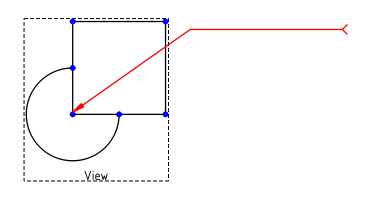

---
- GuiCommand:
   Name: TechDraw LeaderLine
   MenuLocation: TechDraw -> Add Lines -> Add Leaderline to View
   Workbenches: TechDraw_Workbench
   Version: 0.19
   SeeAlso: TechDraw_RichTextAnnotation, TechDraw_WeldSymbol
---

# TechDraw LeaderLine

## Description

The **TechDraw LeaderLine** tool adds a line to a View. Other annotation objects (such as [Rich Text Annotations](TechDraw_RichTextAnnotation.md)) can be connected to the leaderline to form complex annotations.

   
*Leaderline added to a View*

## Usage create 

1.  Select a View.
2.  There are several ways to invoke the tool:
    -   Press the ** [Add Leaderline to View](TechDraw_LeaderLine.md)** button.
    -   Select the **TechDraw → Add Lines →  Add Leaderline to View** option from the menu.
3.  A task panel opens.
4.  Press the **Pick points** button.
5.  Pick the first point on the page to define the start point of the line.
6.  Pick the next point on the page. Hold down **Ctrl** to snap to multiples of 22.5° angles. Optionally use a double-click instead of a single-click to finish entering points.
7.  Optionally add more points.
8.  If you have not double-clicked a point: press the **Save Points** button.
9.  Optionally change the **Start Symbol**, **End Symbol**, **Color**, **Width** and **Style** of the leader. See [Properties](#Properties.md) for more information.
10. Press the **OK** button.

## Usage edit 

1.  Double-click a Leaderline in the [Tree view](Tree_view.md).
2.  A task panel opens.
3.  To edit the points:
    1.  Press the **Edit points** button.
    2.  The Leaderline is marked with temporary nodes.
    3.  Drag one or more of the nodes to a new position.
    4.  Press the **Save changes** button.
4.  Optionally change the **Start Symbol**, **End Symbol**, **Color**, **Width** and **Style** of the leader. See [Properties](#Properties.md) for more information.
5.  Press the **OK** button.

## Notes

-   You cannot add or remove points from an existing Leaderline.
-   If no points were specified at creation time a short line is placed at the center of the View. There is no way to fix such a line, it should be deleted.
-   By default the **Leader Line Auto Horizontal** [preference](TechDraw_Preferences#Annotation.md) is checked. This means that the last line segment of new Leaderlines is drawn horizontally. If there is only one segment the result is then a single horizontal line.
-   You can turn off this auto horizontal feature for existing Leaderlines by changing their **Auto Horizontal** property.

## Properties

### Data


{{Properties_Title|Base}}

-    **Start Symbol|Enumeration**: The symbol at the start of the leaderline. Options:  Filled Arrow,  Open Arrow,  Tick,  Dot,  Open Circle,  Fork,  Filled Triangle, None.

-    **End Symbol|Enumeration**: The symbol at the end of the leaderline. Idem.

-    **X|Distance**: The X coordinate of the leaderline relative to the View.

-    **Y|Distance**: The Y coordinate of the leaderline relative to the View.


{{Properties_Title|Leader}}

-    **Leader Parent|Link**: The View the leaderline is attached to.

-    **Way Points|VectorList**: The points of the leaderline.

-    **Scalable|Bool**: Specifies if the leaderline scales with **Leader Parent**.

-    **Auto Horizontal|Bool**: Specifies if the last leaderline segment is forced to be horizontal.

### View


{{TitleProperty|Base}}

-    **Keep Label|Bool**: Not used.

-    **Stack Order|Integer**: Over or underlap relative to other drawing objects. <small>(v0.21)</small> 


{{TitleProperty|Line Format}}

-    **Color|Color**: The color of the leaderline.

-    **Line Style|Enumeration**: The style of the leaderline. Options: NoLine,  Continuous,  Dash,  Dot,  DashDot,  DashDotDot.

-    **Line Width|Length**: The width of the leaderline.

## Scripting

See also: [Autogenerated API documentation](https://freecad.github.io/SourceDoc/) and [FreeCAD Scripting Basics](FreeCAD_Scripting_Basics.md).

The LeaderLine tool can be used in [macros](Macros.md) and from the [Python](Python.md) console by using the following functions:

 
```python
myPage = FreeCAD.ActiveDocument().Page
myBase = FreeCAD.ActiveDocument().View
leaderObj = FreeCAD.ActiveDocument.addObject('TechDraw::DrawLeaderLine','DrawLeaderLine')
FreeCAD.activeDocument().myPage.addView(leaderObj)
FreeCAD.activeDocument().leaderObj.LeaderParent = myBase
#first waypoint is always (0,0,0)  
#rest of waypoints are positions relative to (0,0,0)
leaderObj.WayPoints = [p0,p1,p2]
leaderObj.X = 5
leaderObj.Y = 5
```


 {{TechDraw Tools navi}}


---
⏵ [documentation index](../README.md) > [TechDraw](TechDraw_Workbench.md) > TechDraw LeaderLine
