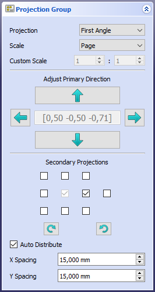

---
- GuiCommand:
   Name:TechDraw ProjectionGroup
   MenuLocation:TechDraw → Insert Projection Group
   Workbenches:[TechDraw](TechDraw_Workbench.md)
   SeeAlso:[TechDraw View](TechDraw_View.md), [TechDraw Section View](TechDraw_SectionView.md)
---

# TechDraw ProjectionGroup

## Description

The  [ProjectionGroup](TechDraw_ProjectionGroup.md) tool creates a [multiview projection](https://en.wikipedia.org/wiki/Multiview_projection) of one or more 3D objects. The isometric views of the 4 front corners can also be included.

If you only want to produce a single view, there is no advantage in using ProjectionGroup; you should then use [Insert View](TechDraw_View.md) instead. If you do not wish to use the traditional [first-](https://en.wikipedia.org/wiki/Multiview_orthographic_projection#First-angle_projection) / [third-angle projection](https://en.wikipedia.org/wiki/Multiview_orthographic_projection#Third-angle_projection), you should use multiple *Views* ([Insert View](TechDraw_View.md)) instead of *ProjectionGroup*.

   
*Three orthogonal views and one isometric view of a solid object*

## Usage

1.  Select one or more *Body* and/or *Part* objects in the 3D window or tree. If you have multiple drawing pages in your document, you will also need to select the desired page in the tree.
2.  Press the ** [Insert Projection Group](TechDraw_ProjectionGroup.md)** button.
3.  A dialog will open in which you can select which views should appear in the group, the group\'s scale and other parameters:

   *Projection Group [task panel](Task_panel.md). The central field indicates the current view direction with percentages of the x, y and z-axes.*

After you created the Projection Group you can move the group as a whole by dragging the central view. You can also move the projection views by dragging.

## Properties

-    **Anchor**: The central view in the group. Normally the Front view.

-    **ProjectionType**: \"First Angle\" or Third Angle\".

-    **AutoDistribute**: If true, space out individual views automatically. Use false to position manually.

-    **spacingX**: Horizontal space between views when automatically positioned. Note that Scale and the size of other views in the group also influence the spacing.

-    **spacingY**: Vertical space between views when automatically positioned.

The ProjectionGroup as a whole inherits X, Y, ScaleType, Scale and Rotation from the basic View.

Individual Views within the group inherit all part view properties, but the ProjectionGroup object controls the scale of all its member Views.

The RotationVector property of individual Views within the group is deprecated as of v0.19. Use XDirection instead.

Note that the central box displays the current projection direction of the primary view. It cannot be used to change the direction.

## Scripting


**See also:**

[TechDraw API](TechDraw_API.md) and [FreeCAD Scripting Basics](FreeCAD_Scripting_Basics.md).

The NewProjGroup tool can be used in [macros](Macros.md) and from the [Python](Python.md) console. A full script is available in the Source distribution in \"source-dir/src/Mod/TechDraw/TDTest/DProjGroupTest.py\".

 
```python
    #make a page
    print("making a page")
    page = FreeCAD.ActiveDocument.addObject('TechDraw::DrawPage','Page')
    FreeCAD.ActiveDocument.addObject('TechDraw::DrawSVGTemplate','Template')
    FreeCAD.ActiveDocument.Template.Template = templateFileSpec
    FreeCAD.ActiveDocument.Page.Template = FreeCAD.ActiveDocument.Template

    #make projection group
    group = FreeCAD.ActiveDocument.addObject('TechDraw::DrawProjGroup','ProjGroup')
    rc = page.addView(group)
    group.Source = [fusion]

    #add Front(Anchor) view
    frontView = group.addProjection("Front")               ##need an Anchor

    #update group
    group.Anchor.Direction = FreeCAD.Vector(0,0,1)
    group.Anchor.RotationVector = FreeCAD.Vector(1,0,0)

    #add more projections
    leftView = group.addProjection("Left")
    topView = group.addProjection("Top")
    rightView = group.addProjection("Right")
    rearView = group.addProjection("Rear")
    BottomView = group.addProjection("Bottom")

    #remove a view from projection group
    iv = group.removeProjection("Left")

``` Programming note: The Projection Group should always be added to the Page (ex. page.addView(group) before adding projections to the Group. This allows the Projection Group to use default parameter values derived from the parent page.


 {{TechDraw Tools navi}}

---
[documentation index](../README.md) > [TechDraw](TechDraw_Workbench.md) > TechDraw ProjectionGroup
