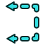

# TechDraw Section Examples
## Introduction

The  [TechDraw workbench](TechDraw_Workbench.md) has made a big step forward regarding the generation of **section views**. To not overload the reference pages, this page\'s intention is to give examples and supply proper naming for the performed tasks.

I\'m doing my best to find the correct terms, but since I\'m not an English native speaker, it\'s your turn to fix my mistakes if you find one.

## Sections

Sections are used to look inside an object to show details that are otherwise invisible or hard to recognize. Usually there are views in the drawing showing the object from at least 2 directions. If a section is provided its position and orientation is indicated with a section line in one of the views.

In FreeCAD it is not possible to directly draw a section line, FreeCAD relies on [task panel](Task_panel.md) inputs instead (see [Simple section](TechDraw_SectionView#Usage.md) and [Complex section](TechDraw_ComplexSection#Usage.md)).

## Example object 

This object has no use at all except to describe the different section representations.

   
*3 views and a 3D image of the object*

## Simple sections 

The  [Insert Section View](TechDraw_SectionView.md) tool creates a simple section that uses a single plane to cut through an object.

The tool requires a base view (**Base View** property) to position the section plane. The vertical axis of the section plane is always the normal of the base view and the horizontal axis of the section plane is parallel to the section line. Usually the section view is oriented with its horizontal axis also parallel to the section line. The angle between section line and the base view\'s horizontal axis is controlled by widgets in the **Set View Direction** area of the tool\'s task panel:

  

The **View Direction as Angle** combobox allows to set an arbitrary angle. The four buttons can be used to set predefined angles:

 90° (up),  270° (down),  180° (left),  0° (right)

### Horizontal section 

Section A-A (section up)

     
*Base View +  → Base View and Section A-A in its default position*

   
*Base View and Section A-A in its proper position*

Section B-B (section down)

     
*Base View +  → Base View and Section B-B in its default position*

   
*Base View and Section B-B in its proper position*

### Vertical section 

Section C-C (section left)

     
*Base View +  → Base View and Section C-C in its default position*

   
*Base View and Section C-C in its proper position*

Section D-D (section right)

     
*Base View +  → Base View and Section D-D in its default position*

   
*Base View and Section D-D in its proper position*

### Arbitrary section 

Section E-E (section at an arbitrary angle)

     
*Base View + "View Direction as Angle" set to {{Value|30°* → Base View and Section E-E in its default position}}

   
*Base View and Section E-E in its proper position*

By default the section plane goes through the center of gravity of the object. To get an offset section we need to change the values in the **Section Plane Location** area.

 

  
*Here the section line was moved 22 mm in the X and 14 mm in the Y direction (without proof that the line goes through the centers of the holes). The automatically generated Z value has no influence in this case.*

### Auxiliary view 

FreeCAD lacks a tool to derive auxiliary views from a base view, but  [Insert Section View](TechDraw_SectionView.md) can also handle that:

Using Section E-E from above and changing the mentioned values to X = {{Value|40 mm}} and Y = {{Value|-23 mm}} the section no longer cuts the object and becomes an auxiliary view instead. Note: be careful when changing the values, large steps can crash FreeCAD!

     
*Section E-E like in the example above + moved section line/plane → View E*

The label was edited. The section line and one arrow have to be hidden in following steps since a single arrow is enough to properly define an auxiliary view.

### Notes

-   Versions used:
    -   The examples have been created using weekly build 0.21 - 31155 with first angle and ISO selected.
    -   C-C, D-D, and E-E: The default Positions were updated to display the current default placement (weekly build 0.21 - 31709) (updated 2023-02-03).
-   On this occasion I realized that horizontal and vertical center lines are oriented according to the page but not the view and so cannot be used to align base and section view, as I would expect.
-   Applying an offset to a section line/plane is a bit complicated, because it can only be moved along global axes and not according to (local) view axes.

## Simple sections in praxis 

### Single Section 

If there is only one section view in the drawing, and it is plain to see that the object is cut along a center line, the section line, including the arrows, and the view title may be omitted.

    
*Both drawings are to standard*

### Internal section 

A section view may be integrated into the base view. This case doesn\'t require arrows and a title either.

  

## Complex sections 

The  [Insert Complex Section](TechDraw_ComplexSection.md) tool creates a complex section, such as an aligned section or an offset section, that uses more than one plane to cut an object.

The tool requires a base view (**Base View** property) to place several connected section planes to cut through the object, these are defined by a 3D polyline. (This tool can also handle curves, but curved sections are rather unusual.)

The vertical axes of the section planes are always parallel to the normal of the base view. Their horizontal axes are derived from the related segments of the 3D polyline. The orientation of the Section view depends on one of the 3D polyline\'s segments and is influenced by the widgets in the **Set View Direction** area of the tool\'s task panel:

   

This tool provides 3 options in the **Projection Strategy** combobox to handle the section line segments:

-    {{Value|Offset}}: only segments perpendicular to the view direction are displayed (default).

-    {{Value|Aligned}}: all segments are displayed in true length.

-    {{Value|NoParallel}}: all segments are projected along the same view direction. Depending on the angle between a segment and the view direction the projection may be shorter than the cut area. Segments parallel to the view direction result in a single line.

### Offset section 

An offset section starts with a base view plus a 3D polyline, a  [sketch](PartDesign_NewSketch.md) in this case.

       
*Base view + sketch + "Projection Strategy" set to {{Value|Offset* + "View Direction as Angle" set to {{Value|30°}} → Base View and Section G-G in its default position}}

The view direction angle must be set to a matching value to avoid unexpected results.

   
*Base View and Section G-G in its proper position*

### Aligned section 

An aligned section also starts with a base view and 3D polyline.

       
*Base view + sketch + "Projection Strategy" set to {{Value|Aligned* +  (or "View Direction as Angle" set to {{Value|0°}}) → Base View and Section H-H in its default position}}

The view direction angle can be set with  and  for a coarse orientation. It has to be guessed and set to a best matching value or the result may be unexpected.

   
*Base View and Section H-H if the "View Direction as Angle" is set to {{Value|30°* (parallel to the lower segment of the section line). The section has been moved to its proper position}}

If the view direction angle is set incorrectly the result may look like this:

   
*Arrows on either side of the section line result in a strange projection, "View Direction as Angle" is set to {{Value|90°*}}

### Auxiliary view 

The  [Insert Complex Section](TechDraw_ComplexSection.md) tool can, like the  [Insert Section View](TechDraw_SectionView.md) tool, create auxiliary views from base views:

An auxiliary view starts with a base view and a single 3D line placed outside the object.

       
*Base view + 3D line → View I*

The **View Direction as Angle** value has to be extracted from the 3D line manually. The label was edited. The section line and one arrow have to be hidden in following steps since a single arrow is enough to properly define an auxiliary view.

### NoParallel section 

A NoParallel section is a mixture of aligned and offset sections.

       
*Base view + sketch → Base View and Section K-K rotated -85° and moved*

The arrow direction should have been horizontal, but the tool did not work when the value of **View Direction as Angle** was set to {{Value|0°}}. So the sketch was rotated by 5° and said angle was set to {{Value|5°}} as well.

### Comparison NoParallel vs. Offset and Aligned 

   
*Base View and Section K-K in 3 versions: "Offset": blue hatching, "NoParallel": black hatching, "Aligned": red hatching*

For some reason if the value of **View Direction as Angle** of the aligned section is set to exactly {{Value|5°}} the result is faulty. Only after editing the section and accepting the strange value of {{Value|5.14°}} that the angle is somehow set to, is the correct result displayed.

   
*Same as above with "View Direction as Angle" set to {{Value|5°* exactly: the view direction of the second segment from the top is flipped (the shaft is visible)}}

### Complex one line sections 

The length (width) of a complex section depends on the length of the used 3D line, but the results differ from offset section to NoParallel section:

    
*Two sections based on the same 3D line. 
Left: The Offset section shows the segment between the arrows as a section while the rest of the object stays uncut. 
Right: The NoParallel section only shows the section between the arrows and omits the rest of the object.*

## Complex sections in praxis 

### Half section 

A view showing a symmetric object cut on one side of a center line and uncut on the other. The depth is usually defined by another center line.

     
*Left and center: Offset section view with and without section line arrows and title, both are to standard. 
Right: Offset section view based on an alternative section line, see section M-M above.*

### Notes 

-   Versions used:
    -   The examples have been created using weekly build 0.21 - 31155 with first angle and ISO selected.
    -   Weekly build 0.21 - 31340 for M-M.
-   The view direction (the orientation of the arrows) has to be determined manually.
-   All complex sections have to be rotated manually.
-   A **View Direction as Angle** value of {{Value|0°}} exactly does not work for offset sections. (180°, too?)
-   The **View Direction as Angle** will be reset to a strange value whenever a section view is activated for editing.

---
 [documentation index](../README.md) > [TechDraw](TechDraw_Workbench.md) > TechDraw Section Examples
