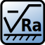

---
- GuiCommand:
   Name:TechDraw SurfaceFinishSymbol
   MenuLocation:TechDraw → Symbols → Create a Surface Finish Symbol
   Workbenches:[TechDraw](TechDraw_Workbench.md)
   Version:0.21
---

# TechDraw SurfaceFinishSymbol

## Description

The **TechDraw SurfaceFinishSymbol** tool adds a surface finish symbol to a page.

   
*The task panel with the ISO style selected. On the right the created symbol.*

   
*The task panel with the ASME style selected. On the right the created symbol.*

## Usage

1.  Select an existing view.
2.  There are several ways to invoke the tool:
    -   Press the ** [Create a Surface Finish Symbol](TechDraw_SurfaceFinishSymbol.md)** button.
    -   Select the **TechDraw → Symbols →  Create a Surface Finish Symbol** option from the menu.
3.  A task panel opens.
4.  Specify the required symbol by clicking one of the 6 symbol buttons.
5.  Optionally change the **Symbol angle**.
6.  Select the **ISO** or the **ASME** style.
7.  Select and/or enter the required attributes.
8.  Press the **OK** button.

 {{TechDraw Tools navi}}

---
 [documentation index](../README.md) > [TechDraw](TechDraw_Workbench.md) > TechDraw SurfaceFinishSymbol
