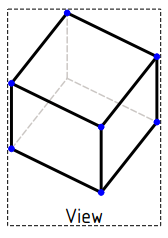

---
- GuiCommand:
   Name:TechDraw View
   MenuLocation:TechDraw → Insert View
   Workbenches:[TechDraw](TechDraw_Workbench.md)
   SeeAlso:[TechDraw Projection Group](TechDraw_ProjectionGroup.md), [TechDraw Section View](TechDraw_SectionView.md)
---

## Description

The View tool adds a representation of one or more objects to a Drawing page. This is the basic building block of the TechDraw workbench. Most other Views are derived in some way from NewView.

   *View of a solid box with hidden lines*

## Usage

1.  Select one or more objects (Body, App::Part, Part::Feature, Draft object, \... See Notes) in the [3D view](3D_view.md) or [Tree view](Tree_view.md).
2.  If you have multiple drawing pages in your document, you will also need to select the desired page in the tree. Use the **Ctrl** to select multiple items in the tree.
3.  Press the ** [Insert View](TechDraw_View.md)** button

View will try to draw anything with a `Shape` property. You can select [Draft](Draft_Workbench.md) objects and [PartDesign Bodies](PartDesign_Body.md) also. View will also extract any shapes from objects within an [App::Part](Std_Part.md) container or a [Group](Std_Group.md).

## Properties

### Data


{{TitleProperty|Base}}

-    **X**: The view\'s horizontal position on the page. (1)

-    **Y**: The view\'s vertical position on the page. (1)

-    **LockPosition**: Prevents Views from being dragged in the Gui when true. The View can still be moved by changing X,Y properties. (1)

-    **Rotation**: Counterclockwise rotation of the View on the page in degrees. (1)

-    **ScaleType**: \"Document\": use the Page\'s scale setting. \"Custom\": use a scale unique to this view. \"Automatic\": fit view to page. (1)

-    **Scale**: A view will be rendered on the page in Scale:1 ratio to the Source. (1)

-    **Caption**: Optional short text caption.


{{TitleProperty|Cosmetics}}


{{TitleProperty|HLR Parameters}}

-    **CoarseView**: If true, TechDraw will use a polygon approximation to calculate drawing geometry. If false, TechDraw will use a precision algorithm. CoarseView can be much faster for complex models. The quality of the drawing is reduced, since every curve is approximated as a series of short line segments. Vertices are not displayed in CoarseView since each short segment would result in two new Vertices and the display becomes cluttered. Linear Dimensions can be added to a CoarseView, but are unlikely to be useful.

:   
    **Note:**CoarseView is affected by an upstream bug in OCCT ([\#3332](https://www.freecadweb.org/tracker/view.php?id=3332)) which causes the View\'s position on the Page to be slightly off from the specified X,Y values.

-    **Smooth Visible**: Visible Smooth lines on/off.

-    **Seam Visible**: Visible Seam lines on/off.

-    **Iso Visible**: Visible Isometric(u,v) lines on/off.

-    **Hard Hidden**: Hidden lines on/off.

-    **Smooth Hidden**: Hidden Smooth lines on/off.

-    **Seam Hidden**: Hidden Seam lines on/off.

-    **Iso Hidden**: Hidden Isometric(u,v) lines on/off.

-    **Iso Count**: Number of Isometric(u,v) lines to draw on each face.


{{TitleProperty|Projection}}

-    **Source**: Links to the drawable objects to be depicted.

-    **XSource**: Links to the drawable objects in an external file. <small>(v0.19)</small> 

-    **Direction**: this vector controls the direction from which you are viewing the object. +X is right, -X is left, +Y is rear, -Y is front (looking into the screen), +Z is up and -Z is down. So a Front view is (0,-1,0) and an isometric view is (1,-1,1). (1)

-    **XDirection**: this vector controls the rotation of the view around the Direction. <small>(v0.19)</small> . (1)

-    **Perspective**: True for perspective projection, false for orthogonal projection.

-    **Focus**: Distance from camera to projection plane for perspective projections. Needs to be adjusted to fit the object. Too far and the perspective is lost, too close and the object is distorted.

\(1\) these properties are common to all View types.

### View

-    **Keep Label**: Always show View Label if true.

-    **LineWidth**: The thickness of visible lines. See [Line Groups](TechDraw_LineGroup.md).

-    **HiddenWidth**: The thickness of hidden lines, if enabled.

-    **IsoWidth**: The thickness of isometric(u,v) surface lines and Dimension lines.

-    **ExtraWidth**: not implemented yet.

-    **ShowCenters**: Circle/arc center marks on/off.

-    **CenterScale**: Circular arc center mark size adjustment, if enabled.

-    **HorizCenterLine**: Show a horizontal centerline through view.

-    **VertCenterLine**: Show a vertical centerline through view.

-    **ShowSectionLine**: Show/hide section line if applicable.

## Scripting


**See also:**

[TechDraw API](TechDraw_API.md) and [FreeCAD Scripting Basics](FreeCAD_Scripting_Basics.md).

The New View tool can be used in [macros](Macros.md) and from the [Python](Python.md) console by using the following functions:

 
```python
view = FreeCAD.ActiveDocument.addObject('TechDraw::DrawViewPart','View')
rc = page.addView(view)
FreeCAD.ActiveDocument.View.Source = [App.ActiveDocument.Box]
FreeCAD.ActiveDocument.View.Direction = (0.0,0.0,1.0)
```


 {{TechDraw Tools navi}}  
