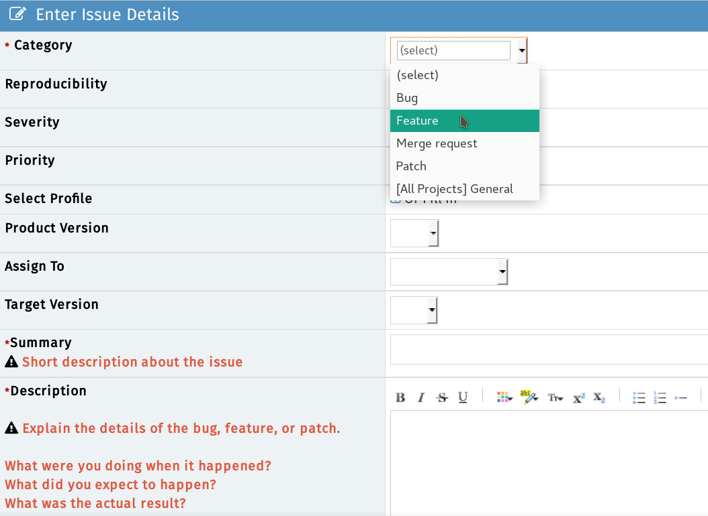

# Tracker
**In February 2022 FreeCAD bug tracking was migrated to [https://github.com/FreeCAD/FreeCAD/issues GitHub Issues]. The Mantis bug tracker described below is now in read-only mode.**

The [FreeCAD BugTracker](https://www.freecadweb.org/tracker) is the place toː report bugs, submit feature requests, patches, or request to merge your branch if you developed something using Git. The tracker is divided into \'Workbenches\', so please be specific and file your request in the appropriate subsection. In case of doubt, leave it in the \"FreeCAD\" section.

## Recommended Workflow 

As shown in the above flowchart, before creating tickets, please always first search the forums and bugtracker to discover if your issue is a known issue. This saves a lot of time/work for developers and volunteers that could be spending said time making FreeCAD even more awesome.

## Reporting bugs 

If you think you might have found a bug, you are welcome to report it as long as you have followed our step-by-step guidelinesː

-   Make sure you\'re using the most up to date version of FreeCAD. **NOTEː** your bug may be fixed in the Development (unstable) version. The average user runs the stable version of FC.
-   Make sure your bug is really a bug, that is, something that should be working but isn\'t. **Make sure the same bug hasn\'t been reported before by first searching the bugtracker and forum**.
    -   Rememberː if you aren\'t sure, please don\'t hesitate to explain your problem/bug in the [Help forum](http://forum.freecadweb.org/viewforum.php?f=3) and ask what to do.
    -   **Note**ː before posting to the forum please read the [Forum Guidelines](https://forum.freecadweb.org/viewtopic.php?f=3&t=2264).
-   Describe as clearly as possible the problem, and how it can be reproduced. If we can not verify the bug, we might not be able to fix it.
    -   This means **reporting in a clear, well-formatted, step-by-step fashion** so even an amateur user could reproduce.
    -   Recommendedː **Screenshots** of the bug are also very helpful to include. Windows users: please do not attach screen captures in Word or PDF format. Use the Windows Snipping tool to save your capture as a PNG image.
    -   Recommendedː Even better, an **Animated gif or Screencast** would also increase the likelihood of reproducing the issue.
-   **Add an example FreeCAD file** (.FCStd file) so devs/testers can quickly reproduce the bug.
    -   Please don\'t zip your \*.FCStd file, it is already zipped.
    -   File attachments are limited in size. If your \*.FCStd file is too big to attach, you can use an online storage service (many are free like Google Drive, Microsoft OneDrive, Dropbox).
-   Include all the information from the \"Copy to Clipboard\" button in the **Help (menu) -\> About FreeCAD** dialogue. Make sure your data includes your OCC or OCE version.
-   Please file one separate report for each bug.
-   If your bug causes a crash in FreeCAD and you\'re on a system that supports it you can try running a **debug backtrace** and attach said trace to the ticket. This can save devs a lot of time pinpointing the source of the crash. See [Debugging](Debugging.md) for more details.

## Requesting features 

If you want something to appear in FreeCAD that is not implemented yet, it is not a bug but a feature request.

1.  **IMPORTANTː** Before requesting a potential Feature Request **please be certain that you are the first one doing so by searching the forums and the bugtracker**. If you have concluded that there are no pre-existing tickets/discussions the next step is toː
2.  Start a forum thread to discuss your feature request with the community via the [Open Discussion forum](http://forum.freecadweb.org/viewforum.php?f=8).
3.  Once the community agrees that this is a valid Feature, you then can open a ticket on the tracker (file it under *feature request* instead of *bug*).

-   **NOTE \#1** To keep things organized please remember to link the forum thread URL into the ticket and the ticket number (as a link) in to the forum thread.
-   **NOTE \#2** Keep in mind there are no guarantees that your wish will be fulfilled.

## Submitting patches 

In case you have programmed a bug fix, an extension or something else that can be of public use in FreeCAD, submit your patch as a \"Pull Request\" at [GitHub](https://github.com/FreeCAD/FreeCAD).

1.  For a large, complex, or behavior-changing submission, open a forum thread in the [Developer subforum](https://forum.freecadweb.org/viewforum.php?f=10) to announce and discuss your patch. For small bugfixes this is not necessary.
2.  Submit your Pull Request (PR) to the [FreeCAD GitHub repo](http://github.com/FreeCAD/FreeCAD). The PR submission message will be pre-filled with a checklist for you to follow to ensure that your submission has the best chance at speedy acceptance. If you haven\'t worked with `git` before or are unfamiliar with submitting a PR to github, please read our introduction to [github](Source_code_management.md) wiki page.
3.  Be present for the discussion, both in the forum and in the GitHub pull request, so that your code can potentially be merged more effectively.

## Requesting merge 

(Same guidelines as [Submiting patches](https://www.freecadweb.org/wiki/Tracker#Submitting_patches))

If you have created a git branch containing changes that you would like to see merged into the FreeCAD code, you can ask there to have your branch reviewed and merged if the FreeCAD developers are OK with it. You must first publish your branch to a public git repository (github, gitlab, bitbucket, sourceforge etc\...) and then give the URL of your branch in your merge request.

## MantisBT Tips and Tricks 

### MantisBT Markup 

MantisBT (Mantis Bug Tracker) has it\'s own unique markup.

-   **@**mention - works just like on GitHub where if you prepend \'@\' to someone\'s username they will receive an email that they have been \'mentioned\' in a ticket thread

-   **\#**1234 - By adding a hash tag in front of a number a shortcut to link to another ticket within MantisBT will present.

    :   **Note**: if you hover over a ticket it will show you the summary + if the ticket is closed, it will be struck-through like \#1234.

-   **\~**5678 - a shortcut that links to a bug note within a ticket. This can be used to reference someone\'s response within the thread. Each person that posts will show a unique \~\#\#\#\# number next to their username. If you look at the image in the example, you see that the shortcut is referencing the *ticket number:comment number* of said ticket

-   **\<del\>\</del\>** - Using these tags will strikeout text.

-   **\<code\>\</code\>** - To present a line or block of code, use this tag and it will colorize and differentiate it elegantly.

### MantisBT BBCode 

In addition to the above [MantisBT Markup](Tracker#MantisBT_Markup.md) one also has the possibility to use BBCode format. For a comprehensive list see the [BBCode plus plugin page](https://github.com/mantisbt-plugins/BBCodePlus#supported-bbcode-tags). Here is a list of supported BBCode tagsː 
[img][/img] - Images
[url][/url] - Links
[email][/email] - Email addresses
[color=red][/color] - Colored text
[highlight=yellow][/highlight] - Highlighted text
[size][/size] - Font size
[list][/list] - Lists
[list=1][/list] - Numbered lists (number is starting number)
[*] - List items
[b][/b] - Bold
[u][/u] - underline
[i][/i] - Italic
[s][/s] - Strikethrough
[left][/left] - Left align
[center][/center] - Center
[right][/right] - Right align
[justify][/justify] - Justify
[hr] - Horizontal rule
[sub][/sub] - Subscript
[sup][/sup] - Superscript
[table][/table] - Table
[table=1][/table] - Table with border of specified width
[tr][/tr] - Table row
[td][/td] - Table column
[code][/code] - Code block
[code=sql][/code] - Code block with language definition
[code start=3][/code] - Code block with line numbers starting at number
[quote][/quote] - Quote by *someone* (no name)
[quote=name][/quote] - Quote by *name*

=== MantisBT \<=\> GitHub Markup === Below are special MantisBT Source-Integration plugin keywords which will link to the FreeCAD GitHub repo. See [GitHub and MantisBT](Tracker#GitHub_and_MantisBT.md).

-   **c:FreeCAD:git commit hash:** - **c** stands for \'commit\'. FreeCAD stands for the FreeCAD GitHub repo. \'git commit hash\' is the specific git commit hash to reference. Note: the trailing colon is necessary. Exampleː cːFreeCADː709d2f325db0490016807b8fa6f49d1c867b6bd8ː
-   **d:FreeCAD:git commit hash:** - similar to the above, **d** stands for \'diff\' which will provide a Diff view of the commit. Exampleː dːFreeCADː709d2f325db0490016807b8fa6f49d1c867b6bd8ː
-   **p:FreeCAD:pullrequest:** - similar to the above, **p** stands for Pull Request. Exampleː pːFreeCADː498ː

 

## GitHub and MantisBT 

The FreeCAD bugtracker has a plug-in called [Source Integration](https://github.com/mantisbt-plugins/source-integration) which essentially ties both the FreeCAD GitHub repo to our MantisBT tracker. It makes it easier to track and associate git commits with their respective MantisBT tickets. **The Source Integration plugin scans the git commit messages for specific keywords in order to execute the following actions:**

**Note** The below keywords need to be added in the git commit message and not the PR subject

### Remotely referencing a ticket 

Using this pattern will automagically associate a git commit to a ticket (**Note:** this will not close the ticket.) The format MantisBT will recognize:

-   bug \#1234
-   bugs \#1234, \#5678
-   issue \#1234
-   issues \#1234, \#5678
-   report \#1234
-   reports \#1234, \#5678

For the inquisitive here is the regex MantisBT uses for this operation:

### Remotely resolving a ticket 

The format MantisBT will recognize:

-   fix \#1234
-   fixed \#1234
-   fixes \#1234
-   fixed \#1234, \#5678
-   fixes \#1234, \#5678
-   resolve \#1234
-   resolved \#1234
-   resolves \#1234
-   resolved \#1234, \#5678
-   resolves \#1234, \#5678

For the inquisitive here is the regex MantisBT uses for this operation:

## Related

-   [Bug Triage](Bug_Triage.md)
-   [Source Code Management](Source_Code_Management.md)

---
 [documentation index](../README.md) > [Developer Documentation](Category_Developer Documentation.md) > [Administration](Category_Administration.md) > Tracker
