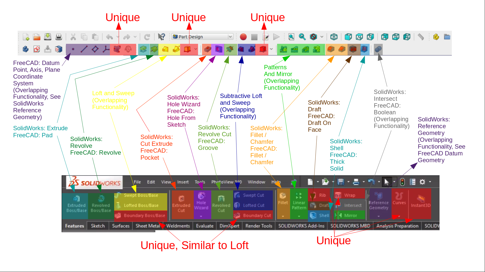

# Transitioning from Solidworks to FreeCAD
{{FYI}}

{{TOCright}}

## Overview

The intention of this page is to serve as a guide for users that are accustomed to the Solidworks CAD/CAM workflow and want to try, use, or perhaps migrate to FreeCAD.

## History

Understanding a little of the history of FreeCAD potentially help users comprehend and orient better to it.

-   FreeCAD was initially designed to behave parametrically using the [Constructive solid geometry](Constructive_solid_geometry.md) method (see also  [Part Workbench](Part_Workbench.md)).
-   Later it incorporated the [feature editing](feature_editing.md) method within the  [PartDesign Workbench](PartDesign_Workbench.md).
-   Solidworks utilizes the latter approach, [feature editing](feature_editing.md).

## Tips

The Part Design Workbench has many equivalent functions to SolidWorks, though may be called by different names. The image below identifies equivalent functions and their names on each platform, as well as noting similar functions and functions that are unique to each platform: 

## Terminology

-   **Extrude** in FreeCAD terms is referred to as Padding (see **_[Pad](PartDesign_Pad.md)**)

-   **Collinear relation** in FreeCAD is called **_[Tangent_constraint](Sketcher_ConstrainTangent.md)**

-    **_[Constrain_Point_on_Object](Sketcher_ConstrainPointOnObject.md)**
    

## Tutorials

List of helpful tutorials

### Joko Engineeringhelp 

There are many video tutorials online. One of the most popular (at the time this was written) is by a Youtuber calling himself [**Joko Engineeringhelp**](https://www.youtube.com/channel/UC-CubOaooNwC-3RBKUoAOQQ/videos) (he also participates on the FreeCAD Forum as Celica\_Supra ([profile link](https://forum.freecadweb.org/memberlist.php?mode=viewprofile&u=22176)). One of his tutorials is meant specifically for former SolidWorks users: <https://www.youtube.com/watch?v=7XXnulyKPNI> Some of the other videos are comparisons of SolidWorks and FreeCAD: <https://www.youtube.com/watch?v=RX8-3rMCbRw>

## Related

### Forum Threads 

-   [Anyone willing to collaborate on writing guides for users coming from other CAD/CAM solutions to FreeCAD?](https://forum.freecadweb.org/viewtopic.php?f=8&t=42139&p=366957#p357540)
-   [Extreme Difficulty coming from Autodesk Inventor 2019.](https://forum.freecadweb.org/viewtopic.php?f=3&t=42980#p366121)

---
 [documentation index](../README.md) > Transitioning from Solidworks to FreeCAD
