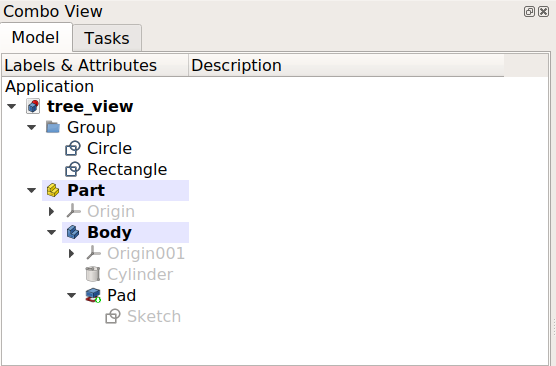

# Tree view
## Introduction

The [tree view](Tree_view.md) appears in the **Model** tab of the [combo view](Combo_view.md), one of the most important panels in the [interface](Interface.md); it shows all user defined objects that are part of a FreeCAD document. The tree view is a representation of the [document\'s structure](document_structure.md), and indicates what information is saved to disk.

These objects don\'t necessarily have to be geometrical shapes visible in the [3D view](3D_view.md), but can also be supporting data objects created with any of the [workbenches](Workbenches.md).

*The tree view showing various elements in the document.*

## Working with the tree view 

By default, whenever a new object is created, it is added to the end of the list in the tree view. The tree view allows managing the objects to keep them organized; it permits creating [groups](Std_Group.md), moving objects inside groups, moving groups inside other groups, renaming objects, copying objects, deleting objects, and other operations in the contextual menu (right click) which depend on the currently selected object and the currently active workbench.

Many operations create objects that are dependent on a previously existing object. In this case, the tree view shows this relationship by absorbing the older object inside the new object. Expanding and collapsing the objects in the tree view shows the parametric history of that object. Objects that are deeper inside others are older, while objects that are outside are newer, and are derived from the older objects. By modifying the interior objects, the parametric operations propagate all the way to the top, generating a new result.

 

*The topmost object is created by doing parametric operations on objects which themselves were created by previous operations. Expanding the tree many levels reveals the original elements that were used to create the partial solids.*

## Actions

**Note:**

expressions and link actions were added in version 0.19.

Since the tree view lists objects that may be visible in the [3D view](3D_view.md), many of the actions are the same to those that can be executed from the [3D view](3D_view.md).

When the application starts, the default [Start Workbench](Start_Workbench.md) is active, and no document has been created, right clicking on the [tree view](Tree_view.md) shows only one command:

-    **Expression actions**: [Copy selected](Std_Expressions.md), [Copy active document](Std_Expressions.md), [Copy all documents](Std_Expressions.md), Paste. These allow working with various documents, but are disabled if no document is present.

Once a new document has been created the following become active:

-    **Expression actions**: [Copy active document](Std_Expressions.md), [Copy all documents](Std_Expressions.md).

In addition, [Link](Std_LinkMake.md) actions are available.

-    **Link actions**: [Make Link](Std_LinkMake.md).

    -   
        **Make Link group**
        
        : [Simple group](Std_LinkMakeGroup.md), [Group with links](Std_LinkMakeGroup.md), [Group with transform links](Std_LinkMakeGroup.md).

### Selecting the document 

If you select the active document and right click, in addition to **Expression actions** and **Link actions**, the following commands appear:

-    **Show hidden items**: if active, the tree view will show hidden items.

-    **Search**: shows an input field to search objects inside the selected document.

-    **Close document**: closes the selected document by calling the application\'s `closeDocument()` method.

-    **Skip recomputes**: if active, the document\'s objects will not [recompute](Std_Refresh.md) automatically.

    -   
        **Allow partial recomputes**
        
        : if active, the document will allow [recompute](Std_Refresh.md) of only some objects.

-    **Mark to recompute**: marks all objects of the document as touched, and ready for [recompute](Std_Refresh.md).

-    **[Create group](Std_Group.md)**: creates a [group](Std_Group.md) in the selected document by using the document\'s `addObject()` method.

### Selecting objects 

Once objects are added to the document then in addition to the previous actions, right clicking on an empty part of the tree view will show additional commands; these depend on the type of object and the active workbench.

For example, with the [Draft Workbench](Draft_Workbench.md) active, first select an object, then right click on an empty place in the tree view:

-    **[Toggle visibility](Std_ToggleVisibility.md)**: makes the object visible or invisible in the [3D view](3D_view.md).

-    **[Show selection](Std_ShowSelection.md)**: makes the selected objects visible.

-    **[Hide selection](Std_HideSelection.md)**: makes the selected objects invisible.

-    **[Toggle selectability](Std_ToggleSelectability.md)**: makes the object no longer selectable in the [3D view](3D_view.md); use again this command to cancel its effect. It sets the object\'s `Selectable` attribute to `True` or `False`. Change the property by toggling **Selectable** in the [property editor](Property_editor.md).

-    **[Select all instances](Std_TreeSelectAllInstances.md)**: selects all instances of this object in the tree view.

-    **[Appearance](Std_SetAppearance.md)**: launches the dialog to change color and sizes of lines and vertices, and color of faces.

-    **[Random color](Std_RandomColor.md)**: assigns a random color to the object. It sets the object\'s `ShapeColor` attribute to a tuple `(r,g,b)` with tree random floats between 0 and 1. Change the property by modifying **Shape Color** in the [property editor](Property_editor.md).

-    **[Cut](Std_Cut.md)**: disabled if the right-click is not on the object.

-    **[Copy](Std_Copy.md)**: copies an object into memory.

-    **[Paste](Std_Paste.md)**: pastes the copied object into the document; the copy is added to the end of the tree view.

-    **[Delete](Std_Delete.md)**: removes the object from the document, and from the tree view, by calling the document\'s `removeObject()` method.

-    **Utilities**: **(optional)** additional contextual commands provided by the [Draft Workbench](Draft_Workbench.md).

If an object is selected, for example, a [Draft Line](Draft_Line.md), and a right click is made in the same object additional commands may be available:

-    **Transform**: launches the transform widget to move or rotate the object.

-    **Set colors**: sets the colors of the object.

-    **Flatten this wire**: **(Draft)** specific command for a [Draft Line](Draft_Line.md).

-    **Hide item**: if active, the selected object will be set as hidden.

-    **Mark to recompute**: marks the selected object as touched, and ready for [recompute](Std_Refresh.md).

-    **Recompute**: recomputes the selected object.

-    **Rename**: starts editing the name of the selected object. This allows changing the `Label` attribute, but not the `Name` attribute, as the latter is read-only.

## Overlay icons 

One or more smaller overlay icons can be displayed on top of an object\'s default icon in the tree view. The available overlay icons and their meaning are listed below. <small>(v0.19)</small> 

###  White check mark on blue background 

This indicates that the object has to be [recomputed](Std_Refresh.md), due to changes made to the model or because the user marked the object in the tree view context menu to be recomputed. In most cases recomputes are triggered automatically, but sometimes they are delayed for performance reasons.

###  White arrow on green background 

This indicates the so called [Tip](PartDesign_Body#Tip.md) of a body. It is usually the last feature in a [PartDesign Body](PartDesign_Body.md) and represents the whole body to the world outside of the body, e.g. when the body is exported or used in [Part boolean](Part_Boolean.md) operations. The tip can be changed by the user.

###  Purple chain link on white background 

This is typically shown for [sketches](Sketch.md), geometric primitives, such as box, cylinder, etc. and [Datum](Datum.md) geometry. It indicates that the object is not attached to anything. It has no Attachment Offset and gets its position and alignment solely from its [Placement](Placement.md) property.

There is a [Basic Attachment Tutorial](Basic_Attachment_Tutorial.md) explaining how to handle such objects.

###  Yellow X 

This is only used for [sketches](Sketch.md) and indicates that the sketch is not fully constrained. Inside of [Sketcher](Sketcher_Workbench.md) the number of remaining degrees of freedom is shown in the solver messages.

###  White exclamation mark on red background 

This indicates that the object has an error that needs to be fixed. After recomputing the whole document a tooltip describing the error is shown when you hover the mouse over the object in the tree view. Note: All other objects depending on an object in such an error state will not be properly recomputed, thus they may still show some old state.

 {{Interface navi}} {{Std Base navi}}

---
[documentation index](../README.md) > Tree view
