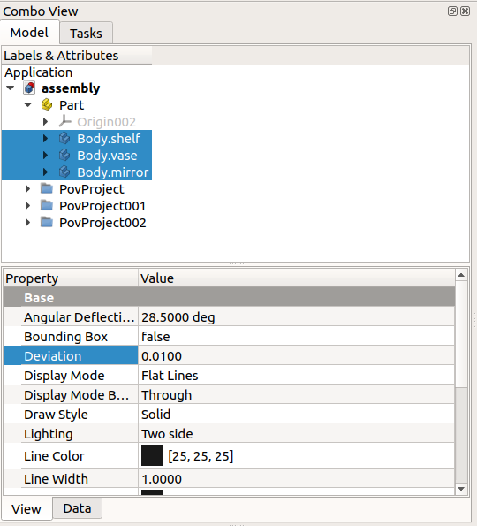

# Tutorial FreeCAD POV ray

 


**The [Raytracing workbench](Raytracing_Workbench.md) is being superseded by the new [https://github.com/FreeCAD/FreeCAD-render Render Workbench], which is intended as its replacement. The Render Workbench can be installed through the [Addon Manager](Std_AddonMgr.md). The information here is provided because by default FreeCAD is still shipped (as of 0.19-24276) with the Raytracing Workbench, and because the new workbench should basically work in the same way**


## Introduction

This tutorial shows how to produce a rendered image in FreeCAD, using the POV-Ray renderer. It assumes that the user already created a part or assembly in FreeCAD, or has imported one into it. It uses the [Raytracing Workbench](Raytracing_Workbench.md) to produce the file for rendering.

This tutorial is based on the forum post by schupin [FreeCAD / pov ray tutorial](https://forum.freecadweb.org/viewtopic.php?f=36&t=32745), which also includes one `.pov` file required to produce a rendering.

  


*align=center|Example by schupin of a 3D model and high quality render produced with FreeCAD and POV-Ray.*

The files used in this tutorial are in post \#8 [in the same thread](https://forum.freecadweb.org/viewtopic.php?f=36&t=32745#p305169).

## Basic setup 

Follow the basic workflow outlined in the [Raytracing Workbench](Raytracing_Workbench.md) documentation.

For direct rendering to work, the `povray` executable must be set in **Edit → Preferences → Raytracing → Render → POV-Ray executable**; set it to its location in your system, for example, `/usr/bin/povray`. Other options used by the renderer can be defined here as well, including the width `+W` and height `+H` of the image, and the use of antialiasing `+A`.

## Setup the .pov file 

1\. Create an assembly using bodies from the [Part](Part_Workbench.md) or [PartDesign Workbenches](PartDesign_Workbench.md), or any other workbench that produces solid objects, for example, the [Arch Workbench](Arch_Workbench.md). Assign colors or materials to the individual bodies that make the assembly, approximately matching the color that you want in your render.

  


*align=center|Assembly of three bodies created in FreeCAD, and with colors or materials assigned.*

2\. If your model is very detailed, make sure the **Deviation** of the body is set to a low value, between `0.1` and `0.01`, or even smaller. The lower this value is, the more detailed the exported mesh will be, and thus the better the quality of the render will be.




*align=center|Deviation property of the bodies created in FreeCAD; the deviation needs to be small in order to export the parts with good resolution.*

3\. Create a POV-Ray project by clicking ** [New](Raytracing_New.md)**. If the viewport is set as [orthographic](Std_OrthographicCamera.md), change it to [perspective](Std_PerspectiveCamera.md), as the renderer will normally work with a camera with perspective view. Using perspective view will allow you to see better the type of scene that will be rendered.

4\. Select all objects that you want to add to your scene, then select the created `PovProject` object, and click on ** [InsertPart](Raytracing_InsertPart.md)**.


**Note:**

beware of those objects that are not currently visible in the 3D viewport. If they are invisible but are included in the scene, they will still be rendered. On the other hand, if you really want to omit a body from being rendered, don\'t select it for inclusion into the POV-Ray project.


**Note 2:**

all objects in the POV-Ray project will have a name based on their internal FreeCAD name. It\'s important to note which is the POV-Ray name, as further options, for example, the material textures, will be assigned to these POV-Ray names.

5\. In the 3D viewport, zoom, pan and rotate the view to setup the scene as you want. Make sure the objects are centered in the viewport, then select the created `PovProject` object, and press ** [ResetCamera](Raytracing_ResetCamera.md)**.

6\. The POV-Ray file is now ready; it contains the selected objects and the camera information. Select the created `PovProject` object, and then press ** [ExportProject](Raytracing_ExportProject.md)** to save the `.pov` file.

7\. The created `.pov` file can now be rendered directly from FreeCAD. Select the created `PovProject` object, then press ** [Render](Raytracing_Render.md)**. When the popup image appears on screen, click on it so that it is sent to FreeCAD in its own window tab.

  


*align=center|First render of the assembly produced with POV-Ray, with the standard template written by the Raytracing Workbench.*

7.1. With the  
```python
povray assembly.pov +W800 +H600 +AM2 +A
```

The options `+WX +HY` set the horizontal and vertical pixel sizes of the final image.

The options `+AM2` (type 2, recursive super-sampling) and `+A` trigger antialiasing to produce a smoother image.

8\. By double clicking the `PovProject` object it\'s possible to see that it is using the `ProjectStd.pov` template; this template creates a basic `.pov` file which will produce a simple and dark image.

To improve the appearance of the image, use a better template. Double click the `PovProject` object and choose the `RadiosityNormal.pov` template. Then export a new `.pov` file, and run again the renderer. The image should look brighter and generally better.

  


*align=center|Render of the assembly produced with POV-Ray, with the RadiosityNormal template written by the Raytracing Workbench.*

Once again double click the   


*align=center|Render of the assembly produced with POV-Ray, with the RadiosityOutdoorHQ template written by the Raytracing Workbench.*

If the rendered image is good enough, then it can be saved, and there is nothing more to do. However, in order to control precisely the appearance of the materials and produce even better results, the `.pov` file needs to be edited manually.

In the following sections, we edit the basic `.pov` file produced with the `ProjectStd` template.

## Editing the .pov file 

9\. The `.pov` file generated by FreeCAD is a simple text file that can be opened with any editor. It loosely resembles a C++ source code file: directives start with a hash `#` and are terminated by a semi-colon `;`. Curly braces { } are used to limit section blocks, and indentation is arbitrary white space. Comments are indicated with a double slash `//`; block comments can be defined with a pair of `/*  */`, like in C.

The file may look complicated at first but 90% of its content is just mesh data that doesn\'t require many changes, as these meshes represent the geometry of the bodies that we want to render.

The file is structured as follows:

-   Includes
-   Global settings
-   Sky sphere
-   Planes
-   Finishes and textures
-   Camera
-   Mesh and body information
-   Light source

The camera information will not be touched, neither most information in the meshes. The main modifications will be made on the other sections.

As the meshes won\'t be heavily modified, the file can be re-organized so this information is at the end of the file.


<div class="toccolours mw-collapsible mw-collapsed">

This is the complete content of the `.pov` file, only without the meshes.


<div class="mw-collapsible-content">

 
```python
// Persistence of Vision Ray Tracer Scene Description File
// for FreeCAD (http://www.freecadweb.org)

#version 3.6;

#include "colors.inc"
#include "metals.inc"

// 

global_settings {
    assumed_gamma 1.0
    ambient_light color rgb <1.0,1.0,1.0>
    max_trace_level 20
}  

// 


sky_sphere {
  pigment {
    gradient y
    color_map {
      [0.0 rgb <0.6,0.7,1.0>]
      [0.7 rgb <0.0,0.1,0.8>]
    }
  }
}


// 

plane {
  y, -1
  texture { pigment {rgb <0.0,0.0,0.0>} finish {ambient 0.0 reflection 0.05 specular 0.0} }
}

// Standard finish
//#declare StdFinish = F_MetalA;
//#declare StdFinish = finish { diffuse 0.7 };
//#declare StdFinish = finish { phong 0.5 };
//#declare StdFinish = finish { ambient rgb <0.5,0.5,0.5> };
//#declare StdFinish = finish { crand 0.5 phong 0.9};
#declare StdFinish = finish { ambient 0.01 diffuse 0.9 phong 1.0 phong_size 70 metallic brilliance 1.5} ;

// declares position and view direction

// Generated by FreeCAD (http://www.freecadweb.org/)
#declare cam_location =  <-171.753,1229.11,-2667.08>;
#declare cam_look_at  = <636.959,359.955,160.296>;
#declare cam_sky      = <0.068217,0.958943,0.275273>;
#declare cam_angle    = 45; 
camera {
  location  cam_location
  look_at   cam_look_at
  sky       cam_sky
  angle     cam_angle 
  right x*800/600
}
// Written by FreeCAD http://www.freecadweb.org/
// face number1 +++++++++++++++++++++++++++++++++++++++++++++++++++++++++++++++++++++
// ... meshes should be defined here until the end of the file ...


//default light
light_source {
  cam_location + cam_angle * 100
  color rgb <10, 10, 10>
}
```


</div>


</div>

### Basic re-organization 

10\. Open the `.pov` file with a text editor, go to the end of the file, select and cut the `light_source` section, and paste it before the first `//face number1` line.

The resulting file should have the `camera` and `light_source` sections next to each other, for example

 
```python
// Generated by FreeCAD (http://www.freecadweb.org/)
#declare cam_location =  <-171.753,1229.11,-2667.08>;
#declare cam_look_at  = <636.959,359.955,160.296>;
#declare cam_sky      = <0.068217,0.958943,0.275273>;
#declare cam_angle    = 45; 
camera {
  location  cam_location
  look_at   cam_look_at
  sky       cam_sky
  angle     cam_angle 
  right x*800/600
}

//default light
light_source {
  cam_location + cam_angle * 100
  color rgb <10, 10, 10>
}
// Written by FreeCAD http://www.freecadweb.org/
// face number1 +++++++++++++++++++++++++++++++++++++++++++++++++++++++++++++++++++++
.
.
.
```

### Prepare lights 

11\. By default, the project file defines one light with a position and color.  
```python
light_source {
  cam_location + cam_angle * 100
  color rgb <10, 10, 10>
}
```

The position of the light is defined by a vector `<x, y, z>`. The `color` can be established like an `<r, g, b>` vector or it could also be a named color such as `White`. If the RGB values are given, they should be in the range `0.0` to `1.0` for the light to have normal brightness.

Like other objects, the light can be modified with many options. The `area_light` option creates a rectangular source, which is more realistic as it results in diffuse illumination that creates soft shadows. The `adaptive` keyword helps reduce the computation time of the light paths; the larger the value the more accurate the result will be; to avoid long rendering times you should use the smallest integer that gives an acceptable result (`1` or `2` is usually enough); to obtain the best result remove the keyword completely (long rendering time). The `jitter` keyword helps improve the shadows by randomly shifting the position of the lights. The keywords `circular` and `orient` turn the area light into a spherical source, which will produce better shadows when there are rounded objects in the scene. Including `fade_distance` and `fade_power` is helpful to attenuate the value of the light with distance, just like it happens with a real light source.

Set up the light coming from the right and above.  
```python
light_source {
    <1200, 1000, -1300>
    color White
    area_light <100, 0, 0>, <0, 0, 100>, 20, 20
    adaptive 1
    jitter
    circular orient
    fade_distance 1000 fade_power 2
}
```

If the light source is supposed to be in the scene, it may be useful to see a reference on the screen where this source should be. To this effect, create a sphere of a small radius and assume this sphere represents the light source; position the sphere where you want, then move the light very close to these coordinates, and test the lighting of the scene; when you are satisfied with the position of the light, simply delete the sphere.  
```python
sphere {
    <1200, 1000, -1200>, 10
    pigment { color White }
}
```

12\. The `sky_sphere` section is used to create a realistic sky background. It is commonly defined as a `gradient` and a `color_map` of at least two colors in order to produce a smooth transition from the color of the horizon to the color of the zenith of the scene.

 
```python
sky_sphere {
    pigment {
        gradient y
        color_map {
            [0.0 color Gray50]
            [0.7 color White]
        }
    }
}
```

  


*align=center|Starting from the standard template, render of the scene with POV-Ray, with the light source and sky sphere set up.*

### Prepare the body textures 

13\. The textures of each body need to be adjusted. This is the most time-consuming job of this process.

In the `.pov` file each body is described in this way

-   Face1, Face2, Face3, Face4, \...
-   Body (union of faces)
-   Object

A body mesh is defined by faces, and each face is defined by a series of triangular elements that themselves are defined by `vertex_vectors`, `normal_vectors`, and `face_indices`. This information doesn\'t need to be modified at all. Then, each body is defined as the union of the specified faces. Again, this information doesn\'t need modification.

Finally, each  
```python
// instance to render
object {Pov_Body
 texture {
      pigment {color rgb <0.827451,0.827451,0.431373>}
      finish {StdFinish } //definition on top of the project
  }
}
```

By searching the `.pov` file for the keyword `object`, it\'s possible to go directly to the desired part in the file, and modify its `texture` appropriately.

As indicated in the comment, the definition of  
```python
// Standard finish
//#declare StdFinish = F_MetalA;
//#declare StdFinish = finish { diffuse 0.7 };
//#declare StdFinish = finish { phong 0.5 };
//#declare StdFinish = finish { ambient rgb <0.5,0.5,0.5> };
//#declare StdFinish = finish { crand 0.5 phong 0.9};
#declare StdFinish = finish { ambient 0.01 diffuse 0.9 phong 1.0 phong_size 70 metallic brilliance 1.5} ;
```

In general, a `texture` is a container that describes a material; it includes information like the `pigment` (color or graphic), `normal` (how the color changes with the curvature of the surface), `finish` (interaction of the surface with the light), `pattern` (agate, brick, dents, leopard, radial, ripples, tiling, waves, wood, etc.), and other properties. There are many options that can be combined together to produce a texture. This mixing is not trivial, but there are many examples online to obtain the desired appearance of the material.

#### Material libraries 

14\. POV-Ray comes with an extensive library of materials that can be used by name. By default, the project template makes available some materials by using  
```python
#include "colors.inc"
#include "metals.inc"
```

The library `colors.inc` defines basic colors by name, `Red`, `Green`, `Blue`, `Yellow`, `Cyan`, `Magenta`, `Clear`, `White`, and `Black`. It also defines several other shades as well as functions to transform colors. The library `metals.inc` contains copper, silver, chrome, and brass textures, and `golds.inc` contains the gold textures.

The standard libraries are located in the installation directory of POV-ray, for example  
```python
/usr/share/povray-3.7/include/
```

#### New textures 

15\. For example, to create a mirror texture, the  
```python
#declare T_mirror = texture {
    finish { reflection {0.9} }
}
```

Alternatively, for metals, a predefined finish can be used.  
```python
#include "metals.inc"
#declare T_mirror = texture {
    finish { F_MetalE }
}
```

Then it can be assigned to the specific object.  
```python
object {Pov_Body002
    texture { T_mirror }
}
```

The  
```python
#include "woods.inc"
#declare T_wood = texture {
    T_Wood7
    scale 50.0
    translate x*1
    translate y*10
}
```

Then it is assigned to the specific object.  
```python
object {Pov_Body
    texture { T_wood }
}
```

The `glass.inc` library defines `F_Glass2` as a finish for transparent acrylic; it also defines `I_Glass` as an interior material which, together with the `caustics` option, is used to calculate as close as possible the effects of light passing through a transparent material. In this case, the `material` section is used, containing external (`texture`) and internal (`interior`) information of the material.

 
```python
#declare M_vase = material {
    texture {
        pigment { color rgbf <1.0, 0.73333, 0.0, 0.75> }
        finish { F_Glass2 }
    }
    interior { I_Glass caustics 1.0 }
}
```

Then it is assigned to the specific object.  
```python
object {Pov_Body001
    material { M_vase }
}
```

  


*align=center|Starting from the standard template, render of the scene with POV-Ray, with the light source and sky sphere set up, and materials assigned.*

### Prepare planes 

16\. If not provided by the original 3D model, planes can be added to simulate a floor or table top on which the objects are standing. More planes can be defined to serve as walls or other types of boundaries.

By default, a single plane is created. It is placed 1 millimeter below the model, so that it appears as a floor. The plane is assigned a basic texture that is black and slightly reflective.  
```python
plane {
  y, -1
  texture { pigment {rgb <0.0,0.0,0.0>} finish {ambient 0.0 reflection 0.05 specular 0.0} }
}
```

Notice that in POV-Ray the X axis is defined as horizontal (left-right), the Y axis is defined as vertical (up-down), and the Z axis is defined as depth (front-rear).

For a simple gray floor, that is barely reflective use  
```python
plane {
  y, -1
  texture { pigment {rgb <0.3, 0.3, 0.3>} finish {ambient 0.0 reflection 0.01 specular 0.0} }
}
```

  


*align=center|Starting from the standard template, render of the scene with POV-Ray, with the light source and sky sphere set up, materials assigned, and a floor plane with a basic gray texture.*

17\. The plane can be given a more complex appearance with the help of normals and material libraries.

Define a normal map that will be used to give the plane the appearance of a parquet floor.

 
```python
#declare Parquet_normal = normal {
    gradient z 2 slope_map { [0 <0,1>][0.05 <1,0>][0.95 <1,0>][1 <0,-1>] }
    scale 80
} ;
```

Then define the plane. As `pigment` use a wood `color_map` defined in `woods.inc`, and modify it with `turbulence` and `scale` so that the wood grain looks random. Then add the created normal, together with another normal; this will result in the texture of the parquet with slight imperfections. Then as `finish`, make it a little bit reflective and glossy.

 
```python
#include "woods.inc"
plane {
    y, -1
    pigment {
        wood color_map { M_Wood8A }
        turbulence 0.5 scale <10, 1, 1>*20
    }
    normal {
        average normal_map {
          [1 Parquet_normal]
          [1 wood 0.5 slope_map { [0 <0,0>][0.5 <0.5,1>][1 <1,0>] }
              turbulence 0.5 scale <10, 1, 1>*20]
        }
    }
    finish { ambient 0.0 reflection 0.1 specular 0.2 }
}
```

  


*align=center|Starting from the standard template, render of the scene with POV-Ray, with the light source and sky sphere set up, materials assigned, and a floor plane with a parquet texture.*

18\. Add a second plane, this time perpendicular to the Z direction, to serve as a backwall. Displace it just a little bit behind the model to avoid covering the mirror. Include the `stones.inc` library, add a generic granite texture, and scale it a bit. This will result in the appearance off a simple dry wall.

 
```python
#include "stones.inc"
plane {
    z, 10
    texture {
        T_Grnt1   
        scale 0.02
    }
}
```

A third plane can be added behind the position of the camera so that the mirror reflects a limited area between the two walls.

 
```python
#include "stones.inc"
plane {
    z, -3700
    texture {
        T_Grnt1   
        scale 0.02
    }
}
```

  


*align=center|Starting from the standard template, render of the scene with POV-Ray, with the light source and sky sphere set up, materials assigned, a floor plane with a parquet texture, and back walls with drywall textures.*

### Prepare the global settings, radiosity 

19\. The global settings define ambient light.

 
```python
global_settings {
    assumed_gamma 1.0
    ambient_light color rgb <1.0,1.0,1.0>
    max_trace_level 20
}
```

The `radiosity` property inside the `global_settings` controls the way POV-Ray computes diffuse light interactions between different objects. It\'s essential to adjust this property to obtain good rendering results.

Because it can be time consuming to test different `radiosity` settings you can use a variable `Rad_Quality` and a `#switch` statement to quickly set low, medium or high quality render settings. The higher the quality settings the more time is required to render an image.

 
```python
#declare Rad_Quality = 1;

global_settings {
    assumed_gamma 1.0
    ambient_light color rgb <1.0,1.0,1.0>
    max_trace_level 20

#switch (Rad_Quality)
 #case (1)
    radiosity { // Settings 1 (fast)
        pretrace_start 0.08
        pretrace_end   0.02
        count 50
        error_bound 0.5
        recursion_limit 1
    }
    #break
 #case (2)
    radiosity { // Settings 2 (medium quality)
        pretrace_start 0.08
        pretrace_end   0.01
        count 120
        error_bound 0.25
        recursion_limit 1
    }
    #break
 #case (3)
    radiosity { // Settings 3 (high quality)
        pretrace_start 0.08
        pretrace_end   0.005
        count 400
        error_bound 0.1
        recursion_limit 2
    }
    #break
#end
}
```

  


*align=center|Starting from the standard template, render of the scene with POV-Ray, with the light source and sky sphere set up, materials assigned, a floor plane with a parquet texture, and back walls with drywall textures. Radiosity settings for fast rendering.*

20\. The  
```python
#include "rad_def.inc"
global_settings {
    radiosity {
        Rad_Settings(Setting, Normal, Media)
    }
}
```

The  
```python
Radiosity_Default
Radiosity_Debug
Radiosity_Fast
Radiosity_Normal
Radiosity_2Bounce
Radiosity_Final
Radiosity_OutdoorLQ
Radiosity_OutdoorHQ
Radiosity_OutdoorLight
Radiosity_IndoorLQ
Radiosity_IndoorHQ
```

The `Normal` and `Media` values are either `off` or `on`.

Therefore, to test different settings, the `#switch` statement could also be written like in the following.

 
```python
#declare Rad_Quality = 3;

global_settings {
    assumed_gamma 1.0
    ambient_light color rgb <1.0,1.0,1.0>
    max_trace_level 20

#switch (Rad_Quality)
 #case (1)
    radiosity { // Settings 1 (fast)
        Rad_Settings(Radiosity_Fast, off, off)
    }
    #break
 #case (2)
    radiosity { // Settings 2 (medium quality)
        Rad_Settings(Radiosity_2Bounce, on, on)
    }
    #break
 #case (3)
    radiosity{ // Settings 3 (high quality)
        Rad_Settings(Radiosity_Final, on, on)
        recursion_limit 2
    }
    #break
#end
}
```

The exact values used by these presets can be found in the  
```python
/usr/share/povray-3.7/include/
```

The [Raytracing Workbench](Raytracing_Workbench.md) has three default templates:

-    `ProjectStd.pov`, it doesn\'t use `radiosity` at all.

-    `RadiosityNormal.pov`, it uses the preset `Radiosity_Normal`.

-    `RadiosityOutdoorHQ.pov`, it uses the preset `Radiosity_OutdoorHQ`.

## Final render 

21\. The edited `.pov` file can be saved when all adjustments have been done.

The final structure is as follows:

-   Includes, with additional libraries
-   Global settings, with radiosity parameters
-   Sky sphere, with lighter color
-   Planes, positioned and with textures
-   Finishes and textures, with custom definitions
-   Camera, not changed
-   Light source, with additional properties
-   Mesh and body information, using the textures defined previously


**Note:**

the sections of the `.pov` file can be in any order, although it is probably easier to work with the file if the mesh information is at the end.

The final rendering can be done by clicking ** [Render](Raytracing_Render.md)** or by running the executable from the command line.

 
```python
povray assembly.pov +W800 +H600 +AM2 +A
```

  


*align=center|Starting from the standard template, render of the scene with POV-Ray, with the light source and sky sphere set up, materials assigned, a floor plane with a parquet texture, and back walls with drywall textures. Radiosity settings for high quality result: `Radiosity_Final* and {{incode|recursion_limit 2`.}}


<div class="toccolours mw-collapsible mw-collapsed">

This is the complete content of the `.pov` file, only without the last section, that is, without the meshes.


<div class="mw-collapsible-content">

 
```python
// Persistence of Vision Ray Tracer Scene Description File
// for FreeCAD (http://www.freecadweb.org)

#version 3.6;

#include "colors.inc"
#include "metals.inc"
#include "woods.inc"
#include "glass.inc"
#include "stones.inc"
#include "rad_def.inc"

// 
#declare Rad_Quality = 3;

global_settings {
    assumed_gamma 1.0
    ambient_light color rgb <1.0,1.0,1.0>
    max_trace_level 20

#switch (Rad_Quality)
 #case (1)
    radiosity { // Settings 1 (fast)
        Rad_Settings(Radiosity_Fast, off, off)
    }
    #break
 #case (2)
    radiosity { // Settings 2 (medium quality)
        Rad_Settings(Radiosity_2Bounce, on, on)
    }
    #break
 #case (3)
    radiosity{ // Settings 3 (high quality)
        Rad_Settings(Radiosity_Final, on, on)
        recursion_limit 2
    }
    #break
#end
}

// 


sky_sphere {
    pigment {
        gradient y
        color_map {
            [0.0 color Gray50]
            [0.7 color White]
        }
    }
}


// 

#declare Parquet_normal = normal {
    gradient z 2 slope_map { [0 <0,1>][0.05 <1,0>][0.95 <1,0>][1 <0,-1>] }
    scale 80
} ;

// Floor
plane {
    y, -1
    pigment {
        wood color_map { M_Wood8A }
        turbulence 0.5 scale <10, 1, 1>*20
    }
    normal {
        average normal_map {
          [1 Parquet_normal]
          [1 wood 0.5 slope_map { [0 <0,0>][0.5 <0.5,1>][1 <1,0>] }
              turbulence 0.5 scale <10, 1, 1>*20]
        }
    }
    finish { ambient 0.0 reflection 0.1 specular 0.2 }
}

// Back wall
plane {
    z, 10
    texture {
        T_Grnt1   
        scale 0.02
    }
}

// Behind camera wall
plane {
    z, -3700
    texture {
        T_Grnt1   
        scale 0.02
    }
}

#declare T_mirror = texture {
    finish { reflection {0.9} }
//    finish { F_MetalE }
}

#declare T_wood = texture {
    T_Wood7
    scale 50.0
    translate x*1
    translate y*10
}

#declare M_vase = material {
    texture {
        pigment { color rgbf <1.0, 0.73333, 0.0, 0.75> }
        finish { F_Glass2 }
    }
    interior { I_Glass caustics 1.0 }
}
// declares position and view direction

// Generated by FreeCAD (http://www.freecadweb.org/)
#declare cam_location =  <-171.753,1229.11,-2667.08>;
#declare cam_look_at  = <636.959,359.955,160.296>;
#declare cam_sky      = <0.068217,0.958943,0.275273>;
#declare cam_angle    = 45; 
camera {
  location  cam_location
  look_at   cam_look_at
  sky       cam_sky
  angle     cam_angle 
  right x*800/600
}
//default light
light_source {
    <1200, 1000, -1300>
    color White
    area_light <100, 0, 0>, <0, 0, 100>, 20, 20
    adaptive 1
    jitter
    circular orient
    fade_distance 1000 fade_power 2
}
// Written by FreeCAD http://www.freecadweb.org/
// face number1 +++++++++++++++++++++++++++++++++++++++++++++++++++++++++++++++++++++
// ... meshes should be defined here until the end of the file ...
```


</div>


</div>

## Final notes 

POV-Ray is a relatively old piece of software, first released in the early 1990s. Its main advantages over more modern software are

-   it is a tested solution that has existed for many years
-   runs in many operating systems
-   the scene can be set with only one text file
-   requires simple computational resources to produce a high quality image, so it works even in relatively old hardware

The user is advised to read the POV-Ray documentation and more tutorials or examples in order to get the right settings for his or her needs.

-   [POV-Ray for Unix version 3.7](http://www.povray.org/documentation/3.7.0/index.html)
-   [POV-Ray Tutorial](http://www.povray.org/documentation/3.7.0/t2_0.html)
-   [POV-Ray Reference](http://www.povray.org/documentation/3.7.0/r3_0.html)

  {{Raytracing Tools navi}}


---
 [documentation index](../README.md) > [Tutorials](Category_Tutorials.md) > [Raytracing](Category_Raytracing.md) > Tutorial FreeCAD POV ray
