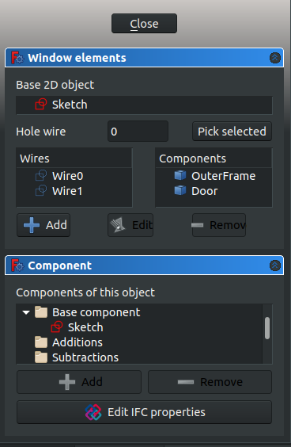
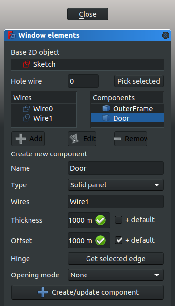
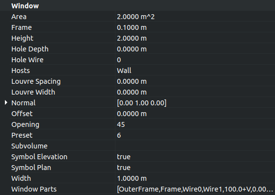

# Tutorial for open windows

 

## Introduction

This tutorial shows how to place [Arch Windows](Arch_Window.md) and Doors in a building model, how to display them as open in the 3D view, and how to create a 2D drawing (plan and elevation projection) for the model. It uses the [Draft Workbench](Draft_Workbench.md), the [Arch Workbench](Arch_Workbench.md), and the [TechDraw Workbench](TechDraw_Workbench.md).

Common tools used are: [Draft Grid](Draft_Snap_Grid.md), [Draft Snap](Draft_Snap.md), [Draft Wire](Draft_Wire.md), [Arch Wall](Arch_Wall.md), [Arch Window](Arch_Window.md), [Arch SectionPlane](Arch_SectionPlane.md), and [TechDraw ArchView](TechDraw_ArchView.md).

See also the following page for some videos on how to work with windows and doors.

-   [The workbench used to create architectural projects is called Arch](http://help-freecad-jpg87.fr/04_arch_ind.php)

## Setup

1\. Open FreeCAD, create a new empty document, and switch to the [Arch Workbench](Arch_Workbench.md).

2\. Make sure your units are set correctly in the menu **Edit → Preferences → General → Units**. For example, `MKS (m/kg/s/degree)` is good for dealing with distances in a typical building; moreover, set the number of decimals to `4`, to consider even the smallest fractions of a meter.

3\. Use the [Draft ToggleGrid](Draft_ToggleGrid.md) button to show a grid with enough resolution. You can change the grid appearance in the menu **Edit → Preferences → Draft → Grid and snapping → Grid**. Set lines at every `50 mm`, with major lines every `20` lines (every meter), and `1000 lines` in total (the grid covers an area of 50 m x 50 m).

4\. [Zoom out](Std_ViewZoomOut.md) of the 3D view if you are too close to the grid.

Now we are ready to create a simple building with closed walls, two doors and two windows.

## Placing a wall 

5\. Use the [Draft Wire](Draft_Wire.md) tool to create a closed wire. Go counterclockwise.

:   5.1. First point in (0, 0, 0); in the dialog enter **0** **m** **Enter**, **0** **m** **Enter**, **0** **m** **Enter**.
:   5.2. Second point in (3, 0, 0). Press **X** to constrain the movement to the X axis; enter the value **3** **m** **Enter**.
:   5.3. Third point in (3, 4, 0). Press **Y** to constrain the movement to the Y axis; enter the value **4** **m** **Enter**.
:   5.4. Fourth point in (0, 4, 0). Press **X** to constrain the movement to the X axis; enter the value **-** **3** **m** **Enter**.
:   5.5. Press **O** to close the Wire, and close the tool.
:   5.6. In the number pad press **0** to get an [axonometric view](Std_ViewIsometric.md) of the model.
:   
    **Note:**the points can also be defined with the mouse pointer by choosing intersections on the grid, with the help of the [Draft Snap](Draft_Snap.md) toolbar and the [Draft Grid](Draft_Snap_Grid.md) method.

6\. Select the `DWire` and change the property **Make Face** to `False`.

7\. Select the `DWire` and click the [Arch Wall](Arch_Wall.md) tool; the Wall is immediately created with a default width (thickness) of 0.2 m, and height of 3 m.

:   
    **Note:**if the property **Make Face** of `DWire` is `True`, this step would create a solid block, instead of using only the contour of `DWire`.

   
*align=center|Base wire for the wall; it is a closed wire that doesn't make a face*

   
*align=center|Wall constructed from the wire*

## Placing doors and windows 

8\. Click the [Arch Window](Arch_Window.md) tool; as preset select `Simple door`, and change the height to 2 m.

:   8.1. Change the snapping to [Draft Midpoint](Draft_Snap_Midpoint.md), and try selecting the bottom edge of the frontal wall; rotate the [standard view](Std_View_Menu.md) as necessary to help you pick the edge and not the wall face; when the midpoint is active, click to place the door.
:   8.2. Click the [Arch Window](Arch_Window.md) tool again, and place another door, but this time in the midpoint of the rear wall; rotate the [standard view](Std_View_Menu.md) as necessary.

   
*align=center|Snapping to the midpoint of the bottom edge of the wall to place the door*

9\. Click the [Arch Window](Arch_Window.md) tool; as preset select `Open 1-pane`, and change the `Sill height` to 1 m.

:   9.1. Keep the snapping to [Draft Midpoint](Draft_Snap_Midpoint.md), and try selecting the lower edge of the left side wall; rotate the [standard view](Std_View_Menu.md) as necessary to help you pick the edge and not the wall face; when the midpoint is active, click to place the window.

:   
    **Note:**the `Sill height` is the distance from the floor to the lower edge of the element. For doors the `Sill height` is usually 0 m as doors are normally touching the floor; on the other hand, windows have a usual separation of 0.5 m to 1.5 m from the floor.

:   9.2. Click the [Arch Window](Arch_Window.md) tool again, and place another window, but this time in the midpoint of the right wall; rotate the [standard view](Std_View_Menu.md) as necessary. This time make the window\'s width (length) 1.5 m, and again make the `Sill height` 1 m.

   
*align=center|Snapping to the midpoint of the bottom edge of the wall to place the window*

:   
    **Note:**the `Sill height` parameter can only be set when initially creating the window with a preset. Once the window is inserted, modify its placement by editing the **Position** vector `[x, y, z]` of the underlying [Sketcher Sketch](Sketcher_Workbench.md).

:   9.3. Move the `Window001` a bit higher. Select the underlying `Sketch003`, and change its **Position** from `[3.1 m, 2.0 m, 1.0 m]` to `[3.1 m, 2.0 m, 1.6 m]`. The entire `Window001` should move up. The wall may still show an opening in the previous position; if this happens, right click the `Wall` element, select `Mark to recompute`, and then press **Ctrl**+**R** to [recompute](recompute.md) the model.

   
*align=center|Wall built with doors and windows*

**Note:**

when placing a window or a door with a preset, hover the element over the [Arch Wall](Arch_Wall.md), and wait for the element to rotate so that it is parallel to that wall. Aim for the bottom edge of the wall, and use the `Sill height` to adjust the distance from the floor. If this is difficult, use the [Draft Near](Draft_Snap_Near.md) snapping mode of the [Draft Snap](Draft_Snap.md) toolbar to insert the element anywhere on the face of the wall, and then adjust its **Position** manually as described above. Having many [Draft Snap](Draft_Snap.md) modes active at the same time may cause issues with placing the element, so try with only one option at a time.

**Note 2:**

occasionally the window may be placed outside the [Arch Wall](Arch_Wall.md); as long as the element is parallel to that wall, you should be able to correct the position manually.

## Opening the doors 

10\. In the tree view select `Sketch` underlying `Door`, and press **Space**, or change the property **Visibility** to `True`

11\. Double click `Door` in the tree view to start editing it.

:   11.1. Inside the `Window elements` frame there are two panes, `Wires` and `Components`.
:   
    **Note:**with a simple door preset there are two wires, `Wire0` and `Wire1`, and two components, `OuterFrame` and `Door`. A custom designed [Arch Door](Arch_Door.md) may have more wires and components.

:   11.2. Click on `Door`, and click the **Edit** button. This shows the properties of the `Door` component like `Name`, `Type`, `Wires`, `Thickness`, `Offset`, `Hinge`, and `Opening mode`.
:   11.3. In the 3D view, select only one vertical edge in the visible sketch of the door, then click the **Get selected edge** button. The button should change to an edge name, for example, **Edge8**.
:   11.4. Change the `Opening mode` to **Arc 90**, or any other option.
:   11.5. Click the **+Create/update component** button, and then **Close** to finish editing the door. The sketch may become hidden again.

 
*align=center|Dialog to edit a window or a door*

 
*align=center|Dialog to edit the components that make a window or a door*

   
*align=center|Vertical edge of sketch selected as hinge for a door*

12\. Select `Door`, and give the property **Opening** a value of 45. The solid panel of the door should open to the inside of the building.

13\. Select `Door`, and change the property **Symbol Elevation** to `True`; the tip of the created wire indicates which side of the door opens; this is easier to see if the viewport changes to [front view](Std_ViewFront.md). Change the property **Symbol Plan** to `True`; a circular arc should indicate the extent of the door\'s swing; this is easier to see if the viewport changes to [top view](Std_ViewTop.md).

14\. Repeat the steps with `Door001` and the underlying `Sketch001` to make the door open 75 degrees to the inside of the building. Also enable the elevation and plan symbols.

 
*align=center|Property view of the door to change Opening value, Symbol elevation, Symbol plan, and other options*

   
*align=center|Door with opening elevation symbol, front view*

   
*align=center|Door with plan symbol, top view*

## Opening the windows 

15\. In the tree view select `Sketch002` underlying `Window`, and press **Space**, or change the property **Visibility** to `True`.

16\. Double click `Window` in the tree view to start editing it.

:   16.1. Click on the `InnerFrame` component, and click the **Edit** button.

:   16.2. In the 3D view, select only one vertical edge of `Sketch002`. The wires representing `OuterFrame` and the `InnerFrame` are very close to each other, so [zoom in](Std_ViewZoomIn.md) as close as possible to the sketch to select the appropriate wire. Then click the **Get selected edge** button. The button should change to an edge name, for example, **Edge12**.
:   
    **Note:**when there are many solids on the screen that it becomes difficult to select only one edge, switch to [wireframe mode](Std_DrawStyle#Wireframe.md) to remove the faces of those solid objects, and see only the wires, edges, and contours.

:   16.3. Change the `Opening mode` to `Arc 90 inv`, or any other option.

17\. Select `Window`, and give the property **Opening** a value of 45. The inner frame containing the transparent glass should open to the inside of the building.

18\. Select `Window`, and change the property **Symbol Elevation** to `True`; the tip of the created wire indicates which side of the window opens; this is easier to see if the viewport changes to [left side view](Std_ViewLeft.md). Change the property **Symbol Plan** to `True`; a circular arc should indicate the extent of the window\'s swing; this is easier to see if the viewport changes to [top view](Std_ViewTop.md).

19\. Repeat the steps with    
*align=center|Horizontal edge of sketch selected as hinge for a window*

   
*align=center|Elevation and plan symbols for all elements, axonometric view*

   
*align=center|Elevation and plan symbols for all elements, top view*

## Making a floor plan of the building 

20\. Still in the [Arch Workbench](Arch_Workbench.md), select all components in the tree view, the [Arch Wall](Arch_Wall.md), the two [Arch Windows](Arch_Window.md), and the two [Arch Doors](Arch_Door.md), then use the [Arch SectionPlane](Arch_SectionPlane.md) tool to create a `Section` element.

**Note:**

change the property **Arrow size** of the section plane to a larger value, for example, `200 mm`, so that the direction of the section is clearly visible in the 3D viewport.

   
*align=center|Section plane cutting through solid objects, including walls, doors, and windows*

21\. Change to the [TechDraw Workbench](TechDraw_Workbench.md) and insert a new page with the [TechDraw PageDefault](TechDraw_PageDefault.md) tool; a new `Page` object is created, and the view switches to this page. The page inserted is a standard A4 sheet in landscape orientation, with a basic frame around it. Use the [TechDraw PageTemplate](TechDraw_PageTemplate.md) tool if you need to create a new page using a particular [SVG](SVG.md) template.

22\. Select `Section`, and use the [TechDraw ArchView](TechDraw_ArchView.md) tool to create an `ArchView` object in the page. Most probably the new object won\'t be visible in the page because it has a very large scale of `1`, that is, 1:1. This means that every meter in the 3D view is shown as a meter in the page view; since the page is only 0.297 m x 0.210 m in size, most features are too big to fit in this page at their natural scale.

23\. Select this `ArchView` object, and change the property **Scale** to `0.02`, which is equivalent to 1:50, a scale suitable for typical buildings. This means every meter in the 3D view will be shown as 20 mm in the page. The object should appear in the center of the page, and can be moved to a better position on the left side. The two doors should look like they are open, but only the left window should look open. The reason the right window doesn\'t appear in the projection is that the plane defined by `Section` does not cut through this right window.

   
*align=center|Section plane cutting through solid objects, including walls, doors, and windows*

24\. Switch back to the [Arch Workbench](Arch_Workbench.md). In the tree view select all components again, and use the [Arch SectionPlane](Arch_SectionPlane.md) tool to create a second `Section001` element.

:   24.1. Select `Section001` and change the property **Position** to `[1.5 m, 2.0 m, 1.8 m]`. This second plane does cut through all Arch objects.
:   24.2. Switch back to the [TechDraw Workbench](TechDraw_Workbench.md). Select `Section001`, use the [TechDraw ArchView](TechDraw_ArchView.md) tool to create `ArchView001`, and set **Scale** to `0.02`. The new view in the TechDraw page now shows all openings in the [Arch Wall](Arch_Wall.md) produced by doors and windows.

**Note:**

set **All On** to `True` for [TechDraw ArchView](TechDraw_ArchView.md) objects so that all elements cut by the plane are visible in the page, regardless of their visibility state in the 3D viewport. The option **Show Fill** can also be set to `True` to draw a shade on the solids that were cut by the section plane.

   
*align=center|Section view of the building, with a second plane cut, A4 sheet, scale 1:50*

## Making an elevation projection of the building 

25\. Go back to the [Arch Workbench](Arch_Workbench.md). In the tree view, select all components, the [Arch Wall](Arch_Wall.md), the two [Arch Windows](Arch_Window.md), and the two [Arch Doors](Arch_Door.md), then use the [Arch SectionPlane](Arch_SectionPlane.md) tool to create a third `Section002` element.

:   25.1. Rotate `Section002`, so that it cuts vertically through the building. Change the properties **Axis** to `[1, 0, 0]`, and **Angle** to `90`.
:   25.2. Change the **Position** to `[1.5 m, -1 m, 1.5 m]`, so that the plane is in front of the building.

   
*align=center|Section planes that cut or look at the building and the solid objects*

26\. Go back to the [TechDraw Workbench](TechDraw_Workbench.md), and use the [TechDraw ArchView](TechDraw_ArchView.md) tool on `Section002`; remember to adjust the scale to `0.02` (1:50). Change **Rotation** to `-90` to correct the appearance of the projections. Arrange `ArchView002` next to the other views in the page. This third projection looks at the building from the front.

   
*align=center|Section view of the building, two top views, and one elevation view, A4 sheet, scale 1:50*

## Arch and TechDraw interaction 

As of the time of writing of this document (FreeCAD 0.18, November 2018), the [TechDraw Workbench](TechDraw_Workbench.md) can only display in its pages what the [Arch Workbench](Arch_Workbench.md) exports as [SVG](SVG.md). This means that the appearance of the elements included within the [Arch SectionPlane](Arch_SectionPlane.md) tool, and displayed by the [TechDraw ArchView](TechDraw_ArchView.md) tool, is controlled by the [Arch Workbench](Arch_Workbench.md).

The [TechDraw Workbench](TechDraw_Workbench.md) only has minimal control over how it displays those [Arch SectionPlane](Arch_SectionPlane.md) (`ArchView`) objects. Therefore, bug reports and feature requests related to displaying Arch elements should be filed with both workbenches.

A closer interaction between the workbenches is planed for future versions of FreeCAD. In those versions it is expected that long-standing issues be resolved, such as controlling the characteristics of lines and faces (line width, line color, face color, hatch patterns, and others).

   {{TechDraw Tools navi}}

---
 [documentation index](../README.md) > [Arch](Category_Arch.md) > [Draft](Category_Draft.md) > [TechDraw](Category_TechDraw.md) > Tutorial for open windows
