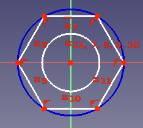
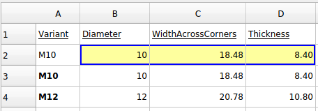

# Variant link
# Introduction

With the release of [FreeCAD 20](Release_notes_0.20#Spreadsheet_Workbench.md), in particular [configuration tables](https://forum.freecadweb.org/viewtopic.php?f=17&t=42183), a powerful new pattern, so called \"variant links\" emerges.

\"Variant links\" build upon [Link](Std_LinkMake.md) to vary sets of parameters for a given object at runtime.

Prior to this, you could parameterize objects with techniques such as spreadsheets, but multiple varied instances of that object couldn\'t coexist at the same time unless you resorted to techniques like copying files or objects which creates maintenance issues.

\"Variant links\" make the maintenance of such variants, and ability to toggle between them easy and maintainable.

# Example

To gain a better idea of \"variant links\", consider the following example.

Imagine a simple hexagonal nut with a \"major\" diameter of 10mm (M10). We can reuse the same design, create a link, and then vary certain parameters to create an M12 hexagonal nut.

For our example, we can describe the differences between these two variants with 3 parameters:

1.  diameter of the center hole
2.  width across the corners
3.  and thickness.

The particular parameter values for our variants are described in the below table.

  Variant   Diameter   WidthAcrossCorners   Thickness
     
  M10       10         18.48                8.4
  M12       12         20.78                10.8

1.  Create a new spreadsheet with a heading row. Leave the first row underneath empty (more on this later). Add parameters for M10 and M12 in row #3 and #4.
    
2.  Use the Part Design workbench to create a body and sketch for the hex nut.
    
3.  Pad the sketch.
4.  Setup a configuration table in the spreadsheet, and bind it to a Configuration property on the Body (read [here](https://forum.freecadweb.org/viewtopic.php?p=357959#p357959) if unclear how to do this).
    
5.  Alias the 3 cells underneath Diameter, WidthAcrossCorners, and Thickness in row #2 with a corresponding alias.
    
6.  Constrain the sketch with Diameter and WidthAcrossCorners.
    
7.  Bind Thickness to the Length of the pad.
8.  Create a SubShapeBinder from the Part Design workbench.
9.  Move the SubShapeBinder out of the Body and set its Support to the Body. See [PartDesign_SubShapeBinder#Usage](PartDesign_SubShapeBinder#Usage.md) if unclear on how to do this.
10. Set \"Bind Copy on Change\" to \"Enabled\" on the SubShapeBinder.
11. Select \"M12\" for the new Configuration property on the SubShapeBinder.
12. Once finished, you should have something like the following.
    

# Key Points & Considerations 

-   Variant links can be made using Links or SubShapeBinders. Realthunder explains the difference between using a Link vs. [SubShapeBinder](PartDesign_SubShapeBinder.md) [here](https://forum.freecadweb.org/viewtopic.php?f=17&t=42183):{{quote|text=Instead of duplicating the linked object with all its hierarchy, the [SubShapeBinder] will make a flattened copy of the mutated object. Another difference to Link is that the [SubShapeBinder] will sync any changes of the original object back to the copy even if the configurations are different, while for Link, once copied, the two objects become independent.}}
    
-   Although built upon links, variant links are not \"cheap\" like normal links^[https://forum.freecadweb.org/viewtopic.php?p=532130#p532130\ 1](https://forum.freecadweb.org/viewtopic.php?p=532130#p532130_1.md)^, as they create copies of the original object. Guidance is provided by Realthunder [here](https://forum.freecadweb.org/viewtopic.php?p=358582#p358582):{{quote|text=[When] using Link for alternative configurations, you'll need to realize that it makes a copy of the original object. ... it would be better to create a single 'variant' link for each [variant] to avoid unnecessary duplicates. Or better, use SubShapeBinder ... And again, create one [SubShapeBinder] for each configuration. }}

---
 [documentation index](../README.md) > Variant link
