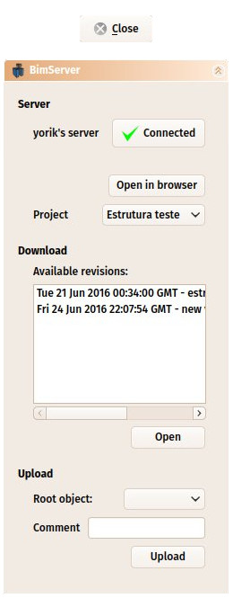

---
- GuiCommand:
   Name: WebTools BimServer
   MenuLocation: Web Tools -> BIM server
   Workbenches: WebTools_Workbench
---

# WebTools BimServer

**Starting from FreeCAD v0.17, this tool has been removed from the Arch Workbench and is now part of the external [WebTools Workbench](WebTools_Workbench.md) that you can install via menu Tools →  [Addon manager](Std_AddonMgr.md).
**

## Description

This command allows you to interact with a [BIMServer](http://www.bimserver.org) instance, open files stored on the BIM server, and save new revisions of those files. BIMServer is a free, open-source server system made to work with IFC files. In its current state, it allows to manage projects with multiple IFC files, and manage revisions. Its highly extensible database system and plugin architecture also allows to design advanced querying/validating tools and intelligent merging workflows.

In order to use this command, the following conditions must be met:

-   The **json** and **requests** Python modules must be installed on your system
-   You need to have access to a BIMServer instance (read the [BIMServer documentation](https://github.com/opensourceBIM/BIMserver/wiki) to install a BIMServer locally), and have credentials (login and password) for that server. At the time of writing, the stable version of BIMServer is 1.4, but we recommend you to install one of the available beta 1.5.X versions, which installs a lot of plugins automatically (in version 1.4 you have to install plugins manually).
-   All the file transfers with the BIMServer are done with IFC files. Therefore, you need to know how to work with [IFC files](Arch_IFC.md).

## Usage

1.  Make sure the above requirements are met, and you have access to a running BIMServer instance.
2.  Select menu **Web Tools →  [BIM Server](WebTools_BimServer.md)
**
3.  Press the **Connect** button and fill in your credential details
4.  Once the connection to the BIMServer has been made, choose a project to work with from the **Project** drop-down box

## Options

-   If this is the first time you are connecting to a BIMServer from FreeCAD, press the **Connect** button, and fill in the server URL, your login (which is always an email address) and your password in the dialog box that will pop up. If you wish to log in automatically the next time you will use the BimServer command, check the **save credentials** option (your login and password are not saved by FreeCAD, only a session cookie).
-   Once FreeCAD has successfully connected to a BIMServer instance, the **Connect** button will turn to **Connected**. Click the button again to disconnect. This will also erase the stored session cookie, so you will need to enter your credentials again next time.
-   In order to delete the session cookie manually and reset everything, you can simply delete the BIMServer URL stored in **Edit → Preferences → Arch → BimServer**.
-   The **Open in browser** button will open the web interface of the BIMServer either in FreeCAD\'s internal web browser, or, if you marked that option in **Edit → Preferences → Arch → BimServer**, in an external web browser. This allows for example to create new projects, or analyze the contents stored on the BIMServer.

### Downloading revisions 

-   The **Project** drop-down box will show the available projects stored on the BIMServer. Choose one to see the available revisions for that project.
-   Select one revision and click **Open** to download and open the IFC file corresponding to that revision in FreeCAD.
-   When pressing the **Open** button, a dialog box will open to allow you to save the downloaded IFC file at a location of your choice before opening it. If you press **Cancel**, the file will be saved under a temporary name in the system\'s temporary directory instead.

### Uploading revisions 

-   If you wish to upload a new revision, make sure the right project has been selected in the **Project** drop-down box
-   Choose the **Root object** you wish to upload. It must be either an [Arch Site](Arch_Site.md) or an [Arch Building](Arch_Building.md). Only objects belonging to that root object will be uploaded.
-   Write a **Comment**, that will be the description (name) of the revision.
-   Press the **Upload** button. A dialog box will open to allow you to save the produced IFC file at a location of your choice before uploading it. If you press **Cancel**, the file will be saved under a temporary name in the system\'s temporary directory instead.

---
⏵ [documentation index](../README.md) > WebTools BimServer
