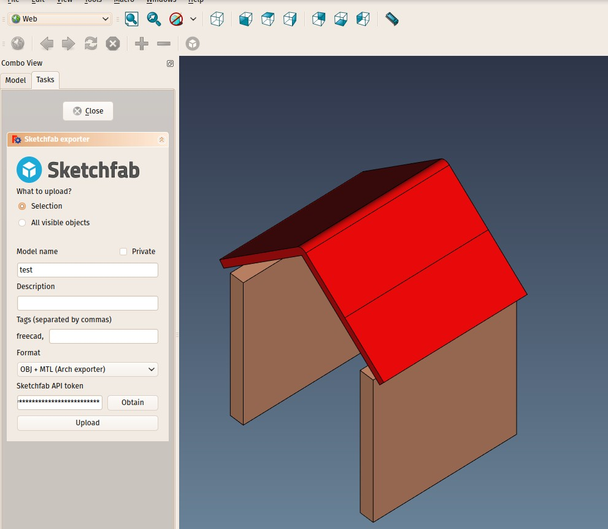

---
- GuiCommand:
   Name: WebTools Sketchfab
   MenuLocation: Web Tools - Sketchfab
   Workbenches: [WebTools](WebTools_Workbench.md)
---

# WebTools Sketchfab

## Description

This tool allows you to export and upload objects to your [SketchFab](http://www.sketchfab.com) account. <small>(v0.17)</small> 

## Usage

1.  Make yourself an account on [SketchFab](http://www.sketchfab.com) if you don\'t have one yet. Free accounts are just fine, paid accounts add more features like the possibility to have private models and bigger maximum upload sizes
2.  Prepare a model you wish to upload
3.  Click on  from the main toolbar in the [WebTools Workbench](WebTools_Workbench.md)
4.  Fill in the fields. Name and API key are mandatory
5.  Click the \"Upload\" button

## Options

-   You need a Sketchfab API key for this exporter to be able to connect to your sketchfab account. By pressing the \"Obtain\" button, you will be directed to your Sketchfab settings page, where that API key (which is unique to your account), is given. Copy the key and paste it in the \"API key\" field in the exporter. This value will be stored by FreeCAD so you only need to do it once
-   The name field is mandatory, the others can be left blank.
-   The exporter proposes several different export formats. The best on for you depends on the kind of model and result you wish to obtain, it is recommended to test what works best for you. Generally, OBJ + MTL will give you a better control over materials, while IV (OpenInventor) will give a result that is more similar to what you see in the FreeCAD 3D view.
-   Once your model is uploaded, Sketchfab offers a pretty advanced interface where you can further configure materials, lighting and environment.
-   When you press the \"Upload button\", after the upload finished, if everything went well, the button will turn into a \"View your model online\" button, which, when clicked, will take you directly to the model page on Sketchfab.
-   Some formats, like OBJ, are interpreted differently by Sketchfab and FreeCAD. FreeCAD considers the Z axis to point upwards, while Sketchfab considers it points towards the person behind the screen. To remedy this, after the upload is finished, the exporter will use the Sketchfab API to rotate the model to its correct position. If this operation fails, you will be warned, but your model will still be correctly uploaded. You can rotate it manually in the Sketchfab interface, by pressing the right arrow besides the\"X\" axis in the model orientation tab.

---
⏵ [documentation index](../README.md) > WebTools Sketchfab
