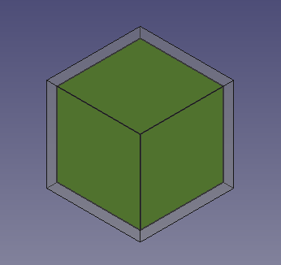
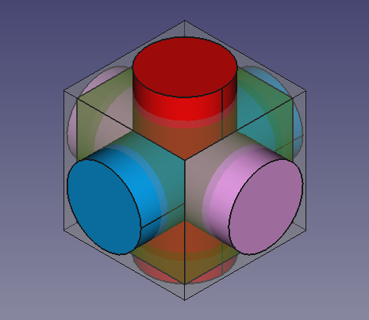
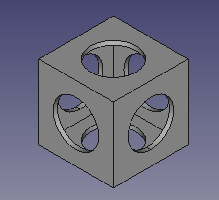
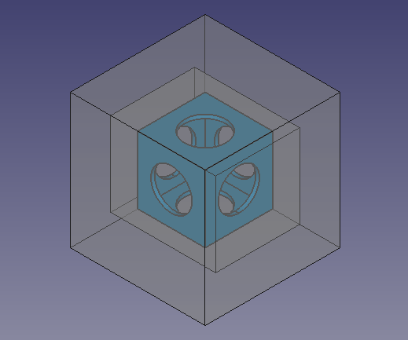
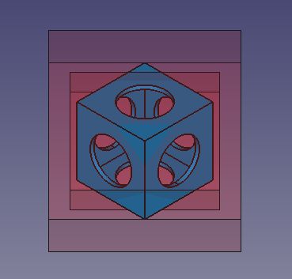
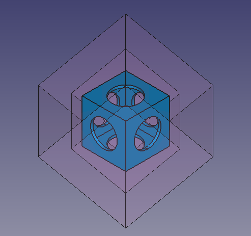
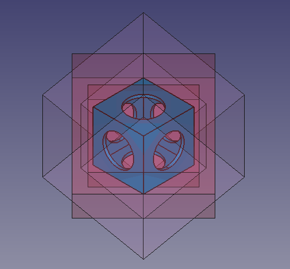
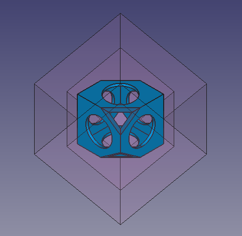

# Whiffle Ball tutorial
---
- TutorialInfo:   Topic:Product design
   Level:Beginner
   Time:30 minutes
   Author:r-frank and vocx
   FCVersion:0.17 and above
   Files:[https://github.com/FreeCAD/Examples/blob/master/Whiffle_Ball_Tutorial_ExampleFiles/WhiffleBall_Tutorial_FCWiki.FCStd?raw=true WhiffleBall_Tutorial_FCWiki.FCStd]
}}

## Introduction

This tutorial was originally written by Roland Frank (†2017, r-frank), and it was rewritten and illustrated by vocx.

This tutorial is here to teach you how to use the [Part Workbench](Part_Workbench.md).

The Part Workbench was the first workbench developed. It provides the basic geometrical elements that can be used as building blocks for other workbenches. The Part Workbench is meant to be used in a traditional [constructive solid geometry](constructive_solid_geometry.md) (CSG) workflow. For a more modern workflow using sketches, pads, and features, use the [PartDesign Workbench](PartDesign_Workbench.md).

You will practice:

-   inserting primitives
-   changing parameters of those primitive objects
-   modifying their [placement](placement.md)
-   doing boolean operations

   
*Final model of the wiffle ball*

## Setup

1\. Open FreeCAD, create a new empty document with **File → [New](File:Std_New.svg   16px]] [[Std_New.md)**, and switch to the [Part Workbench](Part_Workbench.md).

:   1.1. Press the **[View isometric](File:Std_ViewIsometric.svg   16px]] [[Std_ViewIsometric.md)** button, or press **0** in the numerical pad of your keyboard, to change the view to isometric to visualize the 3D solids better.
:   1.2. Press the **[View fit all](File:Std_ViewFitAll.svg   16px]] [[Std_ViewFitAll.md)** button whenever you add objects in order to pan and zoom the [3D view](3D_view.md) so that all elements are seen in the view.
:   1.3. Hold **Ctrl** while you click to select multiple items. If you selected something wrong or want to de-select everything, just click on empty space in the [3D view](3D_view.md).

## Insert primitive cubes 

2\. Insert a primitive cube by clicking on ****.

:   2.1. Select {{incode   Cube}} in the [tree view](tree_view.md).
:   2.2. Change the dimensions in the **Data** tab of the [property editor](property_editor.md).
:   2.3. Change **Length** to {{incode   90 mm}}.
:   2.4. Change **Width** to {{incode   90 mm}}.
:   2.5. Change **Height** to {{incode   90 mm}}.

3\. In the **Data** tab of the [property editor](property_editor.md), click on the **Placement** value so the ellipsis button **...** appears on the right.

:   3.1. Press on the ellipsis to launch the [Placement](Std_Placement.md) dialog.
:   3.2. Change the **Translation** values.
:   3.3. Change **X** to {{incode   -45 mm}}.
:   3.4. Change **Y** to {{incode   -45 mm}}.
:   3.5. Change **Z** to {{incode   -45 mm}}.
:   3.6. Press the **OK** button to close the dialog.

4\. Repeat the process, inserting a second, smaller cube by clicking on ****.

:   4.1. The second cube will be created with the same name, but with an additional number to distinguish the object.
:   4.2. Select {{incode   Cube001}} in the [tree view](tree_view.md), and change the dimensions and placement like with the previous object.
:   4.3. Change **Length** to {{incode   80 mm}}.
:   4.4. Change **Width** to {{incode   80 mm}}.
:   4.5. Change **Height** to {{incode   80 mm}}.
:   4.6. Open the [Placement](Std_Placement.md) dialog.
:   4.7. Change **X** to {{incode   -40 mm}}.
:   4.8. Change **Y** to {{incode   -40 mm}}.
:   4.9. Change **Z** to {{incode   -40 mm}}.
:   4.10. Press the **OK** button to close the dialog.

## Change visual properties 

5\. The previous operations create a smaller cube inside a bigger cube. To visualize this, we can modify the **View** properties in the [property editor](property_editor.md).

:   5.1. Select {{incode   Cube001}}, the smaller cube, in the [tree view](tree_view.md), and change the color. In the **View** tab, click on the **Shape Color** value to open the **Select color** dialog, then choose a green color; also change the value of **Line Width** to {{incode   2.0}}.
:   5.2. Select {{incode   Cube}}, the larger cube, in the [tree view](tree_view.md). In the **View** tab, change the value of **Transparency** to {{incode   70}}.

   
*Solid cube inside another solid cube*

## Insert primitive cylinders 

6\. Insert a primitive cylinder by clicking on ****.

:   6.1. Select {{incode   Cylinder}} in the [tree view](tree_view.md).
:   6.2. Change the dimensions in the **Data** tab of the [property editor](property_editor.md).
:   6.3. Change **Radius** to {{incode   27.5 mm}}.
:   6.4. Change **Height** to {{incode   120 mm}}.
:   6.5. Open the [Placement](Std_Placement.md) dialog.
:   6.6. Change **Z** to {{incode   -60 mm}}.
:   6.7. Press the **OK** button to close the dialog.

7\. Repeat the process, inserting a second cylinder by clicking on ****.

:   7.1. The second cylinder will be created with the same name, but with an additional number to distinguish the object.
:   7.2. Select {{incode   Cylinder001}} in the [tree view](tree_view.md), and change the dimensions and placement like with the previous object.
:   7.3. Change **Radius** to {{incode   27.5 mm}}.
:   7.4. Change **Height** to {{incode   120 mm}}.
:   7.5. Open the [Placement](Std_Placement.md) dialog.
:   7.6. Change **Y** to {{incode   60 mm}}.
:   7.7. Change the **Rotation** to {{incode   Rotation axis with angle}}; **Axis** to {{incode   X}} (by setting the {{incode   X}}, {{incode   Y}} and {{incode   Z}} values of the axis inputboxes to {{incode   1}}, {{incode   0}} and {{incode   0}} respectively), and **Angle** to {{incode   90 deg}}.
:   7.8. Press the **OK** button to close the dialog.

8\. Insert another cylinder. This time create a duplicate so that the radius and height don\'t have to be changed, only its placement.

:   8.1. Select {{incode   Cylinder001}} in the [tree view](tree_view.md), and go to the menu **Edit → [[Std_DuplicateSelection   Duplicate selection]]**. This will create {{incode   Cylinder002}}.
:   8.2. Open the [Placement](Std_Placement.md) dialog.
:   8.3. Change **X** to {{incode   -60 mm}}, and change **Y** back to {{incode   0 mm}}.
:   8.4. Change the **Rotation** to {{incode   Rotation axis with angle}}; **Axis** to {{incode   Y}}, and **Angle** to {{incode   90 deg}}.
:   8.5. Press the **OK** button to close the dialog.

## Change visual properties 

9\. The previous operations create three cylinders that intersect with each other, and also intersect the cubes. To visualize this better we can modify the **View** properties in the [property editor](property_editor.md).

:   9.1. Select {{incode   Cube001}}, the smaller cube, in the [tree view](tree_view.md), and change the transparency. In the **View** tab, change the value of **Transparency** to {{incode   70}}.
:   9.2. Select {{incode   Cylinder}}, in the **View** tab, click on the **Shape Color** value to open the **Select color** dialog, then choose a red color.
:   9.3. Select {{incode   Cylinder001}}, in the **View** tab, click on the **Shape Color** value to open the **Select color** dialog, then choose a blue color.
:   9.4. Select {{incode   Cylinder002}}, in the **View** tab, click on the **Shape Color** value to open the **Select color** dialog, then choose a pink color.
:   9.5. Select the three cylinders, in the **View** tab also change the value of **Line Width** to {{incode   2.0}}.

   
*Solid cylinders that intersect themselves and the solid cubes.*

## Fuse and cut 

10\. In the [tree view](tree_view.md), select {{incode   Cube001}} (the inner, smaller cube), and the tree cylinders, then press **[Fuse](File:Part_Fuse.svg   16px]] [[Part_Fuse.md)**. This will create a {{incode   Fusion}} object.

11\. Then perform a boolean cut of the {{incode   Cube}} (larger cube) and the new {{incode   Fusion}} object.

:   11.1. In the [tree view](tree_view.md) select {{incode   Cube}} first, and then {{incode   Fusion}}.
:   11.2. Then press **[Cut](File:Part_Cut.svg   16px]] [[Part_Cut.md)**. This will create a {{incode   Cut}} object.
:   
    **Note:**the order in which you select the objects is important for the cut operation. The base object is selected first, and the subtracting object comes at the end.
:   11.3. If the colors look strange, select the new {{incode   Cut}} object, go to the **View** tab, click on the **Shape Color** value to open the **Select color** dialog, then choose a gray color; also change the value of **Line Width** to {{incode   2.0}}.

   
*Hollow shape produced from cutting a cube and three cylinders from a bigger cube.*

## Insert primitive cubes to cut the corners of the partial solid 

Now we\'ll create more cubes that will be used as cutting tools to trim the corners of the previously obtained {{incode   Cut}} object.

12\. Click on ****.

:   12.1. Select {{incode   Cube002}} in the [tree view](tree_view.md), and change the dimensions and placement.
:   12.2. Change **Length** to {{incode   140 mm}}.
:   12.3. Change **Width** to {{incode   112 mm}}.
:   12.4. Change **Height** to {{incode   112 mm}}.
:   12.5. Open the [Placement](Std_Placement.md) dialog.
:   12.6. Change **X** to {{incode   -70 mm}}.
:   12.7. Change **Y** to {{incode   -56 mm}}.
:   12.8. Change **Z** to {{incode   -56 mm}}.
:   12.9. Press **OK**.

13\. Click on ****.

:   13.1. Select {{incode   Cube003}} in the [tree view](tree_view.md), and change the dimensions and placement.
:   13.2. Change **Length** to {{incode   180 mm}}.
:   13.3. Change **Width** to {{incode   180 mm}}.
:   13.4. Change **Height** to {{incode   180 mm}}.
:   13.5. Open the [Placement](Std_Placement.md) dialog.
:   13.6. Change **X** to {{incode   -90 mm}}.
:   13.7. Change **Y** to {{incode   -90 mm}}.
:   13.8. Change **Z** to {{incode   -90 mm}}.
:   13.9. Press **OK**.

We\'ll duplicate the previous two objects again to use once more as cutting objects.

14\. Select only {{incode   Cube002}} in the [tree view](tree_view.md), and go to **Edit → [[Std_DuplicateSelection   Duplicate selection]]**. This will create {{incode   Cube004}}.

15\. Select only {{incode   Cube003}} in the [tree view](tree_view.md), and go to **Edit → [[Std_DuplicateSelection   Duplicate selection]]**. This will create {{incode   Cube005}}.

16\. To visualize this better we can modify the **View** properties in the [property editor](property_editor.md).

:   16.1. Select the {{incode   Cut}} object, in the **View** tab, click on the **Shape Color** value to open the **Select color** dialog, then choose a blue color.
:   16.2. Select all new cubes, {{incode   Cube002}}, {{incode   Cube003}}, {{incode   Cube004}}, and {{incode   Cube005}}, in the **View** tab, change the value of **Transparency** to {{incode   80}}.

   
*Additional external cubes that will be used as cutting objects for the internal solid.*

## Cutting the corners 1 

17\. In the [tree view](tree_view.md) select {{incode   Cube002}} and {{incode   Cube003}}.

:   17.1. Open the [Placement](Std_Placement.md) dialog.
:   17.2. Tick the option **Apply incremental changes**; notice that all **Translation** values are reset to zeroes.
:   17.3. Change the **Rotation** to {{incode   Rotation axis with angle}}; **Axis** to {{incode   X}}, and **Angle** to {{incode   45 deg}}, then click on **Apply**. This will apply a rotation around the X-axis, and will reset the **Angle** field to zero.
:   17.4. Change the **Rotation** again, now **Axis** to {{incode   Z}}, and **Angle** to {{incode   45 deg}}, then click on **Apply**. This will apply a rotation around the local Z-axis, and will reset the **Angle** field to zero.
:   17.5. Click on **OK** to close the dialog.

18\. In the [tree view](tree_view.md) de-select the objects; then select {{incode   Cube003}} first, the bigger cube, and then {{incode   Cube002}}, the smaller cube.

:   18.1. Then press **[Cut](File:Part_Cut.svg   16px]] [[Part_Cut.md)**. This will create {{incode   Cut001}}. This is a hollowed body which intersects the initial {{incode   Cut}} only at certain corners.

19\. To visualize this better we can modify the **View** properties in the [property editor](property_editor.md).

:   19.1. Select {{incode   Cube004}} and {{incode   Cube005}}, in the **View** tab, then change the value of **Visibility** to {{incode   false}}, or press **Space** in the keyboard.
:   19.2. Select {{incode   Cut001}}, click on the **Shape Color** value to open the **Select color** dialog, then choose a red color; also change the value of **Transparency** to {{incode   90}}.

   
*A rotated, hollowed solid, which will be used as a cutting object for some corners of the internal solid.*

## Cutting the corners 2 

20\. In the [tree view](tree_view.md) select {{incode   Cut001}}, in the **View** tab, change the value of **Visibility** to {{incode   false}}, or press **Space** in the keyboard.

21\. In the [tree view](tree_view.md) select {{incode   Cube004}} and {{incode   Cube005}}, in the **View** tab, change the value of **Visibility** to {{incode   true}}, or press **Space** in the keyboard.

:   21.1. Open the [Placement](Std_Placement.md) dialog.
:   21.2. Tick the option **Apply incremental changes**; notice that all **Translation** values are reset to zeroes.
:   21.3. Change the **Rotation** to {{incode   Rotation axis with angle}}; **Axis** to {{incode   X}}, and **Angle** to {{incode   45 deg}}, then click on **Apply**. This will apply a rotation around the X-axis, and will reset the {{incode   Angle}} field to zero.
:   21.4. Change the **Rotation** again, now **Axis** to {{incode   Z}}, and **Angle** to {{incode   -45 deg}}, then click on **Apply**. This will apply a rotation around the local Z-axis, and will reset the **Angle** field to zero.
:   21.5. Click on **OK** to close the dialog.

22\. In the [tree view](tree_view.md) de-select the objects; then select {{incode   Cube005}} first, the bigger cube, and then {{incode   Cube004}}, the smaller cube.

:   22.1. Then press **[Cut](File:Part_Cut.svg   16px]] [[Part_Cut.md)**. This will create {{incode   Cut002}}. This is a hollowed body which intersects the initial {{incode   Cut}} only at certain corners.

23\. To visualize this better we can modify the **View** properties in the [property editor](property_editor.md).

:   23.1. Select {{incode   Cut002}}, click on the **Shape Color** value to open the **Select color** dialog, then choose a pink color; also change the value of **Transparency** to {{incode   90}}.

   
*A rotated, hollowed solid, which will be used as a cutting object for some corners of the internal solid.*

## Finishing the model 

24\. Make sure all objects are visible. In the [tree view](tree_view.md) select all objects, in the **View** tab, change the value of **Visibility** to {{incode   true}}, or press **Space** in the keyboard.

   
*The internal hollowed solid, together with the external objects which will be used to cut it.*

25\. In the [tree view](tree_view.md) de-select the objects; then select {{incode   Cut}} first, and then {{incode   Cut001}}.

:   25.1. Then press **[Cut](File:Part_Cut.svg   16px]] [[Part_Cut.md)**. This will create {{incode   Cut003}}.

   
*The internal hollowed solid, cut by {{incode   Cut001*.}}

26\. In the [tree view](tree_view.md) de-select the objects; then select {{incode   Cut003}} first, and then {{incode   Cut002}}.

:   26.1. Then press **[Cut](File:Part_Cut.svg   16px]] [[Part_Cut.md)**. This will create {{incode   Cut004}}. This is the final object.
:   26.2. Select {{incode   Cut004}}, click on the **Shape Color** value to open the **Select color** dialog, then choose a green color; also change the value of **Line Width** to {{incode   2.0}}.

   
*The internal hollowed solid, cut by {{incode   Cut001* and `Cut002`. Final model.}}

27\. Real objects don\'t have perfectly sharp edges or corners, so applying a fillet to the edges can be done to refine the model.

:   27.1. In the [tree view](tree_view.md), select {{incode   Cut004}} then press **[Fillet](File:Part_Fillet.svg   16px]] [[Part_Fillet.md)**.
:   27.2. In the **Fillet edges** [task panel](task_panel.md) go to **Selection**, choose **Select edges**, and then press **All**. As **Fillet type** choose {{incode   Constant radius}}, then set **Radius** to {{incode   1 mm}}.
:   24.3. Press **OK**. This will create a {{incode   Fillet}} object.
:   27.4. In the **View** tab, change the value of **Line Width** to {{incode   2.0}}.

   
*Final whiffle ball model with fillets applied to the edges.*

  {{Userdocnavi
---

---
 [documentation index](../README.md) > [Part](Category_Part.md) > Whiffle Ball tutorial
